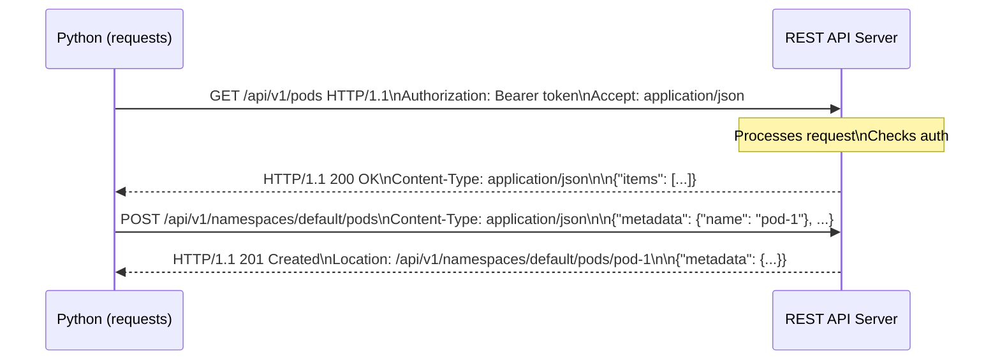

# 9.3.2 HTTP Requests and REST APIs: Talking to Web Services

**Backlinks:** [9.3.1 — Logging and Exception Handling](./9.3.1_Logging_and_Exception_Handling.md) | [Module 2 — Networking](../../2-Networking/) (HTTP methods, status codes, headers — all used here) | [Module 8 — CI/CD](../../8-CICD/) (GitHub API, webhooks, CI step API calls)

**Next note:** [9.3.3 — Advanced HTTP: Sessions, OAuth2, httpx](./9.3.3_Advanced_HTTP_Sessions_and_OAuth2.md)

---

## Why HTTP Clients Matter

Platform engineers constantly interact with APIs:
- **Kubernetes API** — manage clusters programmatically
- **Cloud APIs** — AWS, GCP, Azure resource management
- **Monitoring APIs** — Prometheus, Datadog, Grafana
- **CI/CD APIs** — GitHub, GitLab, Jenkins
- **Webhooks** — receive events from services

The `requests` library is the industry standard for HTTP in Python.

---

## Part 0: HTTP Concepts Refresher (From Module 2)



### HTTP Status Codes You'll See

| Code | Meaning | Action |
|------|---------|--------|
| `200 OK` | Success | Parse response body |
| `201 Created` | Resource created | Parse response (has new resource) |
| `204 No Content` | Success, no body | No `.json()` call |
| `400 Bad Request` | Your request is invalid | Fix request structure |
| `401 Unauthorized` | Missing/invalid auth | Check token/credentials |
| `403 Forbidden` | Auth OK but no permission | Check RBAC/permissions |
| `404 Not Found` | Resource doesn't exist | Handle gracefully |
| `409 Conflict` | Resource already exists | Handle gracefully |
| `422 Unprocessable` | Validation failed | Fix request data |
| `429 Too Many Requests` | Rate limited | Wait, then retry |
| `500 Internal Server Error` | Server bug | Retry, report |
| `503 Service Unavailable` | Server overloaded | Retry with backoff |

---

## Part 1: Installing and Importing requests

```bash
pip install requests
python -c "import requests; print(requests.__version__)"
```

```python
import requests
```

---

## Part 2: GET Requests — Fetching Data

### Basic GET

```python
import requests

# Simple GET
response = requests.get('https://api.github.com/users/octocat')

# Check status
print(f"Status: {response.status_code}")
print(f"OK:     {response.ok}")            # True if 200-399

# Parse JSON body
data = response.json()
print(f"Login:     {data['login']}")
print(f"Followers: {data['followers']}")
```

### GET with Query Parameters

```python
import requests

# Query parameters — requests handles encoding automatically
params = {
    'q':        'python kubernetes',
    'sort':     'stars',
    'order':    'desc',
    'per_page': 5
}

response = requests.get('https://api.github.com/search/repositories', params=params)
# Actual URL: .../search/repositories?q=python+kubernetes&sort=stars&order=desc&per_page=5
print(f"Request URL: {response.url}")

data = response.json()
for repo in data['items']:
    print(f"⭐ {repo['stargazers_count']:6,}  {repo['full_name']}")
```

### GET with Headers

```python
import requests

headers = {
    'Authorization': 'Bearer ghp_xxxxxxxxxxxx',
    'Accept':        'application/vnd.github.v3+json',
    'User-Agent':    'MyScript/1.0'
}

response = requests.get('https://api.github.com/user', headers=headers)
```

---

## Part 3: POST Requests — Creating Data

### POST with JSON Body

```python
import requests

data = {
    'title': 'Deployment failed in production',
    'body':  'Service myapp crashed at 10:30 UTC. Rollback initiated.',
    'labels': ['bug', 'production']
}

response = requests.post(
    'https://api.github.com/repos/myorg/myrepo/issues',
    json=data,                                          # auto-sets Content-Type: application/json
    headers={'Authorization': 'Bearer ghp_xxxx'}
)

if response.status_code == 201:
    issue = response.json()
    print(f"Created issue #{issue['number']}: {issue['html_url']}")
else:
    print(f"Failed: {response.status_code} — {response.text}")
```

> **`json=data` vs `data=json.dumps(data)`:** Using `json=data` tells requests to serialize `data` and set `Content-Type: application/json` automatically. Using `data=...` sends form-encoded data (like an HTML form). Always use `json=` for REST API calls.

### POST with Form Data and Files

```python
import requests

# Form data (application/x-www-form-urlencoded)
response = requests.post('https://httpbin.org/post', data={'key': 'value'})

# File upload (multipart/form-data)
with open('report.pdf', 'rb') as f:
    response = requests.post(
        'https://uploads.example.com/files',
        files={'file': ('report.pdf', f, 'application/pdf')},
        headers={'Authorization': 'Bearer token'}
    )
```

---

## Part 3b: Streaming Responses — Large Downloads and Event Streams

> **Problem:** Calling `.text` or `.json()` loads the **entire response** into memory. For a 2 GB Docker image download or a never-ending Kubernetes watch stream, this either OOMs the process or blocks forever. Streaming processes data chunk-by-chunk as it arrives.

### Downloading Large Files

```python
import requests
from pathlib import Path

def download_file(url: str, dest: str, chunk_size: int = 8192) -> None:
    """Stream a large file to disk without loading it all into memory"""
    with requests.get(url, stream=True, timeout=30) as r:  # ← stream=True
        r.raise_for_status()
        total = int(r.headers.get('Content-Length', 0))
        downloaded = 0

        with open(dest, 'wb') as f:
            for chunk in r.iter_content(chunk_size=chunk_size):
                f.write(chunk)
                downloaded += len(chunk)
                if total:
                    pct = downloaded / total * 100
                    print(f"\rDownloading: {pct:.1f}%", end='', flush=True)

        print(f"\nSaved to {dest} ({downloaded:,} bytes)")

# Usage: download a Terraform binary
download_file(
    'https://releases.hashicorp.com/terraform/1.7.0/terraform_1.7.0_linux_amd64.zip',
    '/tmp/terraform.zip'
)
```

> **`stream=True`:** Without it, `requests.get()` downloads the entire body immediately. With `stream=True`, only the headers are downloaded immediately — the body is fetched lazily when you iterate `.iter_content()` or `.iter_lines()`.

### Streaming Line-by-Line — Kubernetes Watch API

```python
import requests
import json

def watch_pods(namespace: str = 'default', token: str = '') -> None:
    """
    Stream Kubernetes watch events (like 'kubectl get pods --watch').
    The response never ends — it sends JSON lines as events occur.
    """
    url = f'https://kubernetes.default.svc/api/v1/namespaces/{namespace}/pods'
    headers = {'Authorization': f'Bearer {token}'}

    with requests.get(url, params={'watch': 'true'}, headers=headers,
                      stream=True, verify=False, timeout=None) as r:
        r.raise_for_status()
        for line in r.iter_lines(decode_unicode=True):  # ← line by line
            if not line:
                continue   # skip keep-alive empty lines
            event = json.loads(line)
            etype = event['type']                          # ADDED, MODIFIED, DELETED
            name  = event['object']['metadata']['name']
            phase = event['object']['status'].get('phase', 'Unknown')
            print(f"{etype:<10} {name:<40} {phase}")

# Usage: runs until Ctrl+C
# watch_pods('production', token=os.environ['K8S_TOKEN'])
```

### `iter_lines()` vs `iter_content()`

| Method | Returns | Use For |
|--------|---------|---------|
| `r.iter_content(chunk_size=8192)` | Raw bytes chunks | Binary files (images, archives) |
| `r.iter_lines(decode_unicode=True)` | One line at a time | JSON lines, log streams, SSE |

> **Memory usage:** Both methods keep only one chunk/line in memory at a time, regardless of the total response size. This is how you handle multi-GB downloads or infinite streams.

---

## Part 4: PUT, PATCH, DELETE

```python
import requests
headers = {'Authorization': 'Bearer token'}

# PUT — full replacement
response = requests.put(
    'https://api.example.com/resources/1',
    json={'name': 'Updated Name', 'value': 42},
    headers=headers
)

# PATCH — partial update
response = requests.patch(
    'https://api.example.com/resources/1',
    json={'value': 43},    # only update 'value', leave 'name' unchanged
    headers=headers
)

# DELETE
response = requests.delete(
    'https://api.example.com/resources/1',
    headers=headers
)
# DELETE often returns 204 No Content — don't call .json()
if response.status_code == 204:
    print("Deleted successfully")
```

---

## Part 5: Authentication Patterns

### Bearer Token (OAuth2, JWT, GitHub PAT)

```python
import requests

token = 'ghp_xxxx'  # or JWT or OAuth2 access token

headers = {'Authorization': f'Bearer {token}'}
response = requests.get('https://api.example.com/user', headers=headers)
```

### Basic Authentication

```python
import requests
from requests.auth import HTTPBasicAuth

response = requests.get(
    'https://api.example.com/user',
    auth=HTTPBasicAuth('username', 'password')
    # Shorthand: auth=('username', 'password')
)
```

### API Key Patterns

```python
import requests

# Method 1: Custom header
response = requests.get('https://api.example.com/data',
                        headers={'X-API-Key': 'your-key'})

# Method 2: Query parameter (less secure — appears in logs)
response = requests.get('https://api.example.com/data',
                        params={'api_key': 'your-key'})
```

---

## Part 6: Using `requests.Session()` — Connection Pooling

> **Why use `Session`?** Every `requests.get()` call creates a new TCP connection, does a TLS handshake (for HTTPS), then tears it down. With a `Session`, connections are **reused** (connection pooling) — 5-10× faster for many calls to the same host. Sessions also persist headers and auth across calls.

```python
import requests

# Without Session — new connection per call (slow for many calls)
for pod_name in pod_names:
    requests.get(f'https://k8s-api/api/v1/pods/{pod_name}',
                 headers={'Authorization': 'Bearer token'})  # header repeated

# ✅ With Session — reuses connections, auth persists
session = requests.Session()
session.headers.update({
    'Authorization': 'Bearer token',
    'Accept':        'application/json'
})

for pod_name in pod_names:
    response = session.get(f'https://k8s-api/api/v1/pods/{pod_name}')
    # headers are applied automatically

# Session as context manager (auto-closes)
with requests.Session() as session:
    session.headers['Authorization'] = f'Bearer {token}'
    r1 = session.get('https://api.example.com/users')
    r2 = session.post('https://api.example.com/events', json={'type': 'deploy'})
```

---

## Part 7: Handling Responses

### Checking Status Codes

```python
import requests

response = requests.get('https://api.github.com/users/octocat')

# Method 1: check status_code directly
if response.status_code == 200:
    data = response.json()
elif response.status_code == 404:
    print("User not found")
elif response.status_code == 403:
    remaining = response.headers.get('X-RateLimit-Remaining', 'unknown')
    print(f"Rate limited — {remaining} requests remaining")

# Method 2: .ok (True for 200-399)
if response.ok:
    data = response.json()

# Method 3: raise_for_status() — raises HTTPError for 4xx/5xx
try:
    response.raise_for_status()
    data = response.json()
except requests.exceptions.HTTPError as e:
    print(f"HTTP {e.response.status_code}: {e}")
```

### Response Properties

```python
response = requests.get('https://api.github.com/users/octocat')

response.status_code        # 200
response.ok                 # True (200-399)
response.json()             # Parse JSON body → dict
response.text               # Body as string
response.content            # Body as bytes
response.headers            # Response headers dict (case-insensitive)
response.headers['Content-Type']  # 'application/json; charset=utf-8'
response.elapsed.total_seconds()  # response time in seconds
response.url                # final URL (after redirects)

# Rate limit headers (GitHub pattern)
print(response.headers.get('X-RateLimit-Limit',     'N/A'))
print(response.headers.get('X-RateLimit-Remaining', 'N/A'))
print(response.headers.get('X-RateLimit-Reset',     'N/A'))
```

---

## Part 8: Error Handling and Retries

### Exception Hierarchy

```python
import requests
from requests.exceptions import (
    Timeout, ConnectionError, HTTPError, RequestException
)

try:
    response = requests.get('https://api.example.com/data', timeout=5)
    response.raise_for_status()       # raises HTTPError for 4xx/5xx
    data = response.json()

except Timeout:
    # Request exceeded timeout (connect timeout + read timeout)
    print("Request timed out")
except ConnectionError:
    # DNS failure, refused connection, network unreachable
    print("Failed to connect")
except HTTPError as e:
    # 4xx or 5xx response
    print(f"HTTP {e.response.status_code} error")
except RequestException as e:
    # Base class — catches all requests exceptions
    print(f"Request failed: {e}")
```

### Retry with Exponential Backoff

```python
import requests
import time
import logging

logger = logging.getLogger(__name__)

def request_with_retry(
    method: str,
    url: str,
    max_retries: int = 3,
    backoff_base: float = 2.0,
    retry_on: tuple = (429, 500, 502, 503, 504),
    **kwargs
) -> requests.Response:
    """
    Make HTTP request with retry on specified status codes.
    Respects Retry-After header for 429 responses.
    """
    for attempt in range(1, max_retries + 1):
        try:
            response = requests.request(method, url, **kwargs)

            # Success
            if response.ok or response.status_code not in retry_on:
                return response

            # Rate limited — respect Retry-After header
            if response.status_code == 429:
                wait = float(response.headers.get('Retry-After', backoff_base ** attempt))
                logger.warning(f"Rate limited. Waiting {wait:.0f}s (attempt {attempt}/{max_retries})")
            else:
                wait = backoff_base ** (attempt - 1)
                logger.warning(f"HTTP {response.status_code}. Waiting {wait:.0f}s (attempt {attempt}/{max_retries})")

            if attempt < max_retries:
                time.sleep(wait)
            else:
                response.raise_for_status()  # raise on final attempt

        except (requests.exceptions.ConnectionError, requests.exceptions.Timeout) as e:
            if attempt == max_retries:
                raise
            wait = backoff_base ** (attempt - 1)
            logger.warning(f"Network error: {e}. Retrying in {wait:.0f}s")
            time.sleep(wait)

    raise RuntimeError(f"Failed after {max_retries} attempts")  # should not reach here

# Usage
response = request_with_retry('GET', 'https://api.example.com/data', timeout=10)
data = response.json()
```

### `urllib3` Retry Adapter

```python
import requests
from requests.adapters import HTTPAdapter
from urllib3.util.retry import Retry

def create_session_with_retry(
    max_retries: int = 3,
    backoff_factor: float = 0.5,
    status_forcelist: tuple = (429, 500, 502, 503, 504)
) -> requests.Session:
    """Create a session with automatic retry via urllib3"""
    retry = Retry(
        total         = max_retries,
        backoff_factor= backoff_factor,    # wait = backoff_factor * 2^(attempt-1)
        status_forcelist= status_forcelist,
        allowed_methods= ['GET', 'POST', 'PUT', 'DELETE', 'PATCH']
    )
    adapter = HTTPAdapter(max_retries=retry)

    session = requests.Session()
    session.mount('https://', adapter)
    session.mount('http://',  adapter)
    return session

# Usage
session = create_session_with_retry()
response = session.get('https://api.example.com/data', timeout=10)
```

> **`requests.adapters.HTTPAdapter` + `urllib3.Retry`:** This is the lowest-level, most reliable retry mechanism. It works inside `requests.Session` and handles connection-level retries (including TLS issues) that `try/except` cannot. For production API clients, prefer this over manual retry loops.

---

## Part 9: `curl` to `requests` Translation Guide

> **Beginners know `curl`** from testing APIs in the terminal. Here's a direct mapping:

| `curl` command | Python `requests` equivalent |
|----------------|------------------------------|
| `curl https://api.example.com/users` | `requests.get('https://api.example.com/users')` |
| `curl -H 'Authorization: Bearer token' ...` | `requests.get(..., headers={'Authorization': 'Bearer token'})` |
| `curl -X POST -d '{"key":"val"}' -H 'Content-Type: application/json' ...` | `requests.post(..., json={'key': 'val'})` |
| `curl -X DELETE ...` | `requests.delete(...)` |
| `curl -u user:pass ...` | `requests.get(..., auth=('user', 'pass'))` |
| `curl -k ...` (skip SSL) | `requests.get(..., verify=False)` |
| `curl --max-time 10 ...` | `requests.get(..., timeout=10)` |
| `curl -d 'key=val&key2=val2' ...` | `requests.post(..., data={'key': 'val', 'key2': 'val2'})` |
| `curl -F 'file=@/path/to/file' ...` | `requests.post(..., files={'file': open('/path/to/file', 'rb')})` |

---

## Part 10: Practical Examples for Platform Engineers

### Example 1: GitHub API Client

```python
import requests
import os
import logging

logger = logging.getLogger(__name__)

class GitHubClient:
    BASE_URL = 'https://api.github.com'

    def __init__(self, token: str | None = None):
        token = token or os.environ.get('GITHUB_TOKEN')
        if not token:
            raise ValueError("GitHub token required (set GITHUB_TOKEN env var)")

        self.session = requests.Session()
        self.session.headers.update({
            'Authorization':     f'token {token}',
            'Accept':            'application/vnd.github.v3+json',
            'X-GitHub-Api-Version': '2022-11-28'
        })

    def get_pull_requests(self, repo: str, state: str = 'open') -> list[dict]:
        url = f'{self.BASE_URL}/repos/{repo}/pulls'
        response = self.session.get(url, params={'state': state, 'per_page': 100})
        response.raise_for_status()
        return response.json()

    def create_issue(self, repo: str, title: str, body: str,
                     labels: list[str] | None = None) -> dict:
        url = f'{self.BASE_URL}/repos/{repo}/issues'
        response = self.session.post(url, json={
            'title':  title,
            'body':   body,
            'labels': labels or []
        })
        response.raise_for_status()
        logger.info(f"Created issue #{response.json()['number']}: {title}")
        return response.json()

    def add_pr_comment(self, repo: str, pr_number: int, comment: str) -> dict:
        url = f'{self.BASE_URL}/repos/{repo}/issues/{pr_number}/comments'
        response = self.session.post(url, json={'body': comment})
        response.raise_for_status()
        return response.json()

# Usage
github = GitHubClient()
prs = github.get_pull_requests('myorg/myrepo')
for pr in prs:
    print(f"#{pr['number']}: {pr['title']} by @{pr['user']['login']}")
```

### Example 2: Prometheus Query Client

```python
import requests
from datetime import datetime, timedelta

class PrometheusClient:
    def __init__(self, url: str = 'http://localhost:9090'):
        self.url     = url.rstrip('/')
        self.session = requests.Session()
        self.session.timeout = 30

    def query(self, promql: str) -> list[dict]:
        """Instant vector query"""
        resp = self.session.get(
            f'{self.url}/api/v1/query',
            params={'query': promql}
        )
        resp.raise_for_status()
        data = resp.json()
        if data['status'] != 'success':
            raise RuntimeError(f"Prometheus error: {data.get('error')}")
        return data['data']['result']

    def get_pod_cpu(self, pod: str, namespace: str = 'default') -> float | None:
        """Get current CPU usage in cores for a pod"""
        results = self.query(
            f'sum(rate(container_cpu_usage_seconds_total'
            f'{{pod="{pod}",namespace="{namespace}"}}[5m]))'
        )
        if results and results[0]['value']:
            return float(results[0]['value'][1])
        return None

# Usage
prom = PrometheusClient('http://prometheus:9090')
cpu  = prom.get_pod_cpu('myapp-abc123', 'production')
if cpu is not None:
    print(f"Pod CPU: {cpu:.3f} cores")
```

### Example 3: Webhook Receiver (Flask)

```python
import hmac
import hashlib
import logging
import os
from flask import Flask, request, jsonify

app    = Flask(__name__)
logger = logging.getLogger(__name__)

WEBHOOK_SECRET = os.environ.get('GITHUB_WEBHOOK_SECRET', '').encode()

def verify_github_signature(payload_bytes: bytes, signature_header: str) -> bool:
    """
    Verify GitHub webhook HMAC-SHA256 signature.
    GitHub sends: X-Hub-Signature-256: sha256=<hex>
    """
    if not WEBHOOK_SECRET:
        logger.warning("No webhook secret configured — skipping signature check")
        return True

    if not signature_header or not signature_header.startswith('sha256='):
        return False

    expected_hex = hmac.new(
        WEBHOOK_SECRET,
        msg=payload_bytes,
        digestmod=hashlib.sha256
    ).hexdigest()

    received_hex = signature_header.removeprefix('sha256=')
    return hmac.compare_digest(expected_hex, received_hex)

@app.route('/webhook/github', methods=['POST'])
def github_webhook():
    # Verify signature
    sig = request.headers.get('X-Hub-Signature-256', '')
    if not verify_github_signature(request.data, sig):
        logger.warning(f"Invalid webhook signature from {request.remote_addr}")
        return jsonify({'error': 'Invalid signature'}), 401

    event = request.headers.get('X-GitHub-Event', 'unknown')
    payload = request.get_json()

    logger.info(f"Received {event} event")

    if event == 'push':
        repo   = payload['repository']['full_name']
        branch = payload['ref'].split('/')[-1]
        logger.info(f"Push to {repo}:{branch} — {len(payload['commits'])} commits")
    elif event == 'pull_request':
        action = payload['action']
        pr_num = payload['number']
        logger.info(f"PR #{pr_num} {action}: {payload['pull_request']['title']}")

    return jsonify({'status': 'ok'}), 200

if __name__ == '__main__':
    logging.basicConfig(level=logging.INFO)
    app.run(port=5000)
```

> **`hmac.new()` parameter order:** `hmac.new(key, msg=None, digestmod=None)`. The `key` must be bytes. `digestmod` must be specified (Python 3.8+ gives a deprecation warning without it). Always use `hmac.compare_digest()` for the comparison — it is constant-time and prevents timing attacks.

---

## Quick Task: HTTP Client Practice

1. Fetch data from `https://jsonplaceholder.typicode.com/posts` and print the first 5 titles.
2. POST a new post to the same endpoint.
3. Handle `Timeout` and `ConnectionError` gracefully.

> **Ready Solution:**
>
> ```python
> import requests
>
> def fetch_posts() -> list[dict]:
>     try:
>         r = requests.get('https://jsonplaceholder.typicode.com/posts', timeout=10)
>         r.raise_for_status()
>         return r.json()
>     except requests.exceptions.Timeout:
>         print("Request timed out"); return []
>     except requests.exceptions.ConnectionError:
>         print("Connection error"); return []
>     except requests.exceptions.HTTPError as e:
>         print(f"HTTP error: {e}"); return []
>
> def create_post(title: str, body: str) -> dict | None:
>     r = requests.post(
>         'https://jsonplaceholder.typicode.com/posts',
>         json={'title': title, 'body': body, 'userId': 1}
>     )
>     return r.json() if r.status_code == 201 else None
>
> for i, post in enumerate(fetch_posts()[:5]):
>     print(f"{i+1}. {post['title']}")
>
> new = create_post("Test Post", "Test body")
> if new:
>     print(f"Created post ID: {new['id']}")
> ```

---

## Summary Tables

### HTTP Methods

| Method | Function | Idempotent | Body |
|--------|----------|-----------|------|
| GET | Fetch data | ✅ | No |
| POST | Create data | ❌ | Yes (`json=`) |
| PUT | Full update | ✅ | Yes |
| PATCH | Partial update | ❌ | Yes |
| DELETE | Delete | ✅ | No |

### `requests.get()` / `requests.request()` Parameters

| Parameter | Purpose |
|-----------|---------|
| `params=dict` | URL query string |
| `json=dict` | JSON body + Content-Type |
| `data=dict` | Form-encoded body |
| `headers=dict` | HTTP headers |
| `auth=(u, p)` | Basic auth |
| `timeout=N` | Connect + read timeout |
| `verify=False` | Skip SSL (⚠️ insecure) |

### Exception Types

| Exception | When |
|-----------|------|
| `Timeout` | Connect or read timeout |
| `ConnectionError` | DNS, refused connection |
| `HTTPError` | 4xx or 5xx status (`raise_for_status`) |
| `TooManyRedirects` | Too many redirects |
| `RequestException` | Base class — all errors |

---

**Next note (9.3.3)** covers Advanced HTTP: Sessions, OAuth2, httpx, and API design patterns.
