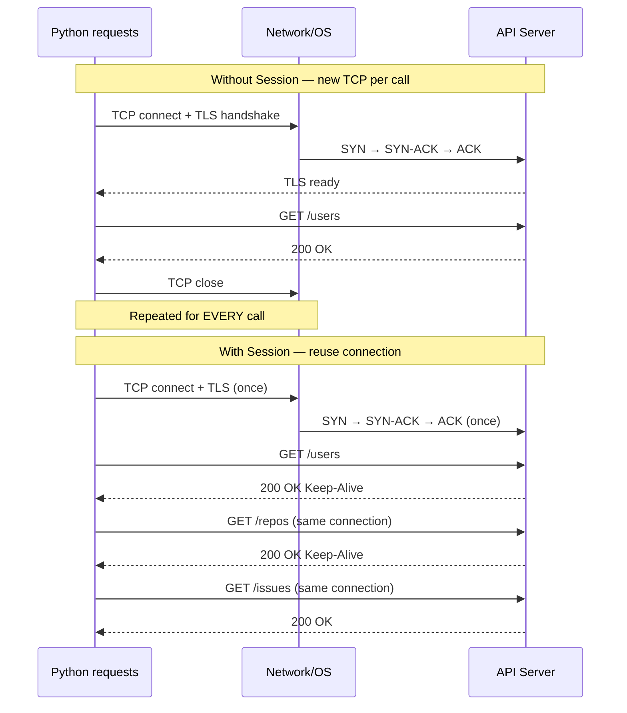
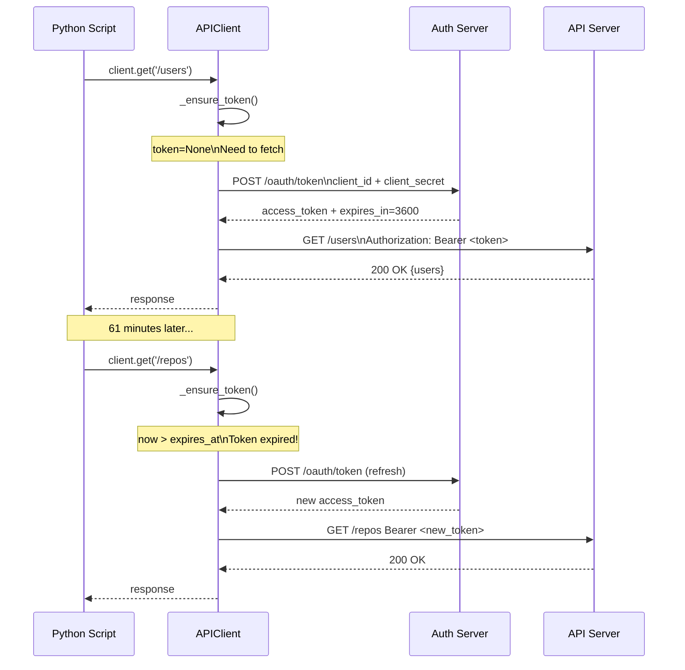
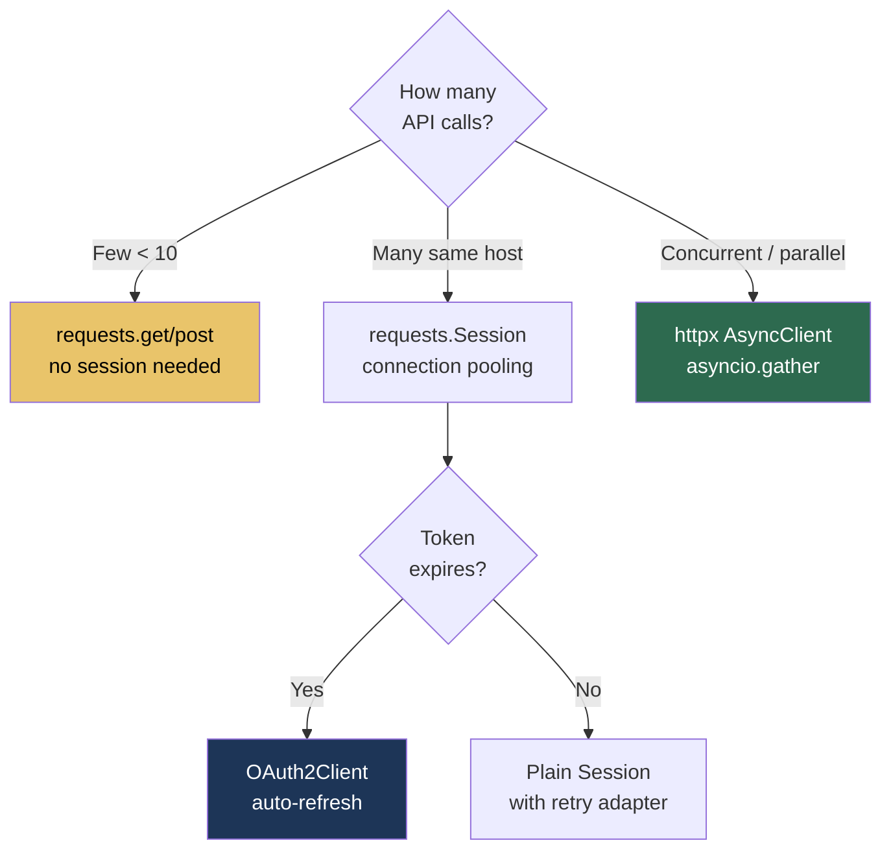

# 9.3.3 Advanced HTTP: Sessions, OAuth2, httpx, and API Design Patterns

**Backlinks:** [9.3.1 — Logging and Exception Handling](./9.3.1_Logging_and_Exception_Handling.md) | [9.3.2 — HTTP Requests and REST APIs](./9.3.2_HTTP_Requests_and_REST_APIs.md) | [9.3.4 — Subchapter Review](./9.3.4_Subchapter_Review.md) | [Module 2 — Networking](../../2-Networking/) (TCP connections, TLS, keep-alive) | [Module 8 — CI/CD](../../8-CICD/) (GitHub OIDC auth — token acquisition covered here)

**Next note:** [9.3.4 — Subchapter 9.3 Review](./9.3.4_Subchapter_Review.md)

---

## Why This Note Exists

Note 9.3.2 covered `requests` basics. This note covers the advanced topics used in production API clients:

1. **Session internals** — connection pooling, keep-alive, SSL context
2. **Auto-refreshing token clients** — OAuth2 client credentials flow
3. **Pagination** — handling APIs that return data in pages
4. **`httpx`** — the modern replacement for `requests` with async support
5. **Async HTTP (intro)** — `asyncio` + `httpx` for concurrent API calls
6. **API client design patterns** — how to build a reusable client class

---

## Part 1: `requests.Session` Deep Dive

### Connection Pooling and Keep-Alive



> **Why this matters for platform scripts:** A script that calls the GitHub API 100 times without a `Session` does 100 TCP handshakes + 100 TLS handshakes. With a `Session`, it does 1 of each. For 100 calls, this can reduce latency from 30+ seconds to under 5 seconds.

```python
import requests
from requests.adapters import HTTPAdapter
from urllib3.util.retry import Retry
from urllib3.util.ssl_ import create_urllib3_context

# Custom session with all settings
def create_production_session(
    base_url: str,
    token:    str,
    max_retries: int = 3,
    pool_connections: int = 10,   # number of host connection pools
    pool_maxsize: int = 10,       # max connections per pool
    timeout: int = 30
) -> requests.Session:
    """Create a production-ready requests session"""

    # Configure retry strategy
    retry = Retry(
        total              = max_retries,
        backoff_factor     = 0.5,          # 0.5s, 1s, 2s
        status_forcelist   = {429, 500, 502, 503, 504},
        allowed_methods    = ['GET', 'POST', 'PUT', 'PATCH', 'DELETE'],
        respect_retry_after_header = True   # use Retry-After for 429
    )

    # Create adapter with connection pool size
    adapter = HTTPAdapter(
        max_retries     = retry,
        pool_connections= pool_connections,
        pool_maxsize    = pool_maxsize
    )

    session = requests.Session()
    session.mount('https://', adapter)
    session.mount('http://',  adapter)

    # Default headers for all requests
    session.headers.update({
        'Authorization': f'Bearer {token}',
        'Accept':        'application/json',
        'User-Agent':    'PlatformScript/1.0',
    })

    # Default timeout (applied via a session hook)
    session.request = lambda method, url, **kwargs: requests.Session.request(
        session, method, url, timeout=kwargs.pop('timeout', timeout), **kwargs
    )

    return session
```

### SSL Configuration

```python
import requests

# Verify with custom CA bundle (internal/corporate CA)
session = requests.Session()
session.verify = '/path/to/internal-ca-bundle.crt'

# Disable verification (⚠️ development only!)
session.verify = False
import urllib3
urllib3.disable_warnings(urllib3.exceptions.InsecureRequestWarning)

# Client certificate (mutual TLS)
session.cert = ('/path/to/client.crt', '/path/to/client.key')
```

---

## Part 2: Auto-Refreshing Token Client (OAuth2 Client Credentials)

> **The problem:** OAuth2 access tokens expire (usually after 1 hour). A long-running script that acquires a token at startup will fail after 60 minutes. The solution is an API client that automatically detects token expiry and refreshes silently.



```python
import requests
import time
import logging
import os
from datetime import datetime, timedelta
from typing import Optional

logger = logging.getLogger(__name__)

class OAuth2Client:
    """
    HTTP client with automatic OAuth2 client_credentials token refresh.
    Refresh happens 60 seconds before expiry to prevent mid-request failures.
    """

    def __init__(
        self,
        base_url:      str,
        token_url:     str,
        client_id:     str,
        client_secret: str,
        scope:         str = ''
    ):
        self.base_url      = base_url.rstrip('/')
        self.token_url     = token_url
        self.client_id     = client_id
        self.client_secret = client_secret
        self.scope         = scope

        self._token:      Optional[str]      = None
        self._expires_at: Optional[datetime] = None

        self.session = requests.Session()
        self.session.headers['Accept'] = 'application/json'

    def _is_token_valid(self) -> bool:
        """Return True if current token is valid with 60-second buffer"""
        if not self._token or not self._expires_at:
            return False
        return datetime.now() < (self._expires_at - timedelta(seconds=60))

    def _fetch_token(self) -> None:
        """Acquire new token via client_credentials grant"""
        logger.debug("Fetching new OAuth2 token")
        response = requests.post(
            self.token_url,
            data={
                'grant_type':    'client_credentials',
                'client_id':     self.client_id,
                'client_secret': self.client_secret,
                'scope':         self.scope
            }
        )
        response.raise_for_status()
        data = response.json()

        self._token      = data['access_token']
        expires_in       = int(data.get('expires_in', 3600))
        self._expires_at = datetime.now() + timedelta(seconds=expires_in)
        self.session.headers['Authorization'] = f'Bearer {self._token}'
        logger.debug(f"Token acquired, valid until {self._expires_at:%H:%M:%S}")

    def _ensure_token(self) -> None:
        """Refresh token if needed (thread-safe in single-threaded use)"""
        if not self._is_token_valid():
            self._fetch_token()

    def get(self, path: str, **kwargs) -> requests.Response:
        self._ensure_token()
        r = self.session.get(f'{self.base_url}/{path.lstrip("/")}', **kwargs)
        # Handle 401 (token revoked mid-session)
        if r.status_code == 401:
            logger.warning("Got 401 — refreshing token and retrying")
            self._token = None
            self._ensure_token()
            r = self.session.get(f'{self.base_url}/{path.lstrip("/")}', **kwargs)
        return r

    def post(self, path: str, **kwargs) -> requests.Response:
        self._ensure_token()
        return self.session.post(f'{self.base_url}/{path.lstrip("/")}', **kwargs)

# Usage
client = OAuth2Client(
    base_url      = 'https://api.example.com',
    token_url     = 'https://auth.example.com/oauth/token',
    client_id     = os.environ['CLIENT_ID'],
    client_secret = os.environ['CLIENT_SECRET'],
    scope         = 'read:users write:deployments'
)

# Token fetched automatically
response = client.get('/users')
data     = response.json()

# Token refreshes automatically when expired
for user_id in range(1000):
    response = client.get(f'/users/{user_id}')  # transparent refresh
```

---

## Part 3: Pagination — Handling Paginated APIs

> **Most APIs return results in pages.** GitHub limits to 100 items per page. Kubernetes limits to 500 items. A script that only calls the API once gets incomplete data.

### Link Header Pagination (GitHub pattern)

```python
import requests
from typing import Generator

def get_all_pages(session: requests.Session, url: str, **kwargs) -> Generator[list, None, None]:
    """Iterate over all pages using Link header (GitHub/GitLab pattern)"""
    while url:
        response = session.get(url, **kwargs)
        response.raise_for_status()
        yield response.json()   # yield current page

        # GitHub sends: Link: <https://api.github.com/...?page=2>; rel="next", ...
        links = response.links
        url   = links.get('next', {}).get('url')   # None when no next page

# Collect all items
def get_all_repos(session: requests.Session, org: str) -> list[dict]:
    all_repos = []
    for page in get_all_pages(session, f'https://api.github.com/orgs/{org}/repos',
                               params={'per_page': 100}):
        all_repos.extend(page)
    return all_repos
```

### Cursor-Based Pagination (Kubernetes `continue` token)

```python
import requests, json

def get_all_pods(session: requests.Session, namespace: str = '') -> list[dict]:
    """Iterate Kubernetes pod list using continue token"""
    base_url  = f'https://kubernetes.default.svc/api/v1'
    path      = f'/namespaces/{namespace}/pods' if namespace else '/pods'
    all_items = []
    params    = {'limit': 500}

    while True:
        response = session.get(f'{base_url}{path}', params=params)
        response.raise_for_status()
        data = response.json()
        all_items.extend(data.get('items', []))

        # Kubernetes uses 'continue' token for next page
        continue_token = data.get('metadata', {}).get('continue')
        if not continue_token:
            break
        params['continue'] = continue_token

    return all_items
```

### Offset Pagination (generic)

```python
import requests

def get_all_with_offset(
    session: requests.Session,
    url: str,
    page_size: int = 100
) -> list[dict]:
    """Generic offset pagination"""
    all_items = []
    page      = 1

    while True:
        response = session.get(url, params={'page': page, 'per_page': page_size})
        response.raise_for_status()
        items = response.json()

        if not items:   # empty page = end of data
            break

        all_items.extend(items)

        if len(items) < page_size:   # partial page = last page
            break

        page += 1

    return all_items
```

---

## Part 4: `httpx` — The Modern `requests`

> **What is `httpx`?** `httpx` is a modern HTTP client built on top of `httpcore`. It has a `requests`-compatible API but also supports **async/await** for concurrent requests. Install: `pip install httpx`.

### `httpx` for Synchronous Use (drop-in requests replacement)

```python
import httpx

# Almost identical to requests
with httpx.Client() as client:
    r = client.get('https://api.github.com/users/octocat')
    print(r.status_code)
    print(r.json())

# Key differences from requests:
# 1. No streaming response .iter_content() — use r.iter_bytes() instead
# 2. timeout is a Timeout object, not just seconds
# 3. http2=True supports HTTP/2 (requests doesn't)
client = httpx.Client(
    timeout  = httpx.Timeout(10.0, connect=5.0),  # 10s total, 5s connect
    http2    = True,            # enable HTTP/2
    headers  = {'Authorization': f'Bearer {token}'}
)
```

### `httpx` Async — Concurrent API Calls

> **Why async?** If you need to call 100 API endpoints, doing them sequentially takes 100 × response_time. With async, you fire all 100 requests at once and wait for all to return — total time ≈ slowest individual request.

```python
import asyncio
import httpx
from typing import Any

async def fetch_one(client: httpx.AsyncClient, url: str) -> dict:
    """Fetch a single URL asynchronously"""
    response = await client.get(url)
    response.raise_for_status()
    return response.json()

async def fetch_all_parallel(urls: list[str], token: str) -> list[dict | None]:
    """Fetch all URLs concurrently"""
    async with httpx.AsyncClient(
        headers={'Authorization': f'Bearer {token}'},
        timeout=30
    ) as client:
        tasks   = [fetch_one(client, url) for url in urls]
        results = await asyncio.gather(*tasks, return_exceptions=True)

    # Separate successes from errors
    output = []
    for url, result in zip(urls, results):
        if isinstance(result, Exception):
            print(f"Failed {url}: {result}")
            output.append(None)
        else:
            output.append(result)

    return output

# Usage
pod_names = ['pod-1', 'pod-2', 'pod-3', 'pod-4', 'pod-5']
urls      = [f'https://k8s-api/api/v1/namespaces/prod/pods/{n}' for n in pod_names]

# Run the async function from synchronous code
results = asyncio.run(fetch_all_parallel(urls, os.environ['K8S_TOKEN']))
# All 5 requests fired simultaneously — ~1s instead of ~5s
```

### When to Use `httpx` vs `requests`

| Situation | Use |
|-----------|-----|
| Simple synchronous scripts | `requests` (simpler, more tutorials) |
| Many parallel API calls | `httpx` async |
| Need HTTP/2 support | `httpx` |
| Existing codebase uses requests | `requests` |
| New greenfield projects | `httpx` (better future) |
| FastAPI / Starlette integration | `httpx` (same ecosystem) |

---

## Part 5: API Client Design Patterns

### Pattern 1 — Base Client Class

```python
import requests
import logging
import os
from typing import Any

class BaseAPIClient:
    """
    Reusable base class for REST API clients.
    Handles: auth, session, base URL, error logging, rate limit awareness.
    """

    def __init__(self, base_url: str, token: str | None = None):
        self.base_url = base_url.rstrip('/')
        self.logger   = logging.getLogger(self.__class__.__name__)
        self.session  = requests.Session()

        if token:
            self.session.headers['Authorization'] = f'Bearer {token}'

    def _url(self, path: str) -> str:
        return f"{self.base_url}/{path.lstrip('/')}"

    def _request(self, method: str, path: str, **kwargs) -> requests.Response:
        url = self._url(path)
        self.logger.debug(f"{method.upper()} {url}")

        r = self.session.request(method, url, timeout=30, **kwargs)

        # Log rate limit info if available
        remaining = r.headers.get('X-RateLimit-Remaining')
        if remaining and int(remaining) < 10:
            self.logger.warning(f"Rate limit low: {remaining} requests remaining")

        r.raise_for_status()
        return r

    def get(self, path: str, **kwargs) -> Any:
        return self._request('GET', path, **kwargs).json()

    def post(self, path: str, **kwargs) -> Any:
        return self._request('POST', path, **kwargs).json()

    def put(self, path: str, **kwargs) -> Any:
        return self._request('PUT', path, **kwargs).json()

    def delete(self, path: str) -> None:
        r = self._request('DELETE', path)
        if r.status_code != 204:
            r.raise_for_status()

# Concrete client extending base
class PrometheusClient(BaseAPIClient):
    def __init__(self, url: str = 'http://prometheus:9090'):
        super().__init__(url)

    def query(self, promql: str) -> list:
        data = self.get('/api/v1/query', params={'query': promql})
        if data['status'] != 'success':
            raise RuntimeError(f"Query failed: {data.get('error')}")
        return data['data']['result']

class SlackClient(BaseAPIClient):
    def __init__(self, token: str | None = None):
        super().__init__('https://slack.com/api', token or os.environ.get('SLACK_BOT_TOKEN'))

    def post_message(self, channel: str, text: str) -> dict:
        return self.post('/chat.postMessage',
                         json={'channel': channel, 'text': text})

    def send_alert(self, channel: str, title: str, message: str, severity: str = 'warning'):
        emoji = {'info': 'ℹ️', 'warning': '⚠️', 'critical': '🚨'}.get(severity, '📢')
        self.post_message(channel, f"{emoji} *{title}*\n{message}")
```

### Pattern 2 — Health Check Aggregator

```python
import requests
import time
import logging
from dataclasses import dataclass, field
from typing import Callable

@dataclass
class ServiceCheck:
    name:    str
    url:     str
    timeout: int = 10
    headers: dict = field(default_factory=dict)

@dataclass
class HealthResult:
    name:         str
    healthy:      bool
    status_code:  int | None = None
    response_ms:  float = 0.0
    error:        str | None = None

def check_service(svc: ServiceCheck) -> HealthResult:
    start = time.time()
    try:
        r = requests.get(svc.url, headers=svc.headers, timeout=svc.timeout)
        ms = (time.time() - start) * 1000
        return HealthResult(svc.name, r.ok, r.status_code, ms)
    except requests.exceptions.Timeout:
        return HealthResult(svc.name, False, None, svc.timeout * 1000, "Timeout")
    except Exception as e:
        return HealthResult(svc.name, False, None, 0, str(e))

def run_health_checks(services: list[ServiceCheck]) -> list[HealthResult]:
    results = [check_service(s) for s in services]
    healthy = sum(1 for r in results if r.healthy)
    print(f"\nHealth: {healthy}/{len(results)} services OK\n")
    for r in results:
        icon = '✅' if r.healthy else '❌'
        code = f"HTTP {r.status_code}" if r.status_code else (r.error or "unknown")
        print(f"  {icon} {r.name:<25} {code:<15} {r.response_ms:6.0f}ms")
    return results

# Usage
checks = [
    ServiceCheck('api-gateway',  'https://gateway.example.com/health'),
    ServiceCheck('prometheus',   'http://prometheus:9090/-/healthy'),
    ServiceCheck('grafana',      'http://grafana:3000/api/health'),
    ServiceCheck('alertmanager', 'http://alertmanager:9093/-/healthy'),
]
results = run_health_checks(checks)
```

---

## Summary

### HTTP Client Decision Tree



### Key Patterns Summary

| Pattern | When to Use | How |
|---------|-------------|-----|
| `requests.Session` | Multiple calls to same host | Shared TCP connection |
| `HTTPAdapter + Retry` | Production API clients | Auto-retry 5xx/429 |
| `OAuth2Client` | Token-based auth | Auto-refresh before expiry |
| Link header pagination | GitHub/GitLab APIs | Follow `rel="next"` |
| `httpx` async | Parallel calls to many endpoints | `asyncio.gather` |
| `BaseAPIClient` | Consistent client design | Extend per API |

---

**End of Subchapter 9.3**

You now have complete HTTP client knowledge: from basic `requests.get()` to async parallel calls, OAuth2 token refresh, pagination, and production client design patterns.

**Next:** [9.4.1 — Testing with pytest](../Subchapter_9.4/9.4.1_Testing_with_pytest.md) — where you write tests for all the functions built in 9.1–9.3.
