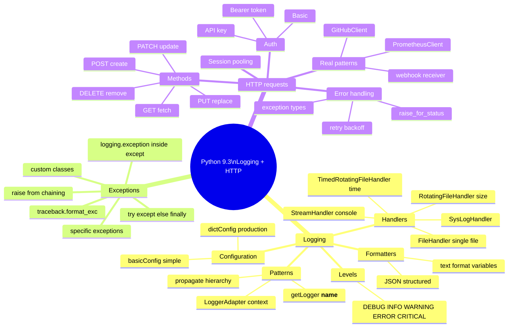

# 9.3.4 Subchapter 9.3 Review: Cheatsheet and Interview Prep

**Backlinks:** [9.3.1 — Logging and Exception Handling](./9.3.1_Logging_and_Exception_Handling.md) | [9.3.2 — HTTP Requests and REST APIs](./9.3.2_HTTP_Requests_and_REST_APIs.md) | [9.3.3 — Advanced HTTP: Sessions, OAuth2, httpx](./9.3.3_Advanced_HTTP_Sessions_and_OAuth2.md)

**Next note:** [9.4.1 — Testing with pytest](../Subchapter_9.4/9.4.1_Testing_with_pytest.md)

---

## Overview



---

## Cheatsheet

### Logging Setup

```python
import logging

# Minimal setup (one line)
logging.basicConfig(level=logging.INFO,
                    format='%(asctime)s - %(levelname)s - %(message)s')

# Named logger (best practice — use in every module)
logger = logging.getLogger(__name__)
logger.info("App started")

# Multiple handlers
logger = logging.getLogger('myapp')
logger.setLevel(logging.DEBUG)

console   = logging.StreamHandler()
file_h    = logging.FileHandler('/var/log/app.log')
formatter = logging.Formatter('%(asctime)s - %(name)s - %(levelname)s - %(message)s')

for h in [console, file_h]:
    h.setFormatter(formatter)
    logger.addHandler(h)
```

### Log Levels

| Level | Value | Code | When |
|-------|-------|------|------|
| DEBUG | 10 | `logger.debug()` | Dev troubleshooting |
| INFO | 20 | `logger.info()` | Normal milestones |
| WARNING | 30 | `logger.warning()` | Unexpected, recoverable |
| ERROR | 40 | `logger.error()` | Failed operation |
| CRITICAL | 50 | `logger.critical()` | App cannot continue |

### Rotating Handlers

```python
from logging.handlers import RotatingFileHandler, TimedRotatingFileHandler

# Size-based
RotatingFileHandler('app.log', maxBytes=5*1024*1024, backupCount=3)

# Time-based (daily)
TimedRotatingFileHandler('app.log', when='midnight', backupCount=30)
```

### JSON Structured Logging

```python
import logging, json
from datetime import datetime, timezone

class JSONFormatter(logging.Formatter):
    def format(self, record):
        return json.dumps({
            'timestamp': datetime.now(timezone.utc).isoformat(),
            'level':     record.levelname,
            'logger':    record.name,
            'message':   record.getMessage(),
            'module':    record.module,
            'line':      record.lineno,
        })

h = logging.StreamHandler()
h.setFormatter(JSONFormatter())
logging.getLogger('myapp').addHandler(h)
```

### Exception Handling

```python
try:
    risky_code()
except FileNotFoundError:
    logger.error("File missing")
except PermissionError as e:
    logger.error(f"Permission: {e}")
except Exception as e:
    logger.exception(f"Unexpected: {e}")   # includes traceback
    raise                                   # re-raise if unrecoverable
else:
    logger.info("Success")                 # only if no exception
finally:
    cleanup()                              # always runs
```

### Custom Exceptions

```python
class PlatformError(Exception):    pass
class ConfigError(PlatformError):  pass
class DeployError(PlatformError):  pass

# Raise with chaining
try:
    yaml.safe_load(f)
except yaml.YAMLError as e:
    raise ConfigError("Invalid config") from e
```

### requests — HTTP GET

```python
import requests

# Basic
r = requests.get('https://api.example.com/data')

# With auth + params
r = requests.get(
    'https://api.example.com/data',
    params={'q': 'search'},
    headers={'Authorization': 'Bearer token'},
    timeout=10
)

# Error handling
try:
    r.raise_for_status()      # HTTPError for 4xx/5xx
    data = r.json()
except requests.exceptions.HTTPError as e:
    print(f"HTTP {e.response.status_code}")
except requests.exceptions.Timeout:
    print("Timed out")
except requests.exceptions.ConnectionError:
    print("Connection failed")
```

### requests — HTTP POST

```python
# JSON body (most common for REST APIs)
r = requests.post('https://api.example.com/items',
                  json={'name': 'item1', 'value': 42},
                  headers={'Authorization': 'Bearer token'})

# Form data
r = requests.post('https://example.com/login',
                  data={'username': 'alice', 'password': 'secret'})
```

### Session for Reuse

```python
import requests

session = requests.Session()
session.headers.update({'Authorization': 'Bearer token'})

# All calls share connection pool and headers
r1 = session.get('https://api.example.com/users')
r2 = session.get('https://api.example.com/posts')
```

### Retry Pattern

```python
import requests, time

def request_with_retry(method, url, max_retries=3, backoff=2, **kwargs):
    for attempt in range(1, max_retries + 1):
        try:
            r = requests.request(method, url, **kwargs)
            if r.ok or r.status_code not in (429, 500, 502, 503, 504):
                return r
            wait = float(r.headers.get('Retry-After', backoff ** attempt))
        except (requests.exceptions.Timeout, requests.exceptions.ConnectionError) as e:
            if attempt == max_retries: raise
            wait = backoff ** (attempt - 1)
        time.sleep(wait)
    raise RuntimeError("Max retries exceeded")
```

---

## Comparison Tables

### Logging Handlers

| Handler | Destination | When to Use |
|---------|-------------|-------------|
| `StreamHandler` | Console | Docker containers |
| `FileHandler` | Single file | Simple scripts |
| `RotatingFileHandler` | Rotating size | Long-running services |
| `TimedRotatingFileHandler` | Rotating daily | Scheduled jobs |
| `SysLogHandler` | `/dev/log` | Linux service integration |

### HTTP Methods

| Method | Use | Idempotent | Body |
|--------|-----|-----------|------|
| GET | Read | ✅ | No |
| POST | Create | ❌ | Yes |
| PUT | Full update | ✅ | Yes |
| PATCH | Partial update | ❌ | Yes |
| DELETE | Delete | ✅ | No |

### Exception Types

| Exception | Raised When |
|-----------|-------------|
| `Timeout` | Request exceeded timeout |
| `ConnectionError` | DNS, refused, unreachable |
| `HTTPError` | `raise_for_status()` on 4xx/5xx |
| `TooManyRedirects` | Redirect limit exceeded |
| `RequestException` | Base class — all requests errors |

---

## Bridge Concepts

| Concept | Explanation |
|---------|-------------|
| `logging.getLogger(__name__)` | Creates a logger named after the current module. Enables hierarchical logger control. |
| `logger.propagate` | If `True` (default), log records bubble up to parent loggers and root logger. Set `False` to prevent duplicate output. |
| `logging.exception()` | Must be called inside an `except` block. Logs at ERROR level and includes the full traceback automatically. |
| `logging.config.dictConfig()` | Configure entire logging system from a dict/YAML. The production-grade setup method. |
| `LoggerAdapter` | Wraps a logger and prepends extra fields to every message (e.g., request_id). |
| `traceback.format_exc()` | Returns the current exception traceback as a string. Same data as `logging.exception()` but as a string for custom use. |
| `requests.Session()` | Reuses TCP connections (pooling). Faster for multiple calls to the same host. Persists headers and auth. |
| `raise_for_status()` | Call after every response. Raises `HTTPError` if status is 4xx or 5xx. Best practice for all API calls. |
| `hmac.compare_digest()` | Constant-time string comparison. Used for webhook signature verification to prevent timing attacks. |
| `hmac.new(key, msg, digestmod)` | Create HMAC object. `key` must be bytes. `digestmod` must be specified (e.g., `hashlib.sha256`). |
| `Retry-After` header | HTTP header from rate-limited APIs (429) indicating seconds to wait before retrying. |
| `verify=False` in requests | Disables SSL certificate verification. ⚠️ Never use in production — vulnerable to MITM attacks. |
| `urllib3.util.retry.Retry` | Lower-level retry that handles connection-level failures, not just status codes. Attach via `HTTPAdapter`. |

---

## Topics Coverage Self-Check

| Topic | Found in Note |
|-------|---------------|
| Log levels (DEBUG → CRITICAL) | 9.3.1 |
| `basicConfig()` simple setup | 9.3.1 |
| Named loggers and `getLogger(__name__)` | 9.3.1 |
| Logger hierarchy and `propagate` | 9.3.1 |
| Multiple handlers (console + file) | 9.3.1 |
| `RotatingFileHandler` (size-based) | 9.3.1 |
| `TimedRotatingFileHandler` (time-based) | 9.3.1 |
| JSON structured logging | 9.3.1 |
| `dictConfig` for production setup | 9.3.1 |
| `LoggerAdapter` for context | 9.3.1 |
| `try/except/else/finally` | 9.3.1 |
| Catching specific exceptions | 9.3.1 |
| Custom exception classes | 9.3.1 |
| `raise X from Y` exception chaining | 9.3.1 |
| `logging.exception()` (inside except) | 9.3.1 |
| `traceback.format_exc()` | 9.3.1 |
| `requests` GET with params and headers | 9.3.2 |
| `requests` POST with `json=` | 9.3.2 |
| PUT, PATCH, DELETE | 9.3.2 |
| Bearer token, Basic, API key auth | 9.3.2 |
| `requests.Session()` for pooling | 9.3.2 |
| `raise_for_status()` | 9.3.2 |
| Response properties (`.json()`, `.text`, `.status_code`) | 9.3.2 |
| Exception types (Timeout, ConnectionError, HTTPError) | 9.3.2 |
| Retry with exponential backoff + Retry-After | 9.3.2 |
| `urllib3.util.retry.Retry` adapter | 9.3.2 |
| `curl` to `requests` translation | 9.3.2 |
| `hmac.new()` + `hmac.compare_digest()` for webhooks | 9.3.2 |

---

## Interview Questions

### Question 1

**Scenario:** An API returns 429 (Too Many Requests) with a `Retry-After: 60` header. A script calls this API 500 times. Write a rate-aware request function.

**Answer:**

```python
import requests
import time
import logging

logger = logging.getLogger(__name__)

def get_with_rate_limit(session: requests.Session, url: str, **kwargs) -> requests.Response:
    """Respect 429 Retry-After header automatically"""
    max_retries = 5
    for attempt in range(max_retries):
        r = session.get(url, **kwargs)
        if r.status_code == 429:
            wait = float(r.headers.get('Retry-After', 60))
            logger.warning(f"Rate limited on {url}. Waiting {wait:.0f}s ({attempt+1}/{max_retries})")
            time.sleep(wait)
            continue
        return r
    raise RuntimeError(f"Rate limit not cleared after {max_retries} attempts")

# Usage
session = requests.Session()
session.headers['Authorization'] = f'Bearer {token}'
for item_id in range(500):
    r = get_with_rate_limit(session, f'https://api.example.com/items/{item_id}', timeout=10)
    r.raise_for_status()
```

---

### Question 2

**Scenario:** A script checks multiple service health URLs. Some time out, some return non-200. Log each result at the appropriate level and continue.

**Answer:**

```python
import logging, requests, time
from requests.exceptions import Timeout, ConnectionError, HTTPError

logger = logging.getLogger(__name__)

def check_services(services: list[dict], timeout: int = 10) -> dict[str, bool]:
    results = {}
    for svc in services:
        name, url = svc['name'], svc['url']
        logger.info(f"Checking {name}...")
        try:
            start = time.time()
            r = requests.get(url, timeout=timeout)
            r.raise_for_status()
            elapsed = (time.time() - start) * 1000
            logger.info(f"✅ {name}: {r.status_code} ({elapsed:.0f}ms)")
            results[name] = True
        except Timeout:
            logger.warning(f"⏰ {name}: timed out after {timeout}s")
            results[name] = False
        except ConnectionError:
            logger.error(f"❌ {name}: connection refused / DNS failure")
            results[name] = False
        except HTTPError as e:
            logger.error(f"❌ {name}: HTTP {e.response.status_code}")
            results[name] = False
        except Exception as e:
            logger.exception(f"❌ {name}: unexpected error")
            results[name] = False
    return results

services = [
    {'name': 'api-gateway', 'url': 'https://gateway.example.com/health'},
    {'name': 'database',    'url': 'http://db.example.com:5432/health'},
    {'name': 'cache',       'url': 'http://redis.example.com:6379/ping'},
]
health = check_services(services)
print(f"\nHealth: {sum(health.values())}/{len(health)} healthy")
```

---

### Question 3

**Scenario:** A platform script needs to log structured JSON (for ELK/Datadog) in production but readable text in development. The format is chosen via env var `LOG_FORMAT=json|text`.

**Answer:**

```python
import logging, json, os
from datetime import datetime, timezone

class JSONFormatter(logging.Formatter):
    def format(self, record):
        return json.dumps({
            'ts':      datetime.now(timezone.utc).isoformat(),
            'level':   record.levelname,
            'msg':     record.getMessage(),
            'module':  record.module,
            'line':    record.lineno,
            **{k: v for k, v in getattr(record, '__dict__', {}).items()
               if k not in logging.LogRecord.__dict__}
        })

def setup_logging(level: int = logging.INFO) -> logging.Logger:
    fmt   = os.environ.get('LOG_FORMAT', 'text')
    name  = os.environ.get('SERVICE_NAME', 'app')

    handler = logging.StreamHandler()
    if fmt == 'json':
        handler.setFormatter(JSONFormatter())
    else:
        handler.setFormatter(logging.Formatter(
            '%(asctime)s %(levelname)-8s %(name)s: %(message)s',
            datefmt='%H:%M:%S'
        ))

    logger = logging.getLogger(name)
    logger.addHandler(handler)
    logger.setLevel(level)
    logger.propagate = False
    return logger
```

---

### Question 4

**Scenario:** Build a `GitHubClient` class with a `create_deployment_status` method that posts deployment status back to GitHub (used in CI pipelines). Include retry on 5xx.

**Answer:**

```python
import requests, os, time, logging
from requests.adapters import HTTPAdapter
from urllib3.util.retry import Retry

logger = logging.getLogger(__name__)

class GitHubClient:
    def __init__(self):
        token = os.environ.get('GITHUB_TOKEN')
        if not token:
            raise ValueError("GITHUB_TOKEN not set")

        retry = Retry(total=3, backoff_factor=1,
                      status_forcelist=[500, 502, 503, 504])
        adapter = HTTPAdapter(max_retries=retry)

        self.session = requests.Session()
        self.session.mount('https://', adapter)
        self.session.headers.update({
            'Authorization': f'token {token}',
            'Accept':        'application/vnd.github.v3+json',
        })

    def create_deployment_status(
        self, repo: str, deployment_id: int, state: str,
        description: str = '', environment_url: str = ''
    ) -> dict:
        """
        state: 'pending' | 'in_progress' | 'success' | 'failure' | 'error'
        """
        valid = {'pending', 'in_progress', 'success', 'failure', 'error'}
        if state not in valid:
            raise ValueError(f"state must be one of {valid}")

        r = self.session.post(
            f'https://api.github.com/repos/{repo}/deployments/{deployment_id}/statuses',
            json={'state': state, 'description': description,
                  'environment_url': environment_url},
            timeout=10
        )
        r.raise_for_status()
        logger.info(f"Posted deployment status: {state} for {repo}#{deployment_id}")
        return r.json()

# In CI pipeline (GitHub Actions)
client = GitHubClient()
client.create_deployment_status(
    'myorg/myrepo',
    int(os.environ['DEPLOYMENT_ID']),
    'success',
    description='Deployed v1.2.3',
    environment_url='https://myapp.example.com'
)
```

---

**End of Subchapter 9.3 Review**

You can now implement production logging, handle errors gracefully, and interact with REST APIs using `requests`. These skills are essential for building robust automation tools.

**Next:** [9.4.1 — Testing with pytest](../Subchapter_9.4/9.4.1_Testing_with_pytest.md)
