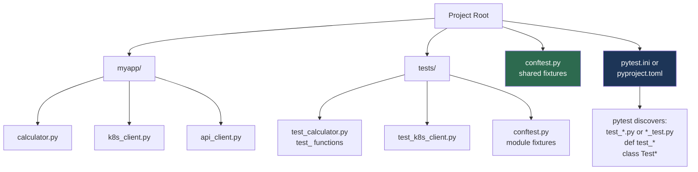
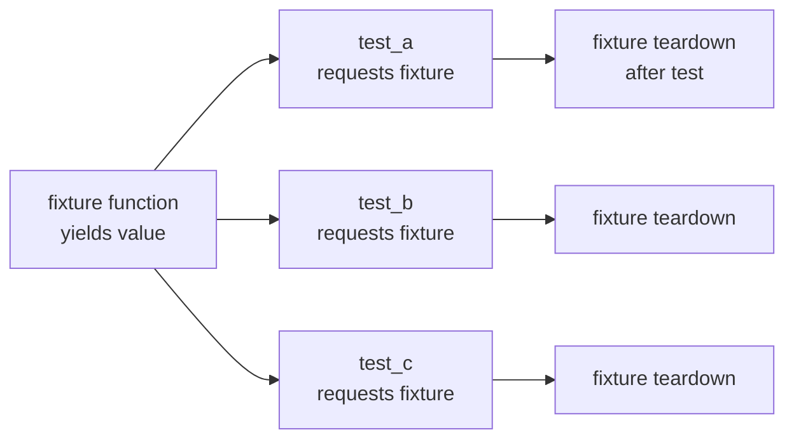

# 9.4.1 Testing with pytest: Building Reliable Automation

**Backlinks:** [9.3.3 — Advanced HTTP](../Subchapter_9.3/9.3.3_Advanced_HTTP_Sessions_and_OAuth2.md) | [Module 8 — CI/CD](../../8-CICD/) (pytest runs inside GitHub Actions `test` job; `--cov-fail-under` enforced in pipelines)

**Next note:** [9.4.2 — Production-Ready Patterns](./9.4.2_Production_Ready_Patterns.md)

---

## Why Testing Matters

Automation scripts that break in production are worse than no automation at all. Testing ensures:
- **Correctness** — functions do what they claim
- **Reliability** — changes don't break existing behavior
- **Confidence** — deploy with peace of mind
- **Documentation** — tests show how code should work

`pytest` is the industry standard for Python testing.

---

## Part 0: Test Structure and pytest Discovery



> **`conftest.py`:** This is the most important file pytest users forget about. It's automatically loaded by pytest — no import needed. Put shared fixtures here so all test files in the same directory (and subdirectories) can use them. You can have multiple `conftest.py` files at different levels.

### Installing pytest

```bash
pip install pytest pytest-cov pytest-mock

# Verify
pytest --version
```

### Project Layout

```
myproject/
├── myapp/
│   ├── __init__.py
│   ├── calculator.py
│   └── k8s_client.py
├── tests/
│   ├── conftest.py          ← shared fixtures (no import needed)
│   ├── test_calculator.py
│   └── test_k8s_client.py
├── pytest.ini               ← pytest configuration
└── requirements.txt
```

### `pytest.ini` or `pyproject.toml` Configuration

```ini
# pytest.ini
[pytest]
testpaths = tests
python_files = test_*.py
python_functions = test_*
python_classes = Test*
addopts = -v --tb=short
markers =
    slow: marks tests as slow (deselect with -m "not slow")
    integration: marks tests requiring external services
```

```toml
# pyproject.toml
[tool.pytest.ini_options]
testpaths = ["tests"]
addopts   = "-v --tb=short"
markers   = [
    "slow: marks tests as slow",
    "integration: requires external services",
]
```

---

## Part 1: Basic Tests

### Writing Your First Tests

```python
# myapp/calculator.py
def add(a, b):       return a + b
def subtract(a, b):  return a - b
def divide(a, b):
    if b == 0:
        raise ValueError("Cannot divide by zero")
    return a / b
```

```python
# tests/test_calculator.py
from myapp.calculator import add, subtract, divide

def test_add_positive():
    assert add(2, 3) == 5

def test_add_negative():
    assert add(-1, 1) == 0

def test_add_zero():
    assert add(0, 0) == 0

def test_subtract():
    assert subtract(10, 5) == 5

def test_divide():
    assert divide(10, 2) == 5.0
    assert divide(9, 3) == 3.0
```

```bash
# Run all tests
pytest

# ============= test session starts =============
# collected 5 items
# tests/test_calculator.py .....           [100%]
# ============= 5 passed in 0.01s ===========
```

### Assert Statements

```python
# Equality
assert result == 5
assert name == "Alice"

# Inequality
assert result != 0

# Boolean
assert is_valid is True
assert error is False

# None
assert value is None
assert value is not None

# Membership
assert 'pod-1' in pod_names
assert 'pod-404' not in pod_names

# Type
assert isinstance(result, dict)
assert isinstance(pods, list)

# String contains
assert "ERROR" in log_line

# Numeric approximation (floats!)
assert abs(0.1 + 0.2 - 0.3) < 0.001
import pytest
assert result == pytest.approx(0.3, rel=1e-6)   # better way
```

---

## Part 2: Testing Exceptions

```python
import pytest
from myapp.calculator import divide

def test_divide_by_zero():
    with pytest.raises(ValueError) as exc_info:
        divide(10, 0)

    assert "Cannot divide by zero" in str(exc_info.value)
    assert exc_info.type == ValueError

# Test exact message
def test_divide_by_zero_message():
    with pytest.raises(ValueError, match="Cannot divide by zero"):
        divide(10, 0)

# Test that exception is NOT raised
def test_divide_valid():
    result = divide(10, 2)   # no exception → test passes
    assert result == 5.0
```

---

## Part 3: Fixtures — Setup and Teardown

> **What are fixtures?** A fixture is a function marked with `@pytest.fixture` that provides a value to tests. It runs before the test (setup) and, if it uses `yield`, also runs after (teardown). Fixtures make tests DRY by extracting shared setup code.



### Basic Fixture

```python
import pytest
import tempfile, os

@pytest.fixture
def temp_log_file():
    """Create a temporary log file, clean up after test"""
    fd, path = tempfile.mkstemp(suffix='.log')
    os.write(fd, b"INFO: App started\nERROR: DB failed\nINFO: Retrying\n")
    os.close(fd)
    yield path      # ← test receives this value
    os.unlink(path) # ← runs AFTER test (cleanup)

def test_count_errors(temp_log_file):
    count = 0
    with open(temp_log_file) as f:
        for line in f:
            if 'ERROR' in line:
                count += 1
    assert count == 1
```

### Built-in Fixtures

```python
def test_with_tmp_path(tmp_path):
    """tmp_path — built-in fixture: unique temporary directory per test"""
    config_file = tmp_path / "config.yaml"
    config_file.write_text("server:\n  port: 8080\n")

    content = config_file.read_text()
    assert "port: 8080" in content

def test_with_tmp_path_factory(tmp_path_factory):
    """tmp_path_factory — for session/module scope"""
    temp_dir = tmp_path_factory.mktemp("data")
    (temp_dir / "test.txt").write_text("hello")
    assert (temp_dir / "test.txt").exists()
```

### `conftest.py` — Shared Fixtures

```python
# tests/conftest.py — automatically loaded, no import needed

import pytest
import yaml
from pathlib import Path

@pytest.fixture(scope='session')
def sample_config() -> dict:
    """Loaded once for the entire test session"""
    return {
        'server':   {'host': 'localhost', 'port': 8080},
        'database': {'host': 'localhost', 'port': 5432}
    }

@pytest.fixture
def config_file(tmp_path, sample_config) -> Path:
    """Create a YAML config file in a temp directory"""
    f = tmp_path / 'config.yaml'
    f.write_text(yaml.dump(sample_config))
    return f

@pytest.fixture
def env_vars(monkeypatch):
    """Set test environment variables"""
    monkeypatch.setenv('DB_HOST', 'test-db')
    monkeypatch.setenv('API_KEY', 'test-key')
    # No teardown needed — monkeypatch restores automatically
```

```python
# tests/test_config.py — uses fixtures from conftest.py automatically
def test_load_config(config_file):
    import yaml
    with open(config_file) as f:
        cfg = yaml.safe_load(f)
    assert cfg['server']['port'] == 8080

def test_db_env(env_vars):
    import os
    assert os.environ['DB_HOST'] == 'test-db'
```

### Fixture Scopes

| Scope | Created | Destroyed | When to Use |
|-------|---------|-----------|-------------|
| `function` (default) | Before each test | After each test | Most fixtures |
| `class` | Before first test in class | After last in class | Class-level shared state |
| `module` | Before first test in module | After last in module | Expensive setups per file |
| `session` | Before any test | After all tests | Very expensive (DB connections) |

---

## Part 4: `monkeypatch` — The Clean Way to Mock

> **`monkeypatch` vs `unittest.mock.patch`:** Both mock things in tests. `monkeypatch` is a pytest built-in fixture — cleaner syntax, no decorator needed, auto-restores after each test. It's the preferred approach for pytest users.

```python
# tests/conftest.py (or directly in test file)
def test_env_override(monkeypatch):
    """Replace env var during test only"""
    monkeypatch.setenv('DB_HOST', 'test-host')
    monkeypatch.setenv('DB_PORT', '9999')
    monkeypatch.delenv('OPTIONAL_VAR', raising=False)  # remove if exists

    import os
    assert os.environ['DB_HOST'] == 'test-host'
    # After test: env vars restored to original values automatically

def test_mock_open(monkeypatch, tmp_path):
    """Replace a function or attribute"""
    # Mock subprocess.run
    import subprocess

    def fake_run(cmd, **kwargs):
        return subprocess.CompletedProcess(cmd, 0, stdout="pod-1\npod-2\n", stderr="")

    monkeypatch.setattr(subprocess, 'run', fake_run)

    from myapp.k8s_client import get_pod_names
    pods = get_pod_names('default')
    assert 'pod-1' in pods

def test_mock_requests(monkeypatch):
    """Mock HTTP requests"""
    import requests
    from unittest.mock import Mock

    mock_response = Mock()
    mock_response.status_code = 200
    mock_response.ok = True
    mock_response.json.return_value = {'status': 'healthy'}

    monkeypatch.setattr(requests, 'get', lambda *a, **kw: mock_response)

    from myapp.health import check_endpoint
    result = check_endpoint('https://api.example.com/health')
    assert result['status'] == 'healthy'
```

---

## Part 5: `unittest.mock` — For More Control

> **When to use `patch` instead of `monkeypatch`:** Use `patch` when you need to verify HOW a function was called (argument checking, call counts). Use `monkeypatch` for simpler attribute replacement.

```python
from unittest.mock import Mock, patch, MagicMock
import pytest

# Mock as decorator — patches for the duration of the test
@patch('myapp.k8s_client.subprocess.run')
def test_get_pods_success(mock_run):
    import json
    mock_run.return_value = Mock(
        returncode=0,
        stdout=json.dumps({'items': [
            {'metadata': {'name': 'pod-1'}},
            {'metadata': {'name': 'pod-2'}}
        ]}),
        stderr=""
    )

    from myapp.k8s_client import get_pods
    pods = get_pods('default')

    assert pods == ['pod-1', 'pod-2']
    mock_run.assert_called_once()
    call_args = mock_run.call_args[0][0]  # first positional arg (the list)
    assert 'kubectl' in call_args

# Patch as context manager
def test_get_pods_failure():
    with patch('myapp.k8s_client.subprocess.run') as mock_run:
        mock_run.return_value = Mock(returncode=1, stdout="", stderr="connection refused")

        from myapp.k8s_client import get_pods
        with pytest.raises(Exception, match="kubectl failed"):
            get_pods('default')

# Mock environment variables with patch
@patch.dict('os.environ', {'DB_HOST': 'test-db', 'DB_PORT': '9999'})
def test_with_env():
    import os
    assert os.environ['DB_HOST'] == 'test-db'

# Mock open() for file reading
@patch('builtins.open', new_callable=unittest.mock.mock_open,
       read_data='{"server": {"port": 8080}}')
def test_read_config(mock_file):
    from myapp.config import load_json_config
    config = load_json_config('config.json')
    assert config['server']['port'] == 8080
    mock_file.assert_called_once_with('config.json', 'r')
```

---

## Part 6: `pytest-mock` — The Best of Both

> **`pytest-mock`** provides a `mocker` fixture that wraps `unittest.mock` but integrates cleanly with pytest. Install: `pip install pytest-mock`

```python
# With pytest-mock — cleaner than @patch decorator
def test_subprocess_call(mocker):
    """mocker is a fixture from pytest-mock"""
    import subprocess

    mock_run = mocker.patch('subprocess.run')
    mock_run.return_value = mocker.Mock(returncode=0, stdout="pod-1\n", stderr="")

    from myapp.k8s_client import get_pod_names
    result = get_pod_names()

    mock_run.assert_called_once_with(
        ['kubectl', 'get', 'pods', '-o', 'name'],
        capture_output=True, text=True
    )
    assert 'pod-1' in result

def test_requests_get(mocker):
    mock_get = mocker.patch('requests.get')
    mock_get.return_value.status_code = 200
    mock_get.return_value.ok = True
    mock_get.return_value.json.return_value = {'status': 'ok'}

    from myapp.health import check_service
    result = check_service('http://service/health')
    assert result is True
```

---

## Part 7: `@pytest.mark.parametrize` — Testing Multiple Inputs

```python
import pytest

@pytest.mark.parametrize("a, b, expected", [
    (1,   2,   3),
    (0,   0,   0),
    (-1,  1,   0),
    (100, 200, 300),
])
def test_add(a, b, expected):
    assert add(a, b) == expected
# Runs 4 separate tests with 4 sets of inputs

# With IDs (better test names in output)
@pytest.mark.parametrize("input, expected", [
    ("ERROR: db timeout",     'error'),
    ("WARNING: high disk",    'warning'),
    ("INFO: deploy started",  'info'),
    ("unknown message",       'unknown'),
], ids=["error-line", "warning-line", "info-line", "unknown"])
def test_parse_severity(input, expected):
    from myapp.log_parser import get_severity
    assert get_severity(input) == expected

# Test exception with parametrize
@pytest.mark.parametrize("port,error_type", [
    (-1,     ValueError),
    (99999,  ValueError),
    ("abc",  TypeError),
])
def test_invalid_port(port, error_type):
    with pytest.raises(error_type):
        validate_port(port)
```

---

## Part 8: Coverage and Markers

### Test Coverage

```bash
# Run with coverage
pytest --cov=myapp tests/

# Coverage report in HTML (open htmlcov/index.html)
pytest --cov=myapp --cov-report=html tests/

# Fail if coverage drops below threshold (add to CI pipeline!)
pytest --cov=myapp --cov-fail-under=80 tests/
# exit code 2 if coverage < 80%

# Show which lines are NOT covered
pytest --cov=myapp --cov-report=term-missing tests/
```

> **`--cov-fail-under=80` in CI:** Add this to your GitHub Actions test step (Module 8). If a developer adds code without tests, the coverage drops and the pipeline fails. This enforces the testing discipline automatically.

### Test Markers

```python
import pytest, sys

@pytest.mark.slow
def test_large_file_processing():
    """Takes 30+ seconds"""
    pass

@pytest.mark.integration
def test_real_api_call():
    """Requires real Kubernetes cluster"""
    pass

@pytest.mark.skip(reason="Feature not implemented yet")
def test_future_feature():
    pass

@pytest.mark.skipif(sys.platform == 'win32', reason="Linux only")
def test_linux_only():
    pass

@pytest.mark.xfail(reason="Known bug #123")
def test_known_bug():
    assert False  # expected to fail
```

```bash
# Run only fast tests (exclude slow)
pytest -m "not slow"

# Run only integration tests
pytest -m integration

# Run tests NOT requiring external services
pytest -m "not integration"
```

### Running Tests

```bash
# All tests
pytest

# Specific file
pytest tests/test_calculator.py

# Specific function
pytest tests/test_calculator.py::test_add_positive

# Keyword filter
pytest -k "add or subtract"

# Stop on first failure
pytest -x

# Show print() output
pytest -s

# Verbose
pytest -v

# Run only failed tests from last run
pytest --lf

# Run new tests + failed tests first
pytest --ff
```

---

## Part 9: Practical — Testing a Kubernetes Client

```python
# myapp/k8s_client.py
import subprocess, json

def get_pods(namespace='default') -> list[str]:
    result = subprocess.run(
        ['kubectl', 'get', 'pods', '-n', namespace, '-o', 'json'],
        capture_output=True, text=True
    )
    if result.returncode != 0:
        raise RuntimeError(f"kubectl failed: {result.stderr}")
    data = json.loads(result.stdout)
    return [item['metadata']['name'] for item in data.get('items', [])]
```

```python
# tests/conftest.py
import pytest

@pytest.fixture
def kubectl_pods_json():
    """Sample kubectl get pods -o json output"""
    return {
        'items': [
            {'metadata': {'name': 'web-abc123',  'namespace': 'default'},
             'status':   {'phase': 'Running'}},
            {'metadata': {'name': 'worker-def456', 'namespace': 'default'},
             'status':   {'phase': 'Running'}},
        ]
    }
```

```python
# tests/test_k8s_client.py
import json, pytest
from unittest.mock import patch, Mock
from myapp.k8s_client import get_pods

def test_get_pods_success(kubectl_pods_json):
    mock_result = Mock(returncode=0,
                       stdout=json.dumps(kubectl_pods_json),
                       stderr="")
    with patch('subprocess.run', return_value=mock_result):
        pods = get_pods('default')

    assert len(pods) == 2
    assert 'web-abc123' in pods
    assert 'worker-def456' in pods

def test_get_pods_empty():
    mock_result = Mock(returncode=0, stdout=json.dumps({'items': []}), stderr="")
    with patch('subprocess.run', return_value=mock_result):
        pods = get_pods('default')
    assert pods == []

def test_get_pods_kubectl_failure():
    mock_result = Mock(returncode=1, stdout="", stderr="connection refused")
    with patch('subprocess.run', return_value=mock_result):
        with pytest.raises(RuntimeError, match="kubectl failed"):
            get_pods('default')

@pytest.mark.parametrize("namespace", ['default', 'production', 'kube-system'])
def test_get_pods_namespace(kubectl_pods_json, namespace):
    mock_result = Mock(returncode=0, stdout=json.dumps(kubectl_pods_json), stderr="")
    with patch('subprocess.run', return_value=mock_result) as mock_run:
        get_pods(namespace)
        call_args = mock_run.call_args[0][0]
        assert '-n' in call_args
        assert namespace in call_args
```

---

## Summary Tables

### pytest Key Commands

| Command | Purpose |
|---------|---------|
| `pytest` | Run all tests |
| `pytest -v` | Verbose output |
| `pytest -x` | Stop on first failure |
| `pytest -k "name"` | Filter by name |
| `pytest -m "marker"` | Filter by marker |
| `pytest -s` | Show print() output |
| `pytest --lf` | Only last failed |
| `pytest --cov=src` | Coverage report |
| `pytest --cov-fail-under=80` | Fail if < 80% coverage |

### Fixture Scopes

| Scope | Created | Torn down | Use for |
|-------|---------|-----------|---------|
| `function` | Each test | Each test | Most fixtures |
| `class` | Each class | Each class | Class state |
| `module` | Each file | Each file | DB connections |
| `session` | Once | Once | Very expensive resources |

### Mocking Options

| Tool | How | When |
|------|-----|------|
| `monkeypatch.setattr()` | Replace function/attr | Simple mocking |
| `monkeypatch.setenv()` | Set env var | Env-based config |
| `@patch('module.func')` | Patch by string path | Verify call args |
| `mocker.patch()` | pytest-mock fixture | Best of both |
| `mock_open` | Mock file reads | File-based code |

---

**Next note (9.4.2)** covers **Production-Ready Patterns** — CLI script structure, configuration management, retry decorators, and graceful shutdown.
