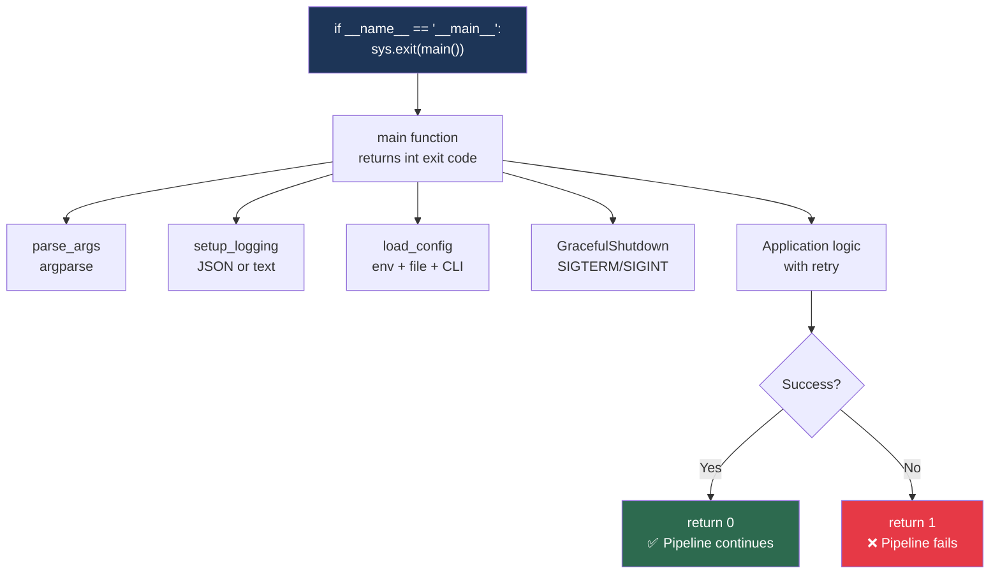
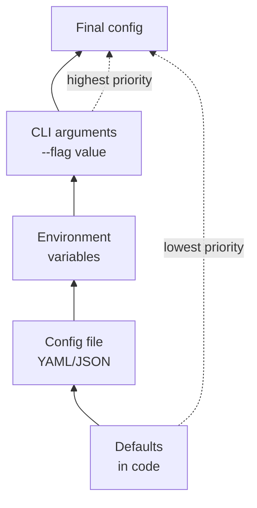
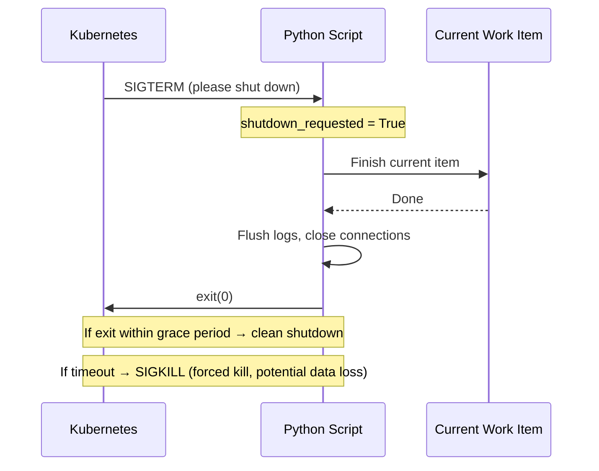

# 9.4.2 Production-Ready Patterns: Writing Robust Automation

**Backlinks:** [9.4.1 — Testing with pytest](./9.4.1_Testing_with_pytest.md) | [9.3.1 — Logging](../Subchapter_9.3/9.3.1_Logging_and_Exception_Handling.md) | [9.2.2 — argparse, env vars](../Subchapter_9.2/9.2.2_Arguments_Environment_and_Path_Handling.md) | [Module 5 — Kubernetes](../../5-Kubernetes/) (SIGTERM in K8s pod lifecycle — why graceful shutdown matters)

**Next note:** [9.4.3 — Complete Python Cheatsheet and Grand Final](./9.4.3_Complete_Python_Cheatsheet_and_Grand_Final.md)

---

## Why Production-Ready Matters

> **A script that works on your laptop but fails in production is worse than no script at all.** Production code running in containers, CI pipelines, and cron jobs must handle: different environments, network failures, signal handling (Kubernetes sends SIGTERM before killing a pod), and structured observability.

This note brings together everything from Module 9 into production-grade patterns.

---

## Part 0: The Production Script Anatomy



> **`if __name__ == "__main__": sys.exit(main())`:** `__name__` equals `"__main__"` only when the file is run directly, not when imported. This guard allows your script to be imported as a module by tests without executing side effects. `sys.exit(main())` passes the integer return code from `main()` to the OS — this is how CI/CD pipelines know if a step succeeded (`0`) or failed (`1+`).

---

## Part 1: CLI Script Structure

### Standard Template

```python
#!/usr/bin/env python3
"""
deploy.py — Production deployment script

Usage:
    python deploy.py --env prod --image myapp:v1.2.3
    python deploy.py --dry-run --verbose
"""

import argparse
import logging
import sys
import os
from pathlib import Path

# ─── Constants ───────────────────────────────────────────────────────────────

VERSION = "1.0.0"

DEFAULTS = {
    'log_level':   'INFO',
    'namespace':   'default',
    'retry_count': 3,
    'timeout':     300
}

# ─── Argument Parsing ────────────────────────────────────────────────────────

def parse_args() -> argparse.Namespace:
    parser = argparse.ArgumentParser(
        description='Production Deployment Script',
        formatter_class=argparse.ArgumentDefaultsHelpFormatter
    )
    parser.add_argument('--env', choices=['dev', 'staging', 'prod'], required=True)
    parser.add_argument('--image')
    parser.add_argument('-n', '--namespace', default=DEFAULTS['namespace'])
    parser.add_argument('-v', '--verbose', action='store_true')
    parser.add_argument('--dry-run', action='store_true')
    parser.add_argument('--version', action='version', version=f'%(prog)s {VERSION}')
    return parser.parse_args()

# ─── Logging ─────────────────────────────────────────────────────────────────

def setup_logging(verbose: bool = False) -> logging.Logger:
    level = logging.DEBUG if verbose else logging.INFO
    logging.basicConfig(level=level,
                        format='%(asctime)s - %(name)s - %(levelname)s - %(message)s')
    return logging.getLogger(__name__)

# ─── Configuration ────────────────────────────────────────────────────────────

def load_config(args: argparse.Namespace) -> dict:
    config = DEFAULTS.copy()
    config['env']       = args.env
    config['namespace'] = args.namespace
    config['dry_run']   = args.dry_run
    config['image']     = getattr(args, 'image', None)

    # Override with environment variables
    config['log_level']   = os.environ.get('LOG_LEVEL',   config['log_level'])
    config['retry_count'] = int(os.environ.get('RETRY_COUNT', str(config['retry_count'])))
    return config

# ─── Business Logic ───────────────────────────────────────────────────────────

def run_application(config: dict, logger: logging.Logger) -> bool:
    """Main application logic — returns True on success"""
    logger.info(f"Starting deployment to {config['env']}/{config['namespace']}")

    if config['dry_run']:
        logger.info("[DRY RUN] Would deploy here — no changes made")
        return True

    # ... actual work ...
    return True

# ─── Entry Point ──────────────────────────────────────────────────────────────

def main() -> int:
    args   = parse_args()
    logger = setup_logging(args.verbose)
    config = load_config(args)

    logger.info(f"Script started (env={config['env']}, dry_run={config['dry_run']})")

    try:
        success = run_application(config, logger)
        if success:
            logger.info("✅ Script completed successfully")
            return 0
        else:
            logger.error("❌ Script failed")
            return 1

    except KeyboardInterrupt:
        logger.warning("Interrupted by user (Ctrl+C)")
        return 130   # standard exit code for SIGINT
    except Exception as e:
        logger.exception(f"Unhandled exception: {e}")
        return 1

if __name__ == "__main__":
    sys.exit(main())
```

---

## Part 2: Configuration Management

### Configuration Hierarchy



```python
import os
import yaml
from pathlib import Path

class Config:
    """
    Configuration with priority: defaults → file → env vars → CLI args
    Environment prefix: MYAPP_ (e.g., MYAPP_SERVER__PORT)
    Double underscore __ = nested key separator
    """

    DEFAULTS = {
        'server':   {'host': '0.0.0.0', 'port': 8080, 'workers': 4},
        'database': {'host': 'localhost', 'port': 5432, 'name': 'myapp'},
        'logging':  {'level': 'INFO', 'format': 'text'},
        'retry':    {'max_attempts': 3, 'backoff': 2}
    }

    def __init__(self, config_path: str | None = None):
        self._cfg = self._deep_copy(self.DEFAULTS)
        if config_path:
            self._load_file(config_path)
        self._load_env('MYAPP_')

    def _deep_copy(self, d: dict) -> dict:
        import copy
        return copy.deepcopy(d)

    def _load_file(self, path: str) -> None:
        p = Path(path)
        if not p.exists():
            raise FileNotFoundError(f"Config file not found: {path}")
        with open(p) as f:
            file_data = yaml.safe_load(f)
        if file_data:
            self._deep_update(self._cfg, file_data)

    def _load_env(self, prefix: str) -> None:
        """MYAPP_SERVER__PORT=9090 → config['server']['port'] = 9090"""
        for key, value in os.environ.items():
            if not key.startswith(prefix):
                continue
            parts = key[len(prefix):].lower().split('__')
            target = self._cfg
            for part in parts[:-1]:
                target = target.setdefault(part, {})
            target[parts[-1]] = self._convert(value)

    def _convert(self, value: str) -> int | bool | str:
        if value.lower() in ('true', 'yes', '1'):  return True
        if value.lower() in ('false', 'no', '0'):  return False
        try:
            return int(value)
        except ValueError:
            return value

    def _deep_update(self, base: dict, update: dict) -> None:
        for key, value in update.items():
            if isinstance(value, dict) and key in base and isinstance(base[key], dict):
                self._deep_update(base[key], value)
            else:
                base[key] = value

    def get(self, path: str, default=None):
        """Get by dot-notation path: config.get('server.port')"""
        node = self._cfg
        for key in path.split('.'):
            if not isinstance(node, dict):
                return default
            node = node.get(key)
            if node is None:
                return default
        return node

# Usage
# MYAPP_SERVER__PORT=9090 python script.py
config = Config('/etc/myapp/config.yaml')
print(f"Server: {config.get('server.host')}:{config.get('server.port')}")
```

---

## Part 3: Retry Patterns

### Retry Decorator

```python
import time
import logging
from functools import wraps
from typing import Callable, Type

logger = logging.getLogger(__name__)

def retry(
    max_attempts: int = 3,
    delay:        float = 1.0,
    backoff:      float = 2.0,
    exceptions:   tuple[Type[Exception], ...] = (Exception,)
):
    """
    Retry decorator with exponential backoff.

    Args:
        max_attempts: Total attempts (1 = no retry)
        delay:        Initial delay in seconds
        backoff:      Multiplier per retry (2 = double each time)
        exceptions:   Exception types to retry on
    """
    def decorator(func: Callable) -> Callable:
        @wraps(func)
        def wrapper(*args, **kwargs):
            current_delay = delay
            last_exc      = None

            for attempt in range(1, max_attempts + 1):
                try:
                    return func(*args, **kwargs)
                except exceptions as e:
                    last_exc = e
                    if attempt == max_attempts:
                        logger.error(f"{func.__name__} failed after {max_attempts} attempts: {e}")
                        raise

                    logger.warning(
                        f"{func.__name__} attempt {attempt}/{max_attempts} failed: {e}. "
                        f"Retrying in {current_delay:.1f}s..."
                    )
                    time.sleep(current_delay)
                    current_delay *= backoff

        return wrapper
    return decorator

# Usage — import requests for the example
import requests

@retry(max_attempts=5, delay=1.0, backoff=2.0,
       exceptions=(requests.RequestException, ConnectionError))
def fetch_data(url: str) -> dict:
    r = requests.get(url, timeout=10)
    r.raise_for_status()
    return r.json()
```

### Retry with Jitter (Prevent Thundering Herd)

```python
import random

def retry_with_jitter(max_attempts: int = 3, base_delay: float = 1.0, max_delay: float = 30.0):
    """Adds random jitter to prevent many processes retrying simultaneously"""
    def decorator(func):
        @wraps(func)
        def wrapper(*args, **kwargs):
            for attempt in range(1, max_attempts + 1):
                try:
                    return func(*args, **kwargs)
                except Exception as e:
                    if attempt == max_attempts:
                        raise
                    # Full jitter: uniform between 0 and exponential backoff
                    cap   = min(base_delay * (2 ** (attempt - 1)), max_delay)
                    sleep = random.uniform(0, cap)
                    logger.warning(f"Attempt {attempt} failed: {e}. Sleeping {sleep:.2f}s")
                    time.sleep(sleep)
        return wrapper
    return decorator
```

---

## Part 4: Graceful Shutdown — Handling SIGTERM

> **Why SIGTERM matters for Kubernetes:** When Kubernetes needs to restart or terminate a pod (rolling update, node drain, scale-down), it first sends SIGTERM to the container's PID 1. If the process doesn't exit cleanly within `terminationGracePeriodSeconds` (default 30s), it sends SIGKILL. A script that ignores SIGTERM will be force-killed, potentially mid-operation.



```python
import signal
import logging
import time

logger = logging.getLogger(__name__)

class GracefulShutdown:
    """
    Handle SIGTERM (Kubernetes pod termination) and SIGINT (Ctrl+C) cleanly.
    Sets shutdown_requested = True, then your main loop checks it.
    """

    def __init__(self):
        self.shutdown_requested = False

    def setup(self) -> None:
        """Register signal handlers"""
        signal.signal(signal.SIGTERM, self._handle)
        signal.signal(signal.SIGINT,  self._handle)
        logger.debug("Graceful shutdown handlers registered")

    def _handle(self, signum: int, frame) -> None:
        sig_name = 'SIGTERM' if signum == signal.SIGTERM else 'SIGINT'
        logger.info(f"Received {sig_name} — initiating graceful shutdown")
        self.shutdown_requested = True

    def should_shutdown(self) -> bool:
        return self.shutdown_requested

# Usage in a worker loop
def worker_loop(shutdown: GracefulShutdown) -> int:
    """Process items until told to stop"""
    items_processed = 0

    while not shutdown.should_shutdown():
        # Get next work item
        item = get_next_item()
        if item is None:
            time.sleep(1)  # poll interval
            continue

        # Process it — complete before checking shutdown again
        logger.info(f"Processing item {item.id}")
        process_item(item)
        items_processed += 1
        logger.debug(f"Completed item {item.id}")

    logger.info(f"Shutdown complete. Processed {items_processed} items.")
    return 0

# Context manager version (cleaner for short scripts)
from contextlib import contextmanager

@contextmanager
def graceful_shutdown_context():
    """Context manager that sets shutdown flag on SIGTERM/SIGINT"""
    requested = {'value': False}

    def handler(signum, frame):
        logger.info(f"Received signal {signum}")
        requested['value'] = True

    old_term = signal.signal(signal.SIGTERM, handler)
    old_int  = signal.signal(signal.SIGINT,  handler)

    try:
        yield lambda: requested['value']
    finally:
        signal.signal(signal.SIGTERM, old_term)
        signal.signal(signal.SIGINT,  old_int)

# Usage
with graceful_shutdown_context() as should_stop:
    while not should_stop():
        do_work()
        time.sleep(5)
```

---

## Part 4b: `atexit` — Cleanup That Always Runs

> **`GracefulShutdown` vs `atexit`:** `GracefulShutdown` handles SIGTERM/SIGINT signals — you control *when* and *how* the script stops. `atexit` handles *cleanup after* the script stops, regardless of how it exits (normal return, unhandled exception, `sys.exit()`). Use both together: `GracefulShutdown` for orderly shutdown, `atexit` for guaranteed cleanup of temp files, lock files, and PID files.

```python
import atexit
import os
import logging
from pathlib import Path

logger = logging.getLogger(__name__)

# Register cleanup functions — called when Python exits
# Multiple functions can be registered; they run in LIFO order (last registered, first called)

def cleanup_pid_file():
    """Remove PID file on exit"""
    pid_file = Path('/var/run/myapp.pid')
    if pid_file.exists():
        pid_file.unlink()
        logger.info("Removed PID file")

def cleanup_temp_dir(path: str):
    """Remove temp directory on exit"""
    import shutil
    if os.path.exists(path):
        shutil.rmtree(path)
        logger.info(f"Cleaned up temp dir: {path}")

def release_lock(lock_file: str):
    """Release advisory lock file"""
    try:
        os.unlink(lock_file)
    except FileNotFoundError:
        pass

# Register at startup
atexit.register(cleanup_pid_file)
atexit.register(cleanup_temp_dir, '/tmp/myapp-build')  # pass args to the function
atexit.register(release_lock, '/var/lock/myapp.lock')

# Lambda registration (for simple one-liners)
atexit.register(lambda: logger.info("Script exiting"))

# Unregister if no longer needed
atexit.unregister(cleanup_pid_file)
```

### Production Pattern: PID File + Lock + atexit

```python
import atexit
import os
import sys
from pathlib import Path

class PIDFile:
    """
    Write PID to file on start, remove on exit.
    Prevents two instances of the same script from running.
    """

    def __init__(self, path: str = '/var/run/myapp.pid'):
        self.path = Path(path)

    def acquire(self) -> None:
        """Write PID, register cleanup"""
        if self.path.exists():
            old_pid = int(self.path.read_text().strip())
            # Check if old process is still running
            try:
                os.kill(old_pid, 0)   # signal 0 = check existence, don't kill
                print(f"Another instance running (PID {old_pid})", file=sys.stderr)
                sys.exit(1)
            except ProcessLookupError:
                pass  # old process is dead — safe to continue

        self.path.write_text(str(os.getpid()))
        atexit.register(self._release)

    def _release(self) -> None:
        try:
            if self.path.exists() and int(self.path.read_text().strip()) == os.getpid():
                self.path.unlink()
        except (ValueError, FileNotFoundError):
            pass

# Usage at script start
pid = PIDFile('/var/run/deploy.pid')
pid.acquire()   # exits if another instance is running
# atexit automatically removes PID file when script ends
```

> **When `atexit` does NOT run:** `os._exit()` (not `sys.exit()`), SIGKILL (signal 9), and `os.abort()` bypass `atexit` handlers. For SIGKILL scenarios (Kubernetes force-kill after grace period), your next startup should check for and clean up stale PID/lock files.

---

## Part 5: `dataclasses` — Modern Config Objects

> **Why `dataclasses`?** Instead of passing `dict` objects around (where typos in keys fail silently), use `@dataclass` to define config/data structures with type hints. You get IDE auto-complete, type checking, and a `__repr__` for free.

```python
from dataclasses import dataclass, field
import os

@dataclass
class DatabaseConfig:
    host:     str = 'localhost'
    port:     int = 5432
    name:     str = 'myapp'
    user:     str = 'appuser'
    password: str = ''

    @classmethod
    def from_env(cls) -> 'DatabaseConfig':
        return cls(
            host     = os.environ.get('DB_HOST', 'localhost'),
            port     = int(os.environ.get('DB_PORT', '5432')),
            name     = os.environ.get('DB_NAME', 'myapp'),
            user     = os.environ.get('DB_USER', 'appuser'),
            password = os.environ.get('DB_PASSWORD', ''),
        )

    @property
    def url(self) -> str:
        return f"postgresql://{self.user}:{self.password}@{self.host}:{self.port}/{self.name}"

@dataclass
class DeployConfig:
    environment: str
    image:       str
    namespace:   str = 'default'
    replicas:    int = 3
    dry_run:     bool = False
    labels:      dict = field(default_factory=dict)   # mutable defaults need field()

# Usage
db  = DatabaseConfig.from_env()
print(db)          # DatabaseConfig(host='localhost', port=5432, ...)
print(db.url)      # postgresql://appuser:@localhost:5432/myapp

deploy = DeployConfig(
    environment = 'prod',
    image       = 'myapp:v1.2.3',
    namespace   = 'web',
    replicas    = 5
)
print(deploy)      # DeployConfig(environment='prod', image='myapp:v1.2.3', ...)
```

---

## Part 6: `functools.lru_cache` and `@cache` — Caching Expensive Calls

> **Problem:** Your script calls `kubectl get nodes` to find node count, and calls it 50 times in a loop. Each call takes 200ms. Total: 10 seconds wasted on identical data.

```python
from functools import lru_cache, cache
import subprocess, json

@lru_cache(maxsize=128)    # cache up to 128 unique inputs
def get_node_count(namespace: str = 'default') -> int:
    """Expensive call — cached after first call per namespace"""
    result = subprocess.run(
        ['kubectl', 'get', 'nodes', '-o', 'json'],
        capture_output=True, text=True
    )
    data = json.loads(result.stdout)
    return len(data.get('items', []))

# First call: runs kubectl (~200ms)
count = get_node_count()

# Subsequent calls: returns cached result immediately (<1ms)
count = get_node_count()   # cached
count = get_node_count()   # cached

# Clear cache manually (e.g., after cluster changes)
get_node_count.cache_clear()

# @cache (Python 3.9+) — simpler, unbounded cache
@cache
def load_config_from_file(path: str) -> dict:
    """Load config file once, cache forever"""
    import yaml
    with open(path) as f:
        return yaml.safe_load(f)
```

> **`lru_cache` limitations:** Only works with **hashable** (immutable) arguments. Lists and dicts cannot be cached directly. Use `tuple(sorted(d.items()))` to convert a dict to a hashable key if needed. The `maxsize=None` makes it unbounded (same as `@cache`).

---

## Part 7: `contextlib.suppress` — Ignore Specific Errors

```python
from contextlib import suppress
import os

# Instead of:
try:
    os.unlink('temp.txt')
except FileNotFoundError:
    pass   # ignore

# Write:
with suppress(FileNotFoundError):
    os.unlink('temp.txt')

# Suppress multiple exceptions
with suppress(FileNotFoundError, PermissionError):
    Path('old_config.yaml').unlink()

# In loops — skip failed items without breaking
for pod_name in pod_names:
    with suppress(RuntimeError, ConnectionError):
        delete_pod(pod_name)   # skip if this pod fails, continue to next
```

---

## Part 8: Complete Production Script

```python
#!/usr/bin/env python3
"""
platform_deploy.py — Production-grade Kubernetes deployment script

Integrates: argparse, logging, dataclass config, retry, graceful shutdown
Covers Module 9 production patterns in one complete example
"""

import argparse
import logging
import signal
import subprocess
import sys
import time
import os
from dataclasses import dataclass
from functools import wraps
from typing import Callable

# ─── Data Classes ────────────────────────────────────────────────────────────

@dataclass
class DeployConfig:
    environment: str
    namespace:   str
    image:       str | None = None
    dry_run:     bool = False
    timeout:     int  = 300

    @classmethod
    def from_args(cls, args: argparse.Namespace) -> 'DeployConfig':
        ns_map = {'dev': 'development', 'staging': 'staging', 'prod': 'production'}
        return cls(
            environment = args.env,
            namespace   = args.namespace or ns_map.get(args.env, args.env),
            image       = getattr(args, 'image', None),
            dry_run     = args.dry_run,
            timeout     = int(os.environ.get('DEPLOY_TIMEOUT', '300'))
        )

# ─── Retry ───────────────────────────────────────────────────────────────────

def retry(max_attempts=3, delay=2.0, backoff=2.0,
          exceptions=(Exception,)) -> Callable:
    def decorator(func):
        @wraps(func)
        def wrapper(*args, **kwargs):
            current_delay = delay
            for attempt in range(1, max_attempts + 1):
                try:
                    return func(*args, **kwargs)
                except exceptions as e:
                    if attempt == max_attempts:
                        raise
                    logging.getLogger(__name__).warning(
                        f"Attempt {attempt} failed: {e}. Retrying in {current_delay:.1f}s"
                    )
                    time.sleep(current_delay)
                    current_delay *= backoff
        return wrapper
    return decorator

# ─── Graceful Shutdown ────────────────────────────────────────────────────────

class GracefulShutdown:
    def __init__(self):
        self.requested = False
        signal.signal(signal.SIGTERM, lambda *_: setattr(self, 'requested', True))
        signal.signal(signal.SIGINT,  lambda *_: setattr(self, 'requested', True))

# ─── Deployer ────────────────────────────────────────────────────────────────

class Deployer:
    def __init__(self, config: DeployConfig, logger: logging.Logger):
        self.config = config
        self.logger = logger

    def _kubectl(self, args: list[str]) -> tuple[bool, str, str]:
        cmd = ['kubectl', '-n', self.config.namespace] + args
        self.logger.debug(f"kubectl {' '.join(args)}")
        r = subprocess.run(cmd, capture_output=True, text=True,
                           timeout=self.config.timeout)
        return r.returncode == 0, r.stdout, r.stderr

    @retry(max_attempts=3, delay=5, exceptions=(RuntimeError,))
    def set_image(self, deployment: str, image: str) -> None:
        ok, out, err = self._kubectl(
            ['set', 'image', f'deployment/{deployment}', f'app={image}']
        )
        if not ok:
            raise RuntimeError(f"set image failed: {err}")

    def wait_rollout(self, deployment: str) -> bool:
        ok, out, err = self._kubectl(
            ['rollout', 'status', f'deployment/{deployment}',
             f'--timeout={self.config.timeout}s']
        )
        return ok

    def run(self, deployment: str) -> bool:
        if not self.config.image:
            self.logger.error("No image specified")
            return False

        if self.config.dry_run:
            self.logger.info(
                f"[DRY RUN] Would deploy {self.config.image} → "
                f"{deployment} in {self.config.namespace}"
            )
            return True

        self.logger.info(f"Deploying {self.config.image} → {deployment}")
        try:
            self.set_image(deployment, self.config.image)
        except RuntimeError as e:
            self.logger.error(f"Failed to set image: {e}")
            return False

        self.logger.info("Waiting for rollout...")
        if self.wait_rollout(deployment):
            self.logger.info("✅ Deployment successful")
            return True
        else:
            self.logger.error("❌ Rollout failed")
            return False

# ─── Entry Point ──────────────────────────────────────────────────────────────

def main() -> int:
    parser = argparse.ArgumentParser(formatter_class=argparse.ArgumentDefaultsHelpFormatter)
    parser.add_argument('deployment',               help='Deployment name')
    parser.add_argument('--env', required=True,     choices=['dev', 'staging', 'prod'])
    parser.add_argument('--image',                  help='New image:tag')
    parser.add_argument('--namespace', '-n')
    parser.add_argument('--dry-run',  action='store_true')
    parser.add_argument('--verbose',  action='store_true')
    args = parser.parse_args()

    logging.basicConfig(
        level=logging.DEBUG if args.verbose else logging.INFO,
        format='%(asctime)s %(levelname)-8s %(message)s'
    )
    logger = logging.getLogger(__name__)

    config    = DeployConfig.from_args(args)
    shutdown  = GracefulShutdown()
    deployer  = Deployer(config, logger)

    logger.info(f"Platform deploy script started (env={config.environment})")

    try:
        if shutdown.requested:
            logger.warning("Shutdown requested before start")
            return 130

        success = deployer.run(args.deployment)
        return 0 if success else 1

    except KeyboardInterrupt:
        return 130
    except Exception as e:
        logger.exception(f"Unhandled exception: {e}")
        return 1

if __name__ == '__main__':
    sys.exit(main())
```

---

## Summary Tables

### Script Structure Checklist

| Component | Why Needed |
|-----------|-----------|
| `#!/usr/bin/env python3` | Direct execution, venv-aware |
| `argparse` with `ArgumentDefaultsHelpFormatter` | CLI interface + auto-docs |
| `logging.getLogger(__name__)` | Named loggers, hierarchical control |
| `@dataclass` config | Type-safe, self-documenting |
| `@retry` decorator | Resilience to transient failures |
| `GracefulShutdown` | Clean K8s pod termination |
| `if __name__ == "__main__": sys.exit(main())` | Import-safe + proper exit code |
| `return 0/1` from `main()` | CI/CD step success/failure |

### Configuration Priority (low to high)

| Source | Python mechanism |
|--------|-----------------|
| Hardcoded defaults | `DEFAULTS = {...}` |
| Config file | `yaml.safe_load(f)` |
| Environment variables | `os.environ.get()` |
| CLI arguments | `args.flag` |

### Production Patterns

| Pattern | Module | Use |
|---------|--------|-----|
| `@retry` | `functools.wraps` | Resilient network calls |
| `@lru_cache` | `functools` | Cache expensive lookups |
| `with suppress(Error):` | `contextlib` | Silently skip known errors |
| `GracefulShutdown` | `signal` | K8s SIGTERM handling |
| `@dataclass` | `dataclasses` | Typed config objects |
| `dictConfig` | `logging.config` | Production logging setup |

---

**Next note (9.4.3)** is the Complete Python Cheatsheet and Module 9 Grand Final — a comprehensive reference and exam.
