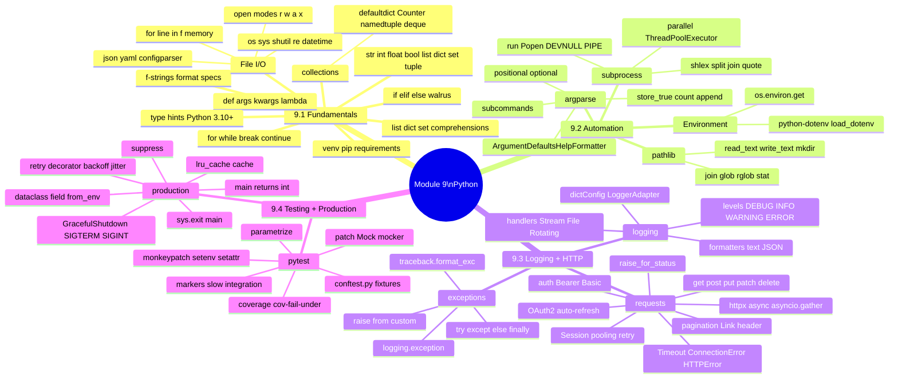

# 9.4.3 Complete Python Cheatsheet and Module 9 Grand Final

**Backlinks:** [9.4.4 — Subchapter Review + Final Exam](./9.4.4_Subchapter_Review_Plus_Final_Exam.md)

**Next note:** [9.4.4 — Subchapter Review + Module 9 Final Exam](./9.4.4_Subchapter_Review_Plus_Final_Exam.md)

---

## Section 1: Module 9 Complete Reference Cheatsheet

### 9.1 — Python Fundamentals

```python
# Virtual environment
python3 -m venv env && source env/bin/activate
pip install requests pyyaml && pip freeze > requirements.txt

# f-strings
f"{name!r}"          # repr format
f"{cpu:.1f}%"        # 1 decimal
f"{port:05d}"        # zero-pad int
f"{name:<20}"        # left-align, width 20
f"{x=}"              # debug: prints "x=42"

# Collections
from collections import defaultdict, Counter, namedtuple, deque
error_counts = defaultdict(int)       # d[key] += 1, no KeyError
top = Counter(items).most_common(5)   # top 5
Pod = namedtuple('Pod', ['name', 'status', 'restarts'])
recent = deque(maxlen=100)            # circular buffer

# Type hints (Python 3.10+)
def func(a: int, b: str | None = None) -> list[dict]: ...
from functools import lru_cache
@lru_cache(maxsize=128)
def expensive(key: str) -> dict: ...
```

### 9.2 — Automation and System Integration

```python
# subprocess
import subprocess, shlex
result = subprocess.run(
    ['kubectl', 'get', 'pods', '-n', 'prod'],
    capture_output=True, text=True, timeout=30
)
if result.returncode != 0:
    print(result.stderr)

# shlex — string → list (handles quotes)
args = shlex.split("kubectl get pods -l 'app=web'")
print(shlex.join(args))   # list → display string

# Popen real-time streaming
proc = subprocess.Popen(['cmd'], stdout=subprocess.PIPE, text=True, bufsize=1)
for line in proc.stdout: print(line, end='')
proc.wait()

# Parallel
from concurrent.futures import ThreadPoolExecutor, as_completed
with ThreadPoolExecutor(max_workers=4) as ex:
    futures = {ex.submit(subprocess.run, cmd, capture_output=True, text=True): name
               for name, cmd in tasks}
    for f in as_completed(futures): print(f.result().returncode)

# argparse
import argparse
p = argparse.ArgumentParser(formatter_class=argparse.ArgumentDefaultsHelpFormatter)
p.add_argument('--env', required=True, choices=['dev','staging','prod'])
p.add_argument('--image'); p.add_argument('-v', action='store_true')
p.add_argument('--files', nargs='+'); p.add_argument('--verbose', action='count', default=0)
args = p.parse_args()

# Environment variables
import os
val = os.environ.get('KEY', 'default')
if not (api_key := os.environ.get('API_KEY')):
    raise ValueError("API_KEY required")

# .env files
from dotenv import load_dotenv
if not os.environ.get('KUBERNETES_SERVICE_HOST'):   # not in K8s
    load_dotenv()

# pathlib
from pathlib import Path
p = Path('/var/log') / 'nginx' / 'access.log'
p.name; p.stem; p.suffix; p.parent; p.exists()
p.mkdir(parents=True, exist_ok=True)
p.read_text(); p.write_text('content')
for f in Path('.').rglob('*.yaml'): print(f)
```

### 9.3 — Logging, Error Handling, HTTP

```python
# Logging setup
import logging
logging.basicConfig(level=logging.INFO,
                    format='%(asctime)s %(levelname)-8s %(name)s: %(message)s')
logger = logging.getLogger(__name__)   # ← always use __name__
logger.info("msg"); logger.error("err", exc_info=True)

# Rotating handler
from logging.handlers import RotatingFileHandler
h = RotatingFileHandler('app.log', maxBytes=5*1024*1024, backupCount=3)
logger.addHandler(h)

# JSON logging
import json
from datetime import datetime, timezone
class JSONFmt(logging.Formatter):
    def format(self, r):
        return json.dumps({'ts': datetime.now(timezone.utc).isoformat(),
                           'level': r.levelname, 'msg': r.getMessage()})

# Exception handling
try:
    risky()
except FileNotFoundError: pass
except (ValueError, TypeError) as e: logger.error(str(e))
except Exception as e: logger.exception("Unhandled"); raise
else: logger.info("success")
finally: cleanup()

# requests
import requests
from requests.adapters import HTTPAdapter
from urllib3.util.retry import Retry

session = requests.Session()
retry   = Retry(total=3, backoff_factor=0.5, status_forcelist={429,500,502,503})
session.mount('https://', HTTPAdapter(max_retries=retry))
session.headers['Authorization'] = f'Bearer {token}'

r = session.get(url, params={'q': 'val'}, timeout=10)
r.raise_for_status()
data = r.json()

# Pagination (GitHub Link header)
while url:
    r = session.get(url); r.raise_for_status()
    yield r.json()
    url = r.links.get('next', {}).get('url')
```

### 9.4 — Testing and Production Patterns

```python
# pytest basics
# pytest.ini: testpaths = tests, addopts = -v --tb=short

# Fixture (conftest.py — auto-loaded)
@pytest.fixture
def config_file(tmp_path):
    f = tmp_path / 'config.yaml'
    f.write_text('server:\n  port: 8080\n')
    return f

# Parametrize
@pytest.mark.parametrize("a, b, expected", [(1,2,3),(0,0,0)])
def test_add(a, b, expected): assert add(a,b) == expected

# monkeypatch
def test_env(monkeypatch):
    monkeypatch.setenv('DB_HOST', 'test-db')
    monkeypatch.setattr(requests, 'get', lambda *a,**k: mock_resp)

# Coverage
# pytest --cov=myapp --cov-fail-under=80

# dataclass config
from dataclasses import dataclass, field
@dataclass
class Config:
    host: str = 'localhost'
    port: int = 8080
    tags: list = field(default_factory=list)
    @classmethod
    def from_env(cls): return cls(host=os.environ.get('HOST','localhost'))

# Retry decorator
def retry(max=3, delay=1.0, backoff=2.0, exceptions=(Exception,)):
    def deco(func):
        @wraps(func)
        def wrapper(*a, **kw):
            d = delay
            for i in range(1, max+1):
                try: return func(*a, **kw)
                except exceptions as e:
                    if i == max: raise
                    time.sleep(d); d *= backoff
        return wrapper
    return deco

# Graceful shutdown
import signal
class GracefulShutdown:
    def __init__(self):
        self.requested = False
        signal.signal(signal.SIGTERM, lambda *_: setattr(self,'requested',True))
        signal.signal(signal.SIGINT,  lambda *_: setattr(self,'requested',True))

# contextlib helpers
from contextlib import suppress
with suppress(FileNotFoundError): Path('f.txt').unlink()

# Production entry point
def main() -> int:
    args = parse_args()
    setup_logging(args.verbose)
    try:
        return 0 if run() else 1
    except KeyboardInterrupt: return 130
    except Exception as e: logger.exception(str(e)); return 1

if __name__ == '__main__': sys.exit(main())
```

---

## Section 2: Module 9 Complete Topic Map



---

## Section 3: Grand Final Exam

This exam covers the **entire Module 9**. No notes. Time limit: 90 minutes for all 8 questions.

---

### Grand Final — Question 1 (10 min)

**Scenario:** Write a function `parse_prometheus_metrics(text: str) -> dict[str, float]` that:
- Parses Prometheus text format: `metric_name{labels} value`
- Ignores comment lines starting with `#`
- Returns `{metric_name: float_value}` dict
- Uses a Counter to track how many metrics were parsed

**Prometheus format example:**
```
# HELP http_requests_total Total HTTP requests
# TYPE http_requests_total counter
http_requests_total{method="GET",status="200"} 1234.0
http_requests_total{method="POST",status="500"} 5.0
go_goroutines 42
```

**Answer:**

```python
import re
from collections import Counter

def parse_prometheus_metrics(text: str) -> dict[str, float]:
    """Parse Prometheus text exposition format"""
    metrics = {}
    counts  = Counter()
    pattern = re.compile(r'^(\w+)(?:\{[^}]*\})?\s+([\d.e+-]+)', re.MULTILINE)

    for line in text.splitlines():
        line = line.strip()
        if not line or line.startswith('#'):
            continue
        m = re.match(r'^(\w+)(?:\{[^}]*\})?\s+([\d.e+\-inf]+)', line)
        if m:
            name  = m.group(1)
            value = float(m.group(2))
            metrics[name] = value
            counts[name] += 1

    print(f"Parsed {len(metrics)} unique metrics "
          f"({sum(counts.values())} total lines)")
    return metrics
```

---

### Grand Final — Question 2 (12 min)

**Scenario:** Write a script `secret_scanner.py` that:
- Accepts `--directory` and `--output-json` arguments
- Recursively finds all `.py`, `.yaml`, `.yml`, `.env`, `.json` files (skipping `.git`)
- Searches for patterns: AWS key `AKIA[A-Z0-9]{16}`, JWT `eyJ[A-Za-z0-9+/=]{20,}`, password assignment `password\s*=\s*["'][^"']{8,}["']`
- Outputs results as formatted f-string table to stdout and JSON to `--output-json` if specified
- Exits with `1` if any secrets found, `0` if clean

**Answer:**

```python
#!/usr/bin/env python3
import argparse, json, re, sys
from pathlib import Path

PATTERNS = {
    'aws_key':  re.compile(r'AKIA[A-Z0-9]{16}'),
    'jwt':      re.compile(r'eyJ[A-Za-z0-9+/=]{20,}'),
    'password': re.compile(r'password\s*=\s*["\'][^"\']{8,}["\']', re.IGNORECASE),
}
EXTENSIONS = {'.py', '.yaml', '.yml', '.env', '.json'}
SKIP_DIRS  = {'.git', '__pycache__', 'venv', 'env', 'node_modules'}

def scan_file(path: Path) -> list[dict]:
    findings = []
    try:
        for lineno, line in enumerate(path.read_text(errors='ignore').splitlines(), 1):
            for name, pattern in PATTERNS.items():
                if pattern.search(line):
                    findings.append({'file': str(path), 'line': lineno,
                                     'type': name, 'snippet': line.strip()[:80]})
    except (PermissionError, IsADirectoryError):
        pass
    return findings

def main() -> int:
    p = argparse.ArgumentParser()
    p.add_argument('--directory',    default='.', help='Directory to scan')
    p.add_argument('--output-json',  help='Write findings to JSON file')
    args = p.parse_args()

    root = Path(args.directory)
    all_findings = []

    for ext in EXTENSIONS:
        for f in root.rglob(f'*{ext}'):
            if any(part in SKIP_DIRS for part in f.parts):
                continue
            all_findings.extend(scan_file(f))

    if all_findings:
        print(f"\n⚠️  Found {len(all_findings)} potential secrets:\n")
        print(f"{'FILE':<50} {'LINE':>5}  {'TYPE':<12}  SNIPPET")
        print("-" * 100)
        for f in all_findings:
            print(f"{f['file']:<50} {f['line']:>5}  {f['type']:<12}  {f['snippet'][:30]}")
    else:
        print("✅ No secrets found")

    if args.output_json:
        with open(args.output_json, 'w') as fh:
            json.dump(all_findings, fh, indent=2)

    return 1 if all_findings else 0

if __name__ == '__main__': sys.exit(main())
```

---

### Grand Final — Question 3 (12 min)

**Scenario:** Write an `ArgoCD` API client class with:
- `get_applications(project: str | None = None) -> list[dict]`
- `sync_application(name: str) -> bool`
- `wait_for_sync(name: str, timeout: int = 120) -> bool` — polls every 5s
- Uses `requests.Session` with `ARGOCD_TOKEN` env var
- `@lru_cache` for `get_applications` (cache until manually cleared)

**Answer:**

```python
import os, time, requests, logging
from functools import lru_cache

logger = logging.getLogger(__name__)

class ArgoCDClient:
    def __init__(self, server: str | None = None):
        self.server = (server or os.environ.get('ARGOCD_SERVER', 'localhost:8080')).rstrip('/')
        token = os.environ.get('ARGOCD_TOKEN')
        if not token:
            raise ValueError("ARGOCD_TOKEN env var required")

        self.session = requests.Session()
        self.session.headers.update({
            'Authorization': f'Bearer {token}',
            'Content-Type':  'application/json'
        })
        self.session.verify = False   # common in ArgoCD setups

    @lru_cache(maxsize=32)
    def get_applications(self, project: str | None = None) -> tuple[dict, ...]:
        """Cached — call .cache_clear() after syncs"""
        params = {'projects': project} if project else {}
        r = self.session.get(f'https://{self.server}/api/v1/applications',
                              params=params, timeout=15)
        r.raise_for_status()
        return tuple(r.json().get('items', []))   # tuple for hashability (lru_cache)

    def sync_application(self, name: str) -> bool:
        self.get_applications.cache_clear()   # invalidate cache
        r = self.session.post(
            f'https://{self.server}/api/v1/applications/{name}/sync',
            json={}, timeout=15
        )
        if r.ok:
            logger.info(f"Triggered sync for {name}")
            return True
        logger.error(f"Sync failed: {r.status_code} {r.text}")
        return False

    def get_sync_status(self, name: str) -> str:
        r = self.session.get(f'https://{self.server}/api/v1/applications/{name}', timeout=10)
        r.raise_for_status()
        return r.json()['status']['sync']['status']    # Synced, OutOfSync, Unknown

    def wait_for_sync(self, name: str, timeout: int = 120) -> bool:
        deadline = time.time() + timeout
        while time.time() < deadline:
            status = self.get_sync_status(name)
            if status == 'Synced':
                logger.info(f"✅ {name} is Synced")
                return True
            logger.debug(f"{name} status: {status}. Waiting...")
            time.sleep(5)
        logger.error(f"Timeout waiting for {name} to sync after {timeout}s")
        return False
```

---

### Grand Final — Question 4 (10 min)

**Scenario:** Write complete pytest tests for `ArgoCDClient.wait_for_sync()` covering:
- Syncs on first poll
- Syncs after 3 polls (status changes)
- Times out without syncing
- Connection error during polling

**Answer:**

```python
import pytest
from unittest.mock import Mock, patch, call
from argocd_client import ArgoCDClient

@pytest.fixture
def client(monkeypatch):
    monkeypatch.setenv('ARGOCD_TOKEN', 'test-token')
    with patch('requests.Session'):
        return ArgoCDClient(server='argocd.example.com')

def test_wait_synced_immediately(client, monkeypatch):
    monkeypatch.setattr(client, 'get_sync_status', lambda name: 'Synced')
    assert client.wait_for_sync('myapp', timeout=10) is True

def test_wait_syncs_after_retries(client, monkeypatch):
    call_count = 0
    def status_progression(name):
        nonlocal call_count
        call_count += 1
        return 'Synced' if call_count >= 3 else 'OutOfSync'

    with patch('time.sleep'):   # don't actually sleep
        monkeypatch.setattr(client, 'get_sync_status', status_progression)
        assert client.wait_for_sync('myapp', timeout=60) is True
    assert call_count == 3

def test_wait_timeout(client, monkeypatch):
    monkeypatch.setattr(client, 'get_sync_status', lambda name: 'OutOfSync')
    with patch('time.sleep'), patch('time.time', side_effect=[0, 5, 10, 121]):
        result = client.wait_for_sync('myapp', timeout=120)
    assert result is False

def test_wait_connection_error(client, monkeypatch):
    def raise_error(name):
        raise requests.exceptions.ConnectionError("refused")
    monkeypatch.setattr(client, 'get_sync_status', raise_error)
    with pytest.raises(requests.exceptions.ConnectionError):
        client.wait_for_sync('myapp', timeout=10)
```

---

### Grand Final — Question 5 (15 min)

**Scenario:** Write a `ClusterHealthReport` that:
- Takes a list of Kubernetes namespaces
- For each namespace: gets pods (mocked subprocess) and counts by status using Counter
- Fetches service health via HTTP (mocked requests)
- Outputs a formatted Markdown table using f-strings
- Saves JSON report to `--output` file
- Has complete pytest test coverage (3+ tests)

**Answer:**

```python
# cluster_health.py
import json, subprocess, requests, sys, argparse
from collections import Counter
from dataclasses import dataclass, field
from pathlib import Path
from typing import Optional

@dataclass
class NamespaceReport:
    name:         str
    pod_statuses: Counter = field(default_factory=Counter)
    service_ok:   bool    = True
    service_url:  Optional[str] = None

def get_pod_status_counts(namespace: str) -> Counter:
    import json as j
    r = subprocess.run(
        ['kubectl','get','pods','-n',namespace,'-o','json'],
        capture_output=True, text=True, timeout=30
    )
    if r.returncode != 0:
        return Counter({'Error': 1})
    return Counter(
        item['status']['phase']
        for item in j.loads(r.stdout).get('items', [])
    )

def check_service(url: str) -> bool:
    try:
        r = requests.get(url, timeout=5)
        return r.ok
    except Exception:
        return False

def build_report(namespaces: list[str], service_urls: dict[str, str]) -> list[NamespaceReport]:
    reports = []
    for ns in namespaces:
        report = NamespaceReport(
            name         = ns,
            pod_statuses = get_pod_status_counts(ns),
            service_url  = service_urls.get(ns)
        )
        if report.service_url:
            report.service_ok = check_service(report.service_url)
        reports.append(report)
    return reports

def print_markdown_table(reports: list[NamespaceReport]) -> None:
    print(f"\n| {'Namespace':<20} | {'Running':>8} | {'Pending':>8} | {'Failed':>8} | {'Health':>8} |")
    print(f"|{'-'*22}|{'-'*10}|{'-'*10}|{'-'*10}|{'-'*10}|")
    for r in reports:
        health = "✅ OK" if r.service_ok else "❌ DOWN"
        print(f"| {r.name:<20} "
              f"| {r.pod_statuses.get('Running',0):>8} "
              f"| {r.pod_statuses.get('Pending',0):>8} "
              f"| {r.pod_statuses.get('Failed',0):>8} "
              f"| {health:>8} |")
    print()
```

```python
# tests/test_cluster_health.py
import json, pytest
from collections import Counter
from unittest.mock import patch, Mock
from cluster_health import get_pod_status_counts, build_report, NamespaceReport

@pytest.fixture
def mock_pods_json():
    return {'items': [
        {'status': {'phase': 'Running'}},
        {'status': {'phase': 'Running'}},
        {'status': {'phase': 'Pending'}},
    ]}

def test_get_pod_status_counts(mock_pods_json):
    mock_result = Mock(returncode=0, stdout=json.dumps(mock_pods_json), stderr='')
    with patch('subprocess.run', return_value=mock_result):
        counts = get_pod_status_counts('production')
    assert counts['Running'] == 2
    assert counts['Pending'] == 1

def test_get_pod_status_kubectl_failure():
    mock_result = Mock(returncode=1, stdout='', stderr='connection refused')
    with patch('subprocess.run', return_value=mock_result):
        counts = get_pod_status_counts('production')
    assert counts['Error'] == 1

@pytest.mark.parametrize("status_code, expected", [(200, True), (503, False)])
def test_build_report_service_health(mock_pods_json, status_code, expected):
    mock_run  = Mock(returncode=0, stdout=json.dumps(mock_pods_json), stderr='')
    mock_resp = Mock(ok=(status_code == 200), status_code=status_code)
    with patch('subprocess.run', return_value=mock_run), \
         patch('requests.get', return_value=mock_resp):
        reports = build_report(['prod'], {'prod': 'http://prod.example.com/health'})
    assert reports[0].service_ok is expected
```

---

### Grand Final — Question 6 (8 min)

**Scenario:** Write a `notify_slack` function using `requests.post` that:
- Sends a deployment notification to a Slack webhook
- Retries 3× on network errors (not on `4xx`)
- Truncates the message if > 4000 chars
- Logs at INFO on success, WARNING on retry, ERROR on final failure
- Has `pytest` tests for success, retry, and truncation

**Answer:**

```python
import requests, time, logging
logger = logging.getLogger(__name__)

def notify_slack(webhook_url: str, message: str, max_chars: int = 4000) -> bool:
    if len(message) > max_chars:
        message = message[:max_chars - 3] + '...'

    for attempt in range(1, 4):
        try:
            r = requests.post(webhook_url, json={'text': message}, timeout=10)
            if r.status_code < 400:
                logger.info(f"Slack notification sent (attempt {attempt})")
                return True
            if r.status_code >= 400:
                logger.error(f"Slack rejected message: {r.status_code} {r.text}")
                return False   # don't retry client errors
        except requests.exceptions.RequestException as e:
            logger.warning(f"Slack attempt {attempt}/3 failed: {e}")
            if attempt < 3:
                time.sleep(2 ** (attempt - 1))

    logger.error("Slack notification failed after 3 attempts")
    return False

# tests
def test_slack_success(mocker):
    mock = mocker.patch('requests.post')
    mock.return_value.status_code = 200
    assert notify_slack('https://hooks.slack.com/x', 'hello') is True
    mock.assert_called_once()

def test_slack_truncates_long_message(mocker):
    mock = mocker.patch('requests.post')
    mock.return_value.status_code = 200
    notify_slack('https://hooks.slack.com/x', 'x' * 5000)
    sent = mock.call_args[1]['json']['text']
    assert len(sent) <= 4000
    assert sent.endswith('...')

def test_slack_retries_on_network_error(mocker):
    mock_post = mocker.patch('requests.post',
                              side_effect=requests.exceptions.ConnectionError("refused"))
    mocker.patch('time.sleep')
    result = notify_slack('https://hooks.slack.com/x', 'msg')
    assert result is False
    assert mock_post.call_count == 3
```

---

### Grand Final — Question 7 (10 min)

**Scenario:** Write a production-grade `CronRunner` class that:
- Runs a given function at a specified interval
- Handles SIGTERM gracefully (finishes current run before stopping)
- Logs run start/end/duration/error
- `@dataclass` for config: `interval`, `timeout`, `max_failures`
- Stops permanently after `max_failures` consecutive failures

**Answer:**

```python
import signal, time, logging, traceback
from dataclasses import dataclass
from typing import Callable

logger = logging.getLogger(__name__)

@dataclass
class CronConfig:
    interval:     int   = 60       # seconds between runs
    timeout:      float = 300.0    # max seconds per run
    max_failures: int   = 5        # stop after N consecutive failures

class CronRunner:
    def __init__(self, func: Callable, config: CronConfig):
        self.func             = func
        self.config           = config
        self.shutdown_requested = False
        self.consecutive_failures = 0

        signal.signal(signal.SIGTERM, lambda *_: setattr(self, 'shutdown_requested', True))
        signal.signal(signal.SIGINT,  lambda *_: setattr(self, 'shutdown_requested', True))

    def run_once(self) -> bool:
        start = time.time()
        logger.info(f"Starting run: {self.func.__name__}")
        try:
            self.func()
            duration = time.time() - start
            logger.info(f"Completed in {duration:.1f}s")
            self.consecutive_failures = 0
            return True
        except Exception as e:
            duration = time.time() - start
            self.consecutive_failures += 1
            logger.error(
                f"Failed after {duration:.1f}s (failure {self.consecutive_failures}/"
                f"{self.config.max_failures}): {e}"
            )
            logger.debug(traceback.format_exc())
            return False

    def run_forever(self) -> int:
        logger.info(f"CronRunner started (interval={self.config.interval}s)")
        while not self.shutdown_requested:
            self.run_once()

            if self.consecutive_failures >= self.config.max_failures:
                logger.critical(f"Max failures ({self.config.max_failures}) reached. Stopping.")
                return 1

            # Sleep in 1-second chunks (respond to SIGTERM quickly)
            for _ in range(self.config.interval):
                if self.shutdown_requested:
                    break
                time.sleep(1)

        logger.info("CronRunner stopped gracefully")
        return 0
```

---

### Grand Final — Question 8 (13 min)

**Scenario:** Write the COMPLETE `deploy_and_verify.py` script that:
- Deploys a Kubernetes app (via kubectl subprocess)
- Posts deployment status to GitHub API (requests + retry)
- Runs a smoke test (HTTP check)
- Logs JSON to stdout
- Returns exit code 0 only if ALL three succeed
- Has SIGTERM handling
- Has at least 5 meaningful pytest tests

This tests the **entire Module 9 end-to-end**.

**Answer:**

```python
#!/usr/bin/env python3
"""deploy_and_verify.py — E2E deploy script using all Module 9 skills"""
import argparse, json, logging, os, signal, subprocess, sys, time
import requests
from dataclasses import dataclass
from datetime import datetime, timezone
from functools import wraps

# ── logging ──────────────────────────────────────────────────────────────────
class JSONFmt(logging.Formatter):
    def format(self, r):
        return json.dumps({'ts': datetime.now(timezone.utc).isoformat(),
                           'level': r.levelname, 'msg': r.getMessage()})

def setup_log(verbose: bool) -> logging.Logger:
    h = logging.StreamHandler()
    h.setFormatter(JSONFmt() if os.environ.get('LOG_FORMAT')=='json'
                   else logging.Formatter('%(asctime)s %(levelname)-8s %(message)s'))
    log = logging.getLogger('deploy'); log.addHandler(h)
    log.setLevel(logging.DEBUG if verbose else logging.INFO)
    log.propagate = False; return log

# ── retry ─────────────────────────────────────────────────────────────────────
def retry(max=3, delay=2.0, backoff=2.0, exc=(Exception,)):
    def deco(func):
        @wraps(func)
        def wrap(*a, **kw):
            d = delay
            for i in range(1, max+1):
                try: return func(*a, **kw)
                except exc as e:
                    if i == max: raise
                    time.sleep(d); d *= backoff
        return wrap
    return deco

# ── dataclass config ──────────────────────────────────────────────────────────
@dataclass
class Config:
    deployment:   str
    namespace:    str
    image:        str
    smoke_url:    str
    github_token: str = ''
    repo:         str = ''
    sha:          str = ''
    dry_run:      bool = False

    @classmethod
    def from_args(cls, args) -> 'Config':
        return cls(
            deployment   = args.deployment,
            namespace    = args.namespace,
            image        = args.image,
            smoke_url    = args.smoke_url,
            github_token = os.environ.get('GITHUB_TOKEN', ''),
            repo         = os.environ.get('GITHUB_REPOSITORY', ''),
            sha          = os.environ.get('GITHUB_SHA', ''),
            dry_run      = args.dry_run
        )

# ── steps ─────────────────────────────────────────────────────────────────────
@retry(max=3, delay=5, exc=(RuntimeError,))
def kubectl_deploy(cfg: Config, log: logging.Logger) -> None:
    if cfg.dry_run:
        log.info(f"[DRY RUN] Would deploy {cfg.image}"); return
    r = subprocess.run(
        ['kubectl','set','image',f'deployment/{cfg.deployment}',f'app={cfg.image}',
         '-n', cfg.namespace], capture_output=True, text=True, timeout=60)
    if r.returncode != 0:
        raise RuntimeError(r.stderr)
    log.info(f"Set image to {cfg.image}")
    r2 = subprocess.run(
        ['kubectl','rollout','status',f'deployment/{cfg.deployment}',
         '-n', cfg.namespace, '--timeout=300s'], capture_output=True, text=True, timeout=310)
    if r2.returncode != 0:
        raise RuntimeError(r2.stderr)

def smoke_test(url: str, log: logging.Logger) -> bool:
    try:
        r = requests.get(url, timeout=10)
        if r.ok:
            log.info(f"Smoke test passed: {url} → {r.status_code}"); return True
        log.error(f"Smoke test failed: {r.status_code}"); return False
    except Exception as e:
        log.error(f"Smoke test error: {e}"); return False

@retry(max=3, delay=2, exc=(requests.RequestException,))
def post_github_status(cfg: Config, state: str, desc: str, log: logging.Logger) -> None:
    if not (cfg.github_token and cfg.repo and cfg.sha): return
    r = requests.post(
        f'https://api.github.com/repos/{cfg.repo}/statuses/{cfg.sha}',
        json={'state': state, 'description': desc, 'context': 'platform/deploy'},
        headers={'Authorization': f'token {cfg.github_token}',
                 'Accept': 'application/vnd.github.v3+json'},
        timeout=10
    )
    r.raise_for_status()
    log.info(f"Posted GitHub status: {state}")

# ── main ──────────────────────────────────────────────────────────────────────
def main() -> int:
    p = argparse.ArgumentParser()
    p.add_argument('deployment'); p.add_argument('--namespace','-n',required=True)
    p.add_argument('--image',required=True); p.add_argument('--smoke-url',required=True)
    p.add_argument('--dry-run',action='store_true'); p.add_argument('-v',action='store_true')
    args = p.parse_args()

    log      = setup_log(args.v)
    cfg      = Config.from_args(args)
    shutdown = type('S',(),{'req':False})()
    signal.signal(signal.SIGTERM, lambda *_: setattr(shutdown,'req',True))

    post_github_status(cfg, 'pending', 'Deployment started', log)
    try:
        kubectl_deploy(cfg, log)
        ok = smoke_test(cfg.smoke_url, log)
        state = 'success' if ok else 'failure'
        post_github_status(cfg, state, 'Deploy complete' if ok else 'Smoke failed', log)
        return 0 if ok else 1
    except Exception as e:
        log.exception(str(e))
        post_github_status(cfg, 'error', str(e)[:100], log)
        return 1

if __name__ == '__main__': sys.exit(main())
```

```python
# tests/test_deploy_and_verify.py
import pytest, json
from unittest.mock import Mock, patch, MagicMock
import deploy_and_verify as dav

@pytest.fixture
def cfg():
    return dav.Config(
        deployment='myapp', namespace='prod', image='myapp:v1',
        smoke_url='http://myapp.example.com/health'
    )

def test_smoke_test_success(cfg):
    with patch('requests.get', return_value=Mock(ok=True, status_code=200)):
        assert dav.smoke_test(cfg.smoke_url, MagicMock()) is True

def test_smoke_test_failure(cfg):
    with patch('requests.get', return_value=Mock(ok=False, status_code=503)):
        assert dav.smoke_test(cfg.smoke_url, MagicMock()) is False

def test_smoke_test_connection_error(cfg):
    import requests
    with patch('requests.get', side_effect=requests.exceptions.ConnectionError()):
        assert dav.smoke_test(cfg.smoke_url, MagicMock()) is False

def test_kubectl_deploy_dry_run(cfg, monkeypatch):
    cfg.dry_run = True
    log = MagicMock()
    dav.kubectl_deploy(cfg, log)                     # should not raise
    log.info.assert_called_with(f"[DRY RUN] Would deploy {cfg.image}")

def test_kubectl_deploy_failure(cfg):
    import subprocess
    mock_result = Mock(returncode=1, stderr='connection refused', stdout='')
    with patch('subprocess.run', return_value=mock_result):
        with pytest.raises(RuntimeError, match='connection refused'):
            dav.kubectl_deploy(cfg, MagicMock())

def test_post_github_status_no_token(cfg):
    # Should silently do nothing when no token is set
    log = MagicMock()
    dav.post_github_status(cfg, 'success', 'done', log)   # no exception
    log.info.assert_not_called()
```

---

## Section 3b: Python Package Structure — `__init__.py` and `__all__`

> **When scripts become packages:** Your DevOps scripts start as single files (`deploy.py`). As they grow, you extract reusable functions into modules. When you have 5+ modules that import from each other, you have a **package** — a directory with `__init__.py`. Understanding package structure is essential for writing testable, importable Python code.

### Package Layout

```
platform_tools/                    # ← package directory
├── __init__.py                    # ← makes this a package
├── cli.py                         # argparse + main()
├── k8s.py                         # kubectl wrapper functions
├── http_client.py                 # API client classes
├── config.py                      # Config dataclass
└── utils/                         # ← sub-package
    ├── __init__.py
    ├── retry.py                   # @retry decorator
    └── logging_setup.py           # JSON formatter
```

### `__init__.py` — What It Does

```python
# platform_tools/__init__.py

# 1. Makes the directory a Python package (can be empty)

# 2. Controls what 'from platform_tools import *' exports
__all__ = ['K8sClient', 'Config', 'retry', 'setup_logging']

# 3. Re-exports from submodules for convenient imports
from platform_tools.k8s import K8sClient
from platform_tools.config import Config
from platform_tools.utils.retry import retry
from platform_tools.utils.logging_setup import setup_logging

# Version (used by pip, setuptools)
__version__ = '1.0.0'
```

```python
# Users can now import cleanly:
from platform_tools import K8sClient, Config, retry
# Instead of:
from platform_tools.k8s import K8sClient
from platform_tools.config import Config
from platform_tools.utils.retry import retry
```

### `__all__` — Controlling Public API

> **Why `__all__` matters:** Without it, `from mypackage import *` imports **everything** — including internal helpers, constants, and imported modules that shouldn't be part of the public API. `__all__` is the explicit list of public names.

```python
# platform_tools/k8s.py

__all__ = ['K8sClient', 'get_pods', 'wait_for_rollout']

# These ARE exported (in __all__)
class K8sClient:
    ...

def get_pods(namespace: str) -> list[dict]:
    ...

def wait_for_rollout(deployment: str) -> bool:
    ...

# These are NOT exported (not in __all__)
def _parse_kubectl_output(raw: str) -> dict:
    """Internal helper — prefixed with _ by convention"""
    ...

KUBECTL_TIMEOUT = 300   # internal constant
```

### `pyproject.toml` — Modern Package Configuration

```toml
# pyproject.toml — replaces setup.py for modern Python packages
[project]
name = "platform-tools"
version = "1.0.0"
description = "DevOps automation toolkit"
requires-python = ">=3.10"
dependencies = [
    "requests>=2.28",
    "pyyaml>=6.0",
    "python-dotenv>=1.0",
]

[project.optional-dependencies]
dev = ["pytest>=7.0", "pytest-cov", "pytest-mock", "mypy"]

[project.scripts]
# Creates CLI commands when installed with pip
deploy = "platform_tools.cli:main"
healthcheck = "platform_tools.health:main"

[tool.pytest.ini_options]
testpaths = ["tests"]
addopts = "-v --tb=short --cov=platform_tools"
```

```bash
# Install in development mode (editable — changes take effect immediately)
pip install -e ".[dev]"

# Now you can run:
deploy --env prod --image myapp:v1.2.3
# And import in scripts:
from platform_tools import K8sClient
```

### When to Package vs Single File

| Scenario | Approach |
|----------|----------|
| One-off script (< 200 lines) | Single `.py` file |
| Reusable functions across scripts | Package with `__init__.py` |
| Team shares common utilities | Package + `pyproject.toml` + internal PyPI |
| Open-source tool | Package + `pyproject.toml` + publish to PyPI |

---

## Section 4: Module 9 Quick Reference Card

### "What imports do I need?"

| Task | Import |
|------|--------|
| Subprocess | `import subprocess, shlex` |
| CLI args | `import argparse` |
| Env vars + .env | `import os; from dotenv import load_dotenv` |
| File paths | `from pathlib import Path` |
| Logging | `import logging; from logging.handlers import RotatingFileHandler` |
| Exceptions | `try/except/else/finally; raise X from Y` |
| HTTP calls | `import requests; from requests.adapters import HTTPAdapter` |
| Retry | `from urllib3.util.retry import Retry` |
| HTTP async | `import httpx; import asyncio` |
| Test mocking | `from unittest.mock import patch, Mock; from pytest_mock import mocker` |
| Config object | `from dataclasses import dataclass, field` |
| Caching | `from functools import lru_cache, wraps` |
| Signal handling | `import signal` |
| Suppress errors | `from contextlib import suppress` |
| Count things | `from collections import Counter, defaultdict` |
| Named tuples | `from collections import namedtuple` |
| JSON | `import json` |
| YAML | `import yaml  # pip install pyyaml` |
| Date/time | `from datetime import datetime, timezone, timedelta` |
| Type hints | `from typing import Optional; # or use X \| None (3.10+)` |

---

**Module 9 Complete.** You are ready for Module 10 — GitOps with ArgoCD.

> In Module 10, the Python skills you built here will be used to: write ArgoCD webhook handlers (9.3.2), build Prometheus health dashboards (9.3.4), automate ApplicationSet creation (9.2.1 subprocess), and test GitOps pipelines (9.4.1 pytest).
