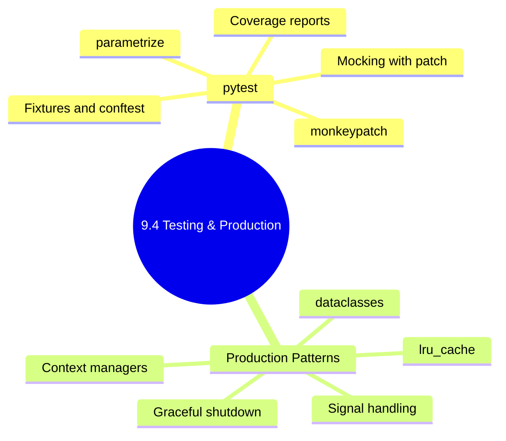

# 9.4.4 Subchapter Review + Module 9 Final Exam: Python for Platform Engineering

**Backlinks:** [9.4.1 — Testing with pytest](./9.4.1_Testing_with_pytest.md) | [9.4.2 — Production-Ready Patterns](./9.4.2_Production_Ready_Patterns.md) | [9.4.3 — Complete Python Cheatsheet and Grand Final](./9.4.3_Complete_Python_Cheatsheet_and_Grand_Final.md)

**Next note:** [Module 10 — GitOps with ArgoCD](../../10-GitOps-ArgoCD/Subchapter_10.1/10.1.1_GitOps_Principles_vs_Push_CI_CD.md)



---

## Part 1: Subchapter 9.4 Cheatsheet

### pytest Core

```python
# Test file: test_*.py or *_test.py
# Function: def test_*()
# Run: pytest -v --tb=short

# Basic assertion
assert result == expected
assert item in collection
assert value is None
with pytest.raises(ValueError, match="message"):
    risky_function()

# Parametrize
@pytest.mark.parametrize("a, b, expected", [(1,2,3), (0,0,0)])
def test_add(a, b, expected):
    assert add(a, b) == expected

# Fixture
@pytest.fixture
def sample_config(tmp_path):
    f = tmp_path / 'config.yaml'
    f.write_text("server:\n  port: 8080\n")
    return f

# conftest.py — shared fixtures (auto-loaded, no import)
# pytest.ini — testpaths, addopts, markers
```

### Mocking

```python
from unittest.mock import patch, Mock

# Patch by string path
@patch('myapp.k8s.subprocess.run')
def test_something(mock_run):
    mock_run.return_value = Mock(returncode=0, stdout='output', stderr='')

# monkeypatch (pytest built-in)
def test_env(monkeypatch):
    monkeypatch.setenv('DB_HOST', 'test-db')
    monkeypatch.setattr(subprocess, 'run', fake_run)

# pytest-mock
def test_with_mocker(mocker):
    mock = mocker.patch('subprocess.run')
    mock.return_value.returncode = 0
```

### Coverage

```bash
pytest --cov=myapp tests/
pytest --cov=myapp --cov-report=html
pytest --cov=myapp --cov-fail-under=80   # fail if < 80%
pytest --cov=myapp --cov-report=term-missing
```

### Production Script Template

```python
#!/usr/bin/env python3
import argparse, logging, sys

def parse_args():
    p = argparse.ArgumentParser(formatter_class=argparse.ArgumentDefaultsHelpFormatter)
    p.add_argument('--env', required=True, choices=['dev','staging','prod'])
    p.add_argument('--dry-run', action='store_true')
    p.add_argument('-v', '--verbose', action='store_true')
    return p.parse_args()

def setup_logging(verbose: bool) -> logging.Logger:
    logging.basicConfig(
        level=logging.DEBUG if verbose else logging.INFO,
        format='%(asctime)s %(levelname)-8s %(message)s'
    )
    return logging.getLogger(__name__)

def main() -> int:
    args   = parse_args()
    logger = setup_logging(args.verbose)
    try:
        # business logic
        return 0
    except KeyboardInterrupt:
        return 130
    except Exception as e:
        logger.exception(f"Failed: {e}")
        return 1

if __name__ == '__main__':
    sys.exit(main())
```

### Retry Decorator

```python
from functools import wraps
import time, logging

def retry(max_attempts=3, delay=1.0, backoff=2.0, exceptions=(Exception,)):
    def decorator(func):
        @wraps(func)
        def wrapper(*args, **kwargs):
            d = delay
            for attempt in range(1, max_attempts + 1):
                try:
                    return func(*args, **kwargs)
                except exceptions as e:
                    if attempt == max_attempts: raise
                    logging.warning(f"Retry {attempt}: {e}")
                    time.sleep(d); d *= backoff
        return wrapper
    return decorator
```

### Graceful Shutdown

```python
import signal

class GracefulShutdown:
    def __init__(self):
        self.requested = False
        signal.signal(signal.SIGTERM, lambda *_: setattr(self, 'requested', True))
        signal.signal(signal.SIGINT,  lambda *_: setattr(self, 'requested', True))
```

### dataclasses

```python
from dataclasses import dataclass, field

@dataclass
class Config:
    host:  str  = 'localhost'
    port:  int  = 8080
    tags:  list = field(default_factory=list)

    @classmethod
    def from_env(cls) -> 'Config':
        import os
        return cls(
            host = os.environ.get('HOST', 'localhost'),
            port = int(os.environ.get('PORT', '8080'))
        )
```

### `lru_cache`

```python
from functools import lru_cache, cache

@lru_cache(maxsize=128)  # cached by args
def expensive_call(key: str) -> dict:
    ...

expensive_call.cache_clear()  # invalidate
```

---

## Part 2: Comparison Tables

### `pytest` vs `unittest`

| Feature | pytest | unittest |
|---------|--------|----------|
| Assertion syntax | `assert a == b` | `self.assertEqual(a, b)` |
| Fixtures | `@pytest.fixture` | `setUp()` / `tearDown()` |
| Shared fixtures | `conftest.py` | Base test class |
| Parametrize | `@pytest.mark.parametrize` | `subTest()` |
| Plugins | Rich ecosystem | Limited |
| Recommendation | **New code** | Legacy only |

### `monkeypatch` vs `unittest.mock.patch`

| Feature | `monkeypatch` | `@patch` |
|---------|--------------|---------|
| Syntax | Fixture method | Decorator |
| Verify call count | Limited | ✅ `assert_called_once()` |
| Env vars | `setenv()` built-in | `@patch.dict(os.environ)` |
| Auto-restore | ✅ | ✅ |
| Recommendation | Simple mocks | Verify HOW something was called |

### Retry Strategies

| Strategy | When to Use |
|----------|-------------|
| Fixed delay `time.sleep(1)` | Simple, low-volume calls |
| Exponential backoff `delay *= 2` | Network APIs |
| With jitter `random.uniform(0, cap)` | Many clients retrying simultaneously |
| `urllib3.Retry` + `HTTPAdapter` | Production `requests.Session` |

---

## Part 3: Module 9 Final Exam

This exam covers **all 4 subchapters** of Module 9. Questions require multi-step solutions.

---

### Question 1 — File Processing CLI (Subchapters 9.1 + 9.2)

**Scenario:** Write a CLI script `log_analyzer.py` that:
- Accepts `logfile` (positional), `--verbose`, `--output` (optional output file)
- Reads the log file memory-efficiently (it may be large)
- Counts lines by severity: ERROR, WARNING, INFO (using `Counter`)
- Prints a formatted table with `f-string` alignment
- Writes JSON results to `--output` if specified
- Returns exit code `1` if any ERRORs were found

**Answer:**

```python
#!/usr/bin/env python3
import argparse
import json
import logging
import sys
from collections import Counter
from pathlib import Path

def parse_args() -> argparse.Namespace:
    p = argparse.ArgumentParser(description='Analyze log files',
                                formatter_class=argparse.ArgumentDefaultsHelpFormatter)
    p.add_argument('logfile',           help='Log file to analyze')
    p.add_argument('-v', '--verbose',   action='store_true')
    p.add_argument('-o', '--output',    help='Write JSON results to this file')
    return p.parse_args()

def analyze_log(filepath: str) -> Counter:
    counts  = Counter()
    path    = Path(filepath)

    if not path.exists():
        raise FileNotFoundError(f"Log file not found: {filepath}")

    with open(path, 'r') as f:
        for line in f:                          # memory-efficient
            for level in ('ERROR', 'WARNING', 'INFO', 'DEBUG'):
                if level in line:
                    counts[level] += 1
                    break
            else:
                counts['OTHER'] += 1

    return counts

def print_report(counts: Counter) -> None:
    total = sum(counts.values())
    print(f"\n{'LEVEL':<12} {'COUNT':>8} {'%':>8}")
    print("-" * 30)
    for level in ('ERROR', 'WARNING', 'INFO', 'DEBUG', 'OTHER'):
        n   = counts.get(level, 0)
        pct = (n / total * 100) if total else 0
        print(f"{level:<12} {n:>8,} {pct:>7.1f}%")
    print("-" * 30)
    print(f"{'TOTAL':<12} {total:>8,}")

def main() -> int:
    args = parse_args()
    logging.basicConfig(level=logging.DEBUG if args.verbose else logging.INFO)
    logger = logging.getLogger(__name__)

    try:
        counts = analyze_log(args.logfile)
        print_report(counts)

        if args.output:
            with open(args.output, 'w') as f:
                json.dump(dict(counts), f, indent=2)
            logger.info(f"Results written to {args.output}")

        return 1 if counts.get('ERROR', 0) > 0 else 0

    except FileNotFoundError as e:
        logger.error(str(e))
        return 1

if __name__ == '__main__':
    sys.exit(main())
```

---

### Question 2 — API Client with Retry and Tests (Subchapters 9.2 + 9.3 + 9.4)

**Scenario:** Write a `GitLabClient` class that:
- Fetches merge requests from the GitLab API
- Uses `requests.Session()` for connection reuse
- Retries on `429` and `5xx` with backoff
- Has a method `post_pipeline_status(project_id, sha, state, description)`

Then write **pytest tests** for both methods using mocking.

**Answer:**

```python
# gitlab_client.py
import requests
import time
import os
import logging
from requests.adapters import HTTPAdapter
from urllib3.util.retry import Retry

logger = logging.getLogger(__name__)

class GitLabClient:
    BASE = 'https://gitlab.com/api/v4'

    def __init__(self, token: str | None = None):
        token = token or os.environ.get('GITLAB_TOKEN')
        if not token:
            raise ValueError("GITLAB_TOKEN not set")

        retry = Retry(total=3, backoff_factor=1,
                      status_forcelist={429, 500, 502, 503})
        self.session = requests.Session()
        self.session.mount('https://', HTTPAdapter(max_retries=retry))
        self.session.headers.update({
            'PRIVATE-TOKEN': token,
            'Accept':        'application/json'
        })

    def get_merge_requests(self, project_id: str, state: str = 'opened') -> list[dict]:
        r = self.session.get(
            f'{self.BASE}/projects/{project_id}/merge_requests',
            params={'state': state, 'per_page': 100},
            timeout=15
        )
        r.raise_for_status()
        return r.json()

    def post_pipeline_status(
        self, project_id: str, sha: str, state: str, description: str = ''
    ) -> dict:
        valid = {'pending', 'running', 'success', 'failed', 'canceled'}
        if state not in valid:
            raise ValueError(f"state must be one of {valid}")

        r = self.session.post(
            f'{self.BASE}/projects/{project_id}/statuses/{sha}',
            json={'state': state, 'description': description,
                  'name':  'platform-deploy'},
            timeout=15
        )
        r.raise_for_status()
        logger.info(f"Posted {state} status for {sha[:8]}")
        return r.json()
```

```python
# tests/test_gitlab_client.py
import pytest
from unittest.mock import patch, Mock
from gitlab_client import GitLabClient

@pytest.fixture
def client():
    with patch.dict('os.environ', {'GITLAB_TOKEN': 'test-token'}):
        return GitLabClient()

def test_get_merge_requests_success(client):
    mock_response = Mock(status_code=200, ok=True)
    mock_response.json.return_value = [
        {'iid': 1, 'title': 'Fix bug', 'state': 'opened'},
        {'iid': 2, 'title': 'Add feature', 'state': 'opened'},
    ]
    with patch.object(client.session, 'get', return_value=mock_response):
        mrs = client.get_merge_requests('myorg%2Fmyrepo')

    assert len(mrs) == 2
    assert mrs[0]['title'] == 'Fix bug'

def test_get_merge_requests_raises_on_failure(client):
    mock_response = Mock(status_code=404)
    mock_response.raise_for_status.side_effect = Exception("404 Not Found")
    with patch.object(client.session, 'get', return_value=mock_response):
        with pytest.raises(Exception, match="404"):
            client.get_merge_requests('invalid%2Frepo')

@pytest.mark.parametrize("state", ['pending', 'running', 'success', 'failed', 'canceled'])
def test_post_pipeline_status_valid_states(client, state):
    mock_response = Mock(status_code=201, ok=True)
    mock_response.json.return_value = {'id': 1, 'status': state}
    with patch.object(client.session, 'post', return_value=mock_response):
        result = client.post_pipeline_status('123', 'abc1234', state)
    assert result['status'] == state

def test_post_pipeline_status_invalid_state(client):
    with pytest.raises(ValueError, match="state must be one of"):
        client.post_pipeline_status('123', 'abc1234', 'invalid')

def test_missing_token():
    with patch.dict('os.environ', {}, clear=True):
        import os
        os.environ.pop('GITLAB_TOKEN', None)
        with pytest.raises(ValueError, match="GITLAB_TOKEN"):
            GitLabClient()
```

---

### Question 3 — Production Deploy Script (Subchapters 9.2 + 9.3 + 9.4)

**Scenario:** Write a Kubernetes deploy script that:
- Uses `@dataclass` for config
- Has `@retry` for `kubectl` calls
- Handles SIGTERM gracefully
- Logs structured JSON if `LOG_FORMAT=json`
- Sets GitHub Actions output variables

**Answer:**

```python
#!/usr/bin/env python3
"""k8s_deploy.py — Full production deploy script"""
import argparse, dataclasses, json, logging, os, signal, subprocess, sys, time
from functools import wraps
from typing import Callable

# ─── Config ──────────────────────────────────────────────────────────────────
@dataclasses.dataclass
class DeployConfig:
    deployment: str
    namespace:  str
    image:      str
    dry_run:    bool = False
    timeout:    int  = dataclasses.field(default_factory=lambda: int(os.environ.get('TIMEOUT','300')))

# ─── Logging ─────────────────────────────────────────────────────────────────
def setup_logging(verbose: bool = False) -> logging.Logger:
    level = logging.DEBUG if verbose else logging.INFO
    if os.environ.get('LOG_FORMAT') == 'json':
        import json as json_mod
        from datetime import datetime, timezone
        class JSON(logging.Formatter):
            def format(self, r):
                return json_mod.dumps({'ts': datetime.now(timezone.utc).isoformat(),
                                       'level': r.levelname, 'msg': r.getMessage()})
        h = logging.StreamHandler(); h.setFormatter(JSON())
        log = logging.getLogger('deploy')
        log.addHandler(h); log.setLevel(level); log.propagate = False
        return log
    logging.basicConfig(level=level, format='%(asctime)s %(levelname)-8s %(message)s')
    return logging.getLogger('deploy')

# ─── Retry ───────────────────────────────────────────────────────────────────
def retry(max_attempts=3, delay=5.0, backoff=2.0, exceptions=(RuntimeError,)):
    def deco(func):
        @wraps(func)
        def wrapper(*args, **kwargs):
            d = delay
            for attempt in range(1, max_attempts + 1):
                try: return func(*args, **kwargs)
                except exceptions as e:
                    if attempt == max_attempts: raise
                    time.sleep(d); d *= backoff
        return wrapper
    return deco

# ─── GHA output ──────────────────────────────────────────────────────────────
def set_output(name: str, value: str) -> None:
    f = os.environ.get('GITHUB_OUTPUT')
    if f:
        with open(f, 'a') as fp: fp.write(f"{name}={value}\n")

# ─── Deployer ────────────────────────────────────────────────────────────────
class Deployer:
    def __init__(self, cfg: DeployConfig, log: logging.Logger):
        self.cfg = cfg; self.log = log

    def _kubectl(self, args: list[str]) -> tuple[bool, str]:
        cmd = ['kubectl', '-n', self.cfg.namespace] + args
        r = subprocess.run(cmd, capture_output=True, text=True, timeout=self.cfg.timeout)
        return r.returncode == 0, r.stderr

    @retry(max_attempts=3, delay=5, exceptions=(RuntimeError,))
    def set_image(self) -> None:
        ok, err = self._kubectl(
            ['set','image', f'deployment/{self.cfg.deployment}', f'app={self.cfg.image}'])
        if not ok: raise RuntimeError(err)

    def run(self) -> bool:
        if self.cfg.dry_run:
            self.log.info(f"[DRY RUN] {self.cfg.deployment} → {self.cfg.image}"); return True
        self.log.info(f"Deploying {self.cfg.image}")
        try:
            self.set_image()
        except RuntimeError as e:
            self.log.error(f"Failed: {e}"); return False
        ok, err = self._kubectl(
            ['rollout','status',f'deployment/{self.cfg.deployment}',f'--timeout={self.cfg.timeout}s'])
        if ok:
            self.log.info("✅ Success")
            set_output('deploy_status', 'success')
            set_output('image', self.cfg.image)
            return True
        self.log.error(f"Rollout failed: {err}"); return False

# ─── Main ────────────────────────────────────────────────────────────────────
def main() -> int:
    p = argparse.ArgumentParser()
    p.add_argument('deployment');  p.add_argument('--namespace', '-n', required=True)
    p.add_argument('--image', required=True); p.add_argument('--dry-run', action='store_true')
    p.add_argument('-v', '--verbose', action='store_true')
    args = p.parse_args()

    log     = setup_logging(args.verbose)
    cfg     = DeployConfig(args.deployment, args.namespace, args.image, args.dry_run)
    shutdown= type('S', (), {'requested': False})()
    signal.signal(signal.SIGTERM, lambda *_: setattr(shutdown, 'requested', True))

    if shutdown.requested: return 130
    try:
        return 0 if Deployer(cfg, log).run() else 1
    except KeyboardInterrupt: return 130
    except Exception as e:
        log.exception(f"Unhandled: {e}"); return 1

if __name__ == '__main__': sys.exit(main())
```

---

### Question 4 — Test Suite for a Config Loader (Subchapter 9.4)

**Scenario:** Write pytest tests for a `Config` class that: loads YAML file → overrides with `MYAPP_` env vars → supports `get('server.port')` dot notation. Cover: file missing, env override, nested key, missing key default.

**Answer:**

```python
# tests/test_config.py
import os, yaml, pytest
from unittest.mock import patch
from myapp.config import Config   # the Config class from 9.4.2

@pytest.fixture
def config_file(tmp_path):
    data = {'server': {'host': 'localhost', 'port': 8080},
            'database': {'host': 'db.example.com', 'port': 5432}}
    f = tmp_path / 'config.yaml'
    f.write_text(yaml.dump(data))
    return str(f)

def test_defaults_only():
    config = Config()
    assert config.get('server.port') == 8080
    assert config.get('database.host') == 'localhost'

def test_load_from_file(config_file):
    config = Config(config_file)
    assert config.get('database.host') == 'db.example.com'

def test_file_not_found():
    with pytest.raises(FileNotFoundError, match="Config file not found"):
        Config('/nonexistent/config.yaml')

def test_env_override(config_file, monkeypatch):
    monkeypatch.setenv('MYAPP_SERVER__PORT', '9090')
    config = Config(config_file)
    assert config.get('server.port') == 9090

def test_env_bool_conversion(monkeypatch):
    monkeypatch.setenv('MYAPP_LOGGING__DEBUG', 'true')
    config = Config()
    assert config.get('logging.debug') is True

def test_missing_key_returns_default():
    config = Config()
    assert config.get('nonexistent.key') is None
    assert config.get('nonexistent.key', 'fallback') == 'fallback'

@pytest.mark.parametrize("env_val, expected", [
    ('true',  True),  ('false', False),
    ('yes',   True),  ('no',    False),
    ('42',    42),    ('hello', 'hello'),
])
def test_env_type_conversion(monkeypatch, env_val, expected):
    monkeypatch.setenv('MYAPP_TEST__KEY', env_val)
    config = Config()
    assert config.get('test.key') == expected
```

---

### Question 5 — Health Monitor with Structured Logging (All Subchapters)

**Scenario:** Write a health monitor that:
- Reads service URLs from a YAML file (9.1.2)
- Checks each with `requests` and retry (9.3.2)
- Logs JSON to stdout (9.3.1)
- Accepts `--interval` seconds via argparse (9.2.2)
- Sends Slack alert if service down for 3 consecutive checks (9.3.2)
- Handles SIGTERM gracefully (9.4.2)
- Has a `--once` flag to check once and exit (useful for testing)

**Answer:**

```python
#!/usr/bin/env python3
"""health_monitor.py — Production health monitoring daemon"""

import argparse, json, logging, os, signal, sys, time, yaml
import requests
from collections import defaultdict
from datetime import datetime, timezone
from logging import LogRecord
from pathlib import Path

class JSONFormatter(logging.Formatter):
    def format(self, r: LogRecord) -> str:
        d = {'ts': datetime.now(timezone.utc).isoformat(),
             'level': r.levelname, 'msg': r.getMessage()}
        if r.exc_info: d['exc'] = self.formatException(r.exc_info)
        return json.dumps(d)

def setup_logging(verbose: bool) -> logging.Logger:
    h = logging.StreamHandler()
    h.setFormatter(JSONFormatter() if os.environ.get('LOG_FORMAT') == 'json'
                   else logging.Formatter('%(asctime)s %(levelname)-8s %(message)s'))
    log = logging.getLogger('healthmon')
    log.addHandler(h)
    log.setLevel(logging.DEBUG if verbose else logging.INFO)
    log.propagate = False
    return log

def parse_args():
    p = argparse.ArgumentParser(formatter_class=argparse.ArgumentDefaultsHelpFormatter)
    p.add_argument('--config',   default='services.yaml', help='Service config file')
    p.add_argument('--interval', type=int, default=30,    help='Check interval (seconds)')
    p.add_argument('--threshold',type=int, default=3,     help='Failures before alert')
    p.add_argument('--once',     action='store_true',     help='Check once and exit')
    p.add_argument('-v','--verbose', action='store_true')
    return p.parse_args()

def send_slack_alert(webhook_url: str, service: str, error: str, failures: int) -> None:
    try:
        requests.post(webhook_url, json={
            'text': f"🚨 *{service}* has been down for {failures} consecutive checks.\nError: {error}"
        }, timeout=5)
    except Exception as e:
        logging.getLogger('healthmon').error(f"Slack alert failed: {e}")

def check_service(session: requests.Session, name: str, url: str,
                  timeout: int = 10) -> tuple[bool, str | None]:
    try:
        r = session.get(url, timeout=timeout)
        if r.ok:
            return True, None
        return False, f"HTTP {r.status_code}"
    except requests.exceptions.Timeout:
        return False, f"Timeout after {timeout}s"
    except requests.exceptions.ConnectionError as e:
        return False, f"Connection error: {e}"

def main() -> int:
    args = parse_args()
    log  = setup_logging(args.verbose)

    try:
        with open(args.config) as f:
            config = yaml.safe_load(f)
    except FileNotFoundError:
        log.error(f"Config not found: {args.config}"); return 1

    services     = config.get('services', [])
    slack_url    = config.get('slack_webhook')
    failures     = defaultdict(int)
    shutdown     = type('S', (), {'requested': False})()

    signal.signal(signal.SIGTERM, lambda *_: setattr(shutdown, 'requested', True))
    signal.signal(signal.SIGINT,  lambda *_: setattr(shutdown, 'requested', True))

    session = requests.Session()
    log.info(f"Starting health monitor for {len(services)} services")

    while not shutdown.requested:
        for svc in services:
            name, url = svc['name'], svc['url']
            healthy, error = check_service(session, name, url)

            if healthy:
                if failures[name] >= args.threshold:
                    log.info(f"✅ {name} recovered after {failures[name]} failures")
                failures[name] = 0
                log.debug(f"✅ {name}: OK")
            else:
                failures[name] += 1
                log.warning(f"❌ {name}: {error} (failure #{failures[name]})")
                if failures[name] == args.threshold and slack_url:
                    send_slack_alert(slack_url, name, error, failures[name])

        if args.once:
            break

        for _ in range(args.interval):
            if shutdown.requested: break
            time.sleep(1)

    log.info("Health monitor stopped")
    return 0

if __name__ == '__main__':
    sys.exit(main())
```

---

## Module 9 Completion Checklist

Before moving to Module 10 (GitOps with ArgoCD), verify you can do each without looking:

| Subchapter | Skill | ☐ |
|------------|-------|---|
| **9.1 — Basics** | Write f-string with alignment formatting | ☐ |
| | Create a list comprehension with filter | ☐ |
| | Use `defaultdict`, `Counter`, `namedtuple` | ☐ |
| | Annotate a function with type hints | ☐ |
| | Explain `venv` and when to use it | ☐ |
| **9.1 — File I/O** | Read large file line-by-line | ☐ |
| | Parse YAML with `safe_load` (not `load`) | ☐ |
| | Use `os.walk` to traverse directory tree | ☐ |
| | Find files with `pathlib.rglob('*.yaml')` | ☐ |
| **9.2 — subprocess** | Run kubectl, capture stdout | ☐ |
| | Use `shlex.split()` to parse command string | ☐ |
| | Stream real-time output with `Popen` | ☐ |
| | Run 4 docker builds in parallel | ☐ |
| | Load `.env` file with `python-dotenv` | ☐ |
| **9.2 — argparse** | Build tool with `--env`, `--dry-run`, subcommands | ☐ |
| | Set default values, type conversion, choices | ☐ |
| **9.3 — Logging** | Set up console + rotating file handler | ☐ |
| | Write JSON structured log formatter | ☐ |
| | Use `logging.exception()` inside `except` | ☐ |
| | Configure with `dictConfig` | ☐ |
| **9.3 — HTTP** | Make GET/POST with `requests.Session` | ☐ |
| | Implement retry with `urllib3.Retry` | ☐ |
| | Handle `Timeout`, `ConnectionError`, `HTTPError` | ☐ |
| | Implement OAuth2 auto-refresh client | ☐ |
| | Handle paginated API responses | ☐ |
| **9.4 — Testing** | Write fixtures in `conftest.py` | ☐ |
| | Use `monkeypatch` for env vars and functions | ☐ |
| | Parametrize a test with 4+ inputs | ☐ |
| | Mock `subprocess.run` with correct call assertions | ☐ |
| | Run `pytest --cov --cov-fail-under=80` | ☐ |
| **9.4 — Production** | Use `@dataclass` for config | ☐ |
| | Implement `@retry` decorator | ☐ |
| | Handle SIGTERM with `GracefulShutdown` | ☐ |
| | Use `@lru_cache` for expensive lookups | ☐ |
| | Write script that CI/CD passes (exit 0) or fails (exit 1) | ☐ |

---

**Congratulations on completing Module 9!**

You can now write robust, testable, production-grade Python automation for platform engineering — from parsing log files to deploying Kubernetes workloads to building health monitors.

**Next:** [Module 10 — GitOps with ArgoCD](../../10-GitOps-ArgoCD/Subchapter_10.1/10.1.1_GitOps_Principles_vs_Push_CI_CD.md)

> **Bridge to Module 10:** Everything you built in Module 9 was *push-based* — Python scripts that actively call `kubectl apply` or `docker push`. Module 10 introduces *pull-based* GitOps, where ArgoCD watches your Git repo and applies changes automatically. The `subprocess`-based deploy scripts from 9.2 and 9.4 will be replaced by ArgoCD Applications. But the Python skills remain essential — you'll write ArgoCD webhook handlers, build Prometheus query tools, and automate GitOps workflows.
