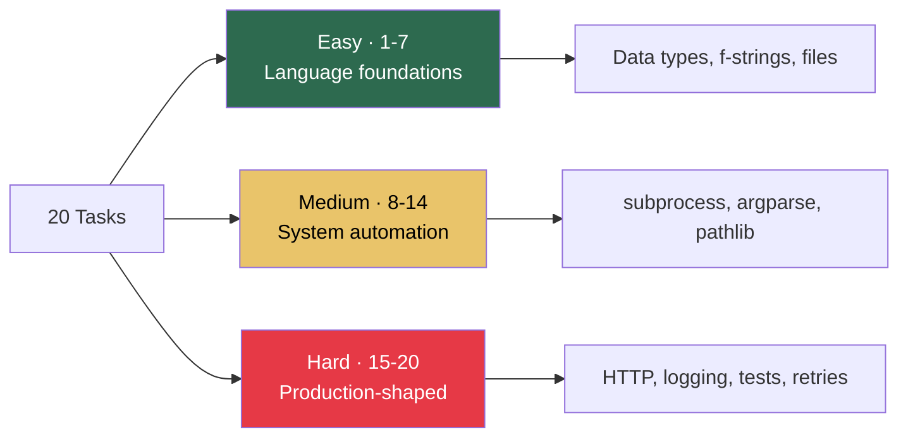

# 9.5.1 Practice Lab — 20 Tasks (Linux + Networking + Shell + Python)

**Backlinks:** [Module 1 — Linux](../../1-Linux/) · [Module 2 — Networking](../../2-Networking/) · [Module 3 — Shell Scripting](../../3-Shell-Scripting/) · [Module 9 — Python](../) · [Module 3 Practice Lab](../../3-Shell-Scripting/Subchapter_3.3/3.3.1_Practice_Lab_20_Tasks.md)

---

## How to Use This Lab

- Attempt each task **before** opening the solution. The learning comes from struggling first.
- Each task links back to the exact chapter that covers the skill — use the 📎 links if you get stuck.
- Set up once:
  ```bash
  mkdir -p ~/python-practice && cd ~/python-practice
  python3 -m venv .venv && source .venv/bin/activate
  pip install requests pyyaml pytest
  ```
- Every solution is production-shaped — not just "works on happy path" but with error handling, type hints, and f-strings.

> **Tip:** Commit each task as a separate Git commit in a `python-practice` repo. You'll end with a personal reference library of 20 DevOps micro-tools.

---

## Task Distribution



---

## Tasks 1–7 · Language Foundations (Easy)

### Task 1 — Port Checker Without Libraries

Write `port_check.py` that takes a host and port as arguments and prints whether the port is open. Use only the standard library. 📎 [9.1.1](../Subchapter_9.1/9.1.1_Python_Basics_Data_Types_and_Control_Flow.md) · [Module 2 — TCP basics](../../2-Networking/)

```bash
python3 port_check.py google.com 443
# ✅ google.com:443 is OPEN

python3 port_check.py example.com 12345
# ❌ example.com:12345 is CLOSED
```

<details>
<summary>Show solution</summary>

```python
#!/usr/bin/env python3
"""Check if a TCP port is open on a host."""
import socket
import sys


def is_open(host: str, port: int, timeout: float = 3.0) -> bool:
    """Attempt a TCP connect. Returns True on success."""
    try:
        with socket.create_connection((host, port), timeout=timeout):
            return True
    except (socket.timeout, ConnectionRefusedError, OSError):
        return False


def main() -> int:
    if len(sys.argv) != 3:
        print("usage: port_check.py <host> <port>", file=sys.stderr)
        return 2
    host, port_str = sys.argv[1], sys.argv[2]
    try:
        port = int(port_str)
    except ValueError:
        print(f"port must be an integer, got: {port_str!r}", file=sys.stderr)
        return 2
    if is_open(host, port):
        print(f"✅ {host}:{port} is OPEN")
        return 0
    print(f"❌ {host}:{port} is CLOSED")
    return 1


if __name__ == "__main__":
    sys.exit(main())
```

**Why it works:** `socket.create_connection` does the DNS lookup + TCP handshake in one call. `with` closes the socket even on exception. Exit codes follow the Module 1 convention: `0 = open`, `1 = closed`, `2 = usage error`.
</details>

---

### Task 2 — Word Frequency Counter

Read a text file, print the top 10 most frequent words (case-insensitive, ignoring punctuation). 📎 [9.1.2](../Subchapter_9.1/9.1.2_File_IO_Modules_and_Libraries.md) · [9.1.3 Collections](../Subchapter_9.1/9.1.3_Collections_Type_Hints_and_Fstrings.md)

<details>
<summary>Show solution</summary>

```python
#!/usr/bin/env python3
"""Top-N word frequency in a text file."""
import re
import sys
from collections import Counter
from pathlib import Path


def top_words(path: Path, n: int = 10) -> list[tuple[str, int]]:
    text = path.read_text(encoding="utf-8").lower()
    words = re.findall(r"[a-z']+", text)     # letters + apostrophes
    return Counter(words).most_common(n)


if __name__ == "__main__":
    if len(sys.argv) != 2:
        sys.exit("usage: wordfreq.py <file>")
    for word, count in top_words(Path(sys.argv[1])):
        print(f"{count:>6}  {word}")
```

**Why it works:** `Counter.most_common(n)` is an O(n log k) heap operation — faster than sorting a dict of thousands of words. `re.findall(r"[a-z']+", ...)` strips punctuation for free.
</details>

---

### Task 3 — Log Level Filter

Given a log file with lines like `2024-11-05 14:23:01 [ERROR] something failed`, write `loglevel.py ERROR application.log` that prints only matching lines, with colour. 📎 [9.1.1](../Subchapter_9.1/9.1.1_Python_Basics_Data_Types_and_Control_Flow.md) · [Module 1 grep patterns](../../1-Linux/)

<details>
<summary>Show solution</summary>

```python
#!/usr/bin/env python3
import sys
from pathlib import Path

COLOURS = {
    "DEBUG": "\033[90m",   # grey
    "INFO":  "\033[34m",   # blue
    "WARN":  "\033[33m",   # yellow
    "WARNING": "\033[33m",
    "ERROR": "\033[31m",   # red
    "CRITICAL": "\033[41m\033[97m",  # red bg white fg
}
RESET = "\033[0m"


def main() -> int:
    if len(sys.argv) != 3:
        print("usage: loglevel.py LEVEL FILE", file=sys.stderr)
        return 2
    level, path = sys.argv[1].upper(), Path(sys.argv[2])
    colour = COLOURS.get(level, "")
    needle = f"[{level}]"
    matched = 0
    for line in path.read_text(encoding="utf-8", errors="replace").splitlines():
        if needle in line:
            print(f"{colour}{line}{RESET}")
            matched += 1
    print(f"\n-- {matched} {level} line(s) --", file=sys.stderr)
    return 0 if matched else 1


if __name__ == "__main__":
    sys.exit(main())
```

**Why it works:** ANSI escape codes work in any modern terminal. `errors="replace"` prevents crashes on binary/corrupt log lines. Exit code `1` when no matches — shell-friendly.
</details>

---

### Task 4 — Deduplicate Lines Preserving Order

Read stdin, print unique lines in the order they first appeared. Classic `awk '!seen[$0]++'` in Python. 📎 [9.1.3](../Subchapter_9.1/9.1.3_Collections_Type_Hints_and_Fstrings.md) · [Module 3 awk](../../3-Shell-Scripting/)

<details>
<summary>Show solution</summary>

```python
#!/usr/bin/env python3
import sys

def main() -> None:
    seen: set[str] = set()
    for line in sys.stdin:
        line = line.rstrip("\n")
        if line not in seen:
            seen.add(line)
            print(line)

if __name__ == "__main__":
    main()
```

**Why it works:** `set` lookups are O(1). Python 3.7+ guarantees `dict` insertion order, but for this task a `set` + ordered iteration is enough since we print as we go.
</details>

---

### Task 5 — YAML ⇄ JSON Converter

Write `convert.py input.yaml output.json` that converts in either direction based on file extensions. 📎 [9.1.2](../Subchapter_9.1/9.1.2_File_IO_Modules_and_Libraries.md) · [Module 5 YAML manifests](../../5-Kubernetes/)

<details>
<summary>Show solution</summary>

```python
#!/usr/bin/env python3
import json
import sys
from pathlib import Path

import yaml  # pip install pyyaml


def load(path: Path):
    text = path.read_text(encoding="utf-8")
    if path.suffix in {".yaml", ".yml"}:
        return yaml.safe_load(text)
    if path.suffix == ".json":
        return json.loads(text)
    raise ValueError(f"unsupported input extension: {path.suffix}")


def dump(data, path: Path) -> None:
    if path.suffix in {".yaml", ".yml"}:
        path.write_text(yaml.safe_dump(data, sort_keys=False), encoding="utf-8")
    elif path.suffix == ".json":
        path.write_text(json.dumps(data, indent=2), encoding="utf-8")
    else:
        raise ValueError(f"unsupported output extension: {path.suffix}")


if __name__ == "__main__":
    if len(sys.argv) != 3:
        sys.exit("usage: convert.py INPUT OUTPUT")
    src, dst = Path(sys.argv[1]), Path(sys.argv[2])
    dump(load(src), dst)
    print(f"✔ {src} → {dst}")
```

**Why it works:** `yaml.safe_load` avoids arbitrary-Python-object deserialisation (a real CVE risk with `yaml.load`). `sort_keys=False` preserves the author's ordering of keys — matters for readable K8s manifests.
</details>

---

### Task 6 — Simple HTTP Health Check

Hit a URL, print status code + response time. Retry 3 times on timeout with exponential backoff. 📎 [9.3.2](../Subchapter_9.3/9.3.2_HTTP_Requests_and_REST_APIs.md)

<details>
<summary>Show solution</summary>

```python
#!/usr/bin/env python3
import sys
import time

import requests


def check(url: str, retries: int = 3, timeout: float = 5.0) -> int:
    delay = 1.0
    for attempt in range(1, retries + 1):
        try:
            start = time.monotonic()
            r = requests.get(url, timeout=timeout)
            elapsed_ms = (time.monotonic() - start) * 1000
            print(f"{r.status_code}  {elapsed_ms:6.1f}ms  {url}")
            return 0 if r.ok else 1
        except requests.Timeout:
            print(f"attempt {attempt}/{retries}: timeout", file=sys.stderr)
            if attempt < retries:
                time.sleep(delay)
                delay *= 2
        except requests.RequestException as e:
            print(f"error: {e}", file=sys.stderr)
            return 2
    return 3  # all retries exhausted


if __name__ == "__main__":
    if len(sys.argv) != 2:
        sys.exit("usage: healthcheck.py URL")
    sys.exit(check(sys.argv[1]))
```

**Why it works:** `time.monotonic()` is immune to wall-clock changes (NTP) — always use it for measuring elapsed time. Distinct exit codes (`0/1/2/3`) let calling scripts react to *why* the check failed.
</details>

---

### Task 7 — Environment Variable Template

Read a file with `${VAR}` placeholders, substitute values from the environment, write the result. Fail loudly on missing vars. 📎 [9.2.2](../Subchapter_9.2/9.2.2_Arguments_Environment_and_Path_Handling.md) · [Module 3 envsubst](../../3-Shell-Scripting/)

<details>
<summary>Show solution</summary>

```python
#!/usr/bin/env python3
import os
import re
import sys
from pathlib import Path

PATTERN = re.compile(r"\$\{([A-Z_][A-Z0-9_]*)\}")


def render(template: str) -> str:
    missing: list[str] = []

    def sub(match: re.Match[str]) -> str:
        name = match.group(1)
        value = os.environ.get(name)
        if value is None:
            missing.append(name)
            return match.group(0)
        return value

    rendered = PATTERN.sub(sub, template)
    if missing:
        raise KeyError(f"missing env vars: {', '.join(sorted(set(missing)))}")
    return rendered


if __name__ == "__main__":
    if len(sys.argv) != 3:
        sys.exit("usage: envsub.py TEMPLATE OUTPUT")
    src, dst = Path(sys.argv[1]), Path(sys.argv[2])
    try:
        dst.write_text(render(src.read_text()), encoding="utf-8")
    except KeyError as e:
        print(f"error: {e}", file=sys.stderr)
        sys.exit(1)
    print(f"✔ rendered {src} → {dst}")
```

**Why it works:** Collecting all missing vars before raising beats failing on the first one — the user fixes all in one pass. `re.sub` with a callable is the cleanest way to do per-match substitution with side effects.
</details>

---

## Tasks 8–14 · System Automation (Medium)

### Task 8 — Safe Shell Command Wrapper

Build `run.py` that runs a shell command, logs stdout/stderr separately, times it, and exits with the child's exit code. Must support `--timeout` and must **not** use `shell=True`. 📎 [9.2.1](../Subchapter_9.2/9.2.1_Subprocess_and_Running_Shell_Commands.md)

<details>
<summary>Show solution</summary>

```python
#!/usr/bin/env python3
import argparse
import shlex
import subprocess
import sys
import time


def main() -> int:
    ap = argparse.ArgumentParser()
    ap.add_argument("--timeout", type=float, default=None)
    ap.add_argument("command", nargs=argparse.REMAINDER)
    args = ap.parse_args()
    if not args.command:
        ap.error("command required")

    cmd = args.command
    print(f"$ {' '.join(shlex.quote(a) for a in cmd)}", file=sys.stderr)
    start = time.monotonic()
    try:
        result = subprocess.run(
            cmd,
            capture_output=True,
            text=True,
            timeout=args.timeout,
            check=False,
        )
    except subprocess.TimeoutExpired:
        print(f"TIMEOUT after {args.timeout}s", file=sys.stderr)
        return 124  # convention: GNU timeout exit code

    elapsed = time.monotonic() - start
    if result.stdout:
        sys.stdout.write(result.stdout)
    if result.stderr:
        sys.stderr.write(result.stderr)
    print(f"(exit={result.returncode}, took {elapsed:.2f}s)", file=sys.stderr)
    return result.returncode


if __name__ == "__main__":
    sys.exit(main())
```

**Why it works:** `shell=False` (the default) means no shell-injection risk. `shlex.quote` safely echoes the command for logging. Exit code `124` matches GNU `timeout`'s convention, so CI pipelines recognise it.
</details>

---

### Task 9 — Find Large Files

Walk a directory tree, print the top 10 largest files with size in MB. 📎 [9.1.2 pathlib](../Subchapter_9.1/9.1.2_File_IO_Modules_and_Libraries.md) · [Module 1 find/du](../../1-Linux/)

<details>
<summary>Show solution</summary>

```python
#!/usr/bin/env python3
import sys
from pathlib import Path


def largest(root: Path, n: int = 10) -> list[tuple[int, Path]]:
    files: list[tuple[int, Path]] = []
    for p in root.rglob("*"):
        try:
            if p.is_file() and not p.is_symlink():
                files.append((p.stat().st_size, p))
        except (PermissionError, FileNotFoundError):
            continue
    files.sort(reverse=True)
    return files[:n]


if __name__ == "__main__":
    root = Path(sys.argv[1] if len(sys.argv) > 1 else ".")
    for size, path in largest(root):
        mb = size / (1024 * 1024)
        print(f"{mb:>8.1f} MB  {path}")
```

**Why it works:** `rglob("*")` is recursive and handles hidden files. Catching `PermissionError`/`FileNotFoundError` per-file means one unreadable directory doesn't abort the whole scan — critical when scanning `/`.
</details>

---

### Task 10 — argparse CLI Tool

Build `cli.py` with sub-commands `greet <name>` and `sum <a> <b>`, each with `--verbose`. 📎 [9.2.2](../Subchapter_9.2/9.2.2_Arguments_Environment_and_Path_Handling.md)

<details>
<summary>Show solution</summary>

```python
#!/usr/bin/env python3
import argparse
import sys


def cmd_greet(args: argparse.Namespace) -> int:
    if args.verbose:
        print(f"greeting {args.name!r}...", file=sys.stderr)
    print(f"Hello, {args.name}!")
    return 0


def cmd_sum(args: argparse.Namespace) -> int:
    result = args.a + args.b
    if args.verbose:
        print(f"{args.a} + {args.b} = {result}", file=sys.stderr)
    print(result)
    return 0


def build_parser() -> argparse.ArgumentParser:
    ap = argparse.ArgumentParser(prog="cli")
    ap.add_argument("--verbose", action="store_true")
    sub = ap.add_subparsers(dest="command", required=True)

    g = sub.add_parser("greet")
    g.add_argument("name")
    g.set_defaults(func=cmd_greet)

    s = sub.add_parser("sum")
    s.add_argument("a", type=int)
    s.add_argument("b", type=int)
    s.set_defaults(func=cmd_sum)

    return ap


if __name__ == "__main__":
    args = build_parser().parse_args()
    sys.exit(args.func(args))
```

**Why it works:** `set_defaults(func=...)` is the cleanest sub-command dispatch pattern — no `if args.command == ...` ladder. `required=True` on `add_subparsers` means Python ≥ 3.7 will error if no sub-command is given.
</details>

---

### Task 11 — Tail -f in Python

Replicate `tail -f logfile`: open the file, print existing last 10 lines, then print new lines as they're appended. 📎 [9.1.2](../Subchapter_9.1/9.1.2_File_IO_Modules_and_Libraries.md)

<details>
<summary>Show solution</summary>

```python
#!/usr/bin/env python3
import sys
import time
from collections import deque
from pathlib import Path


def tail_f(path: Path, n: int = 10, interval: float = 0.5) -> None:
    with path.open("r", encoding="utf-8") as f:
        # print last n lines using a ring buffer
        for line in deque(f, maxlen=n):
            sys.stdout.write(line)
        sys.stdout.flush()
        # follow
        while True:
            line = f.readline()
            if not line:
                time.sleep(interval)
                continue
            sys.stdout.write(line)
            sys.stdout.flush()


if __name__ == "__main__":
    if len(sys.argv) != 2:
        sys.exit("usage: tailf.py FILE")
    try:
        tail_f(Path(sys.argv[1]))
    except KeyboardInterrupt:
        pass
```

**Why it works:** `deque(f, maxlen=n)` is memory-efficient for huge log files — only the last `n` lines are ever held. `readline()` returns `""` (empty string) at EOF but keeps the file-position pointer, so new writes are picked up on the next call.
</details>

---

### Task 12 — Parallel Host Ping

Given a list of 50 hostnames, ping each and print "UP" / "DOWN" in parallel (should finish in ~1 s, not 50 s). 📎 [Module 9.4 production patterns](../Subchapter_9.4/9.4.2_Production_Ready_Patterns.md) · [Module 2 ICMP](../../2-Networking/)

<details>
<summary>Show solution</summary>

```python
#!/usr/bin/env python3
import subprocess
import sys
from concurrent.futures import ThreadPoolExecutor


def is_up(host: str, timeout: int = 1) -> bool:
    r = subprocess.run(
        ["ping", "-c", "1", "-W", str(timeout), host],
        capture_output=True,
    )
    return r.returncode == 0


def main() -> int:
    hosts = [line.strip() for line in sys.stdin if line.strip()]
    with ThreadPoolExecutor(max_workers=32) as pool:
        for host, up in zip(hosts, pool.map(is_up, hosts)):
            status = "✅ UP " if up else "❌ DOWN"
            print(f"{status}  {host}")
    return 0


if __name__ == "__main__":
    sys.exit(main())
```

**Why it works:** `ThreadPoolExecutor` is perfect for I/O-bound work like pinging — threads wait on network, they don't fight over the GIL. `pool.map` preserves input order so output is predictable.
</details>

---

### Task 13 — Git Log Statistics

Call `git log` via subprocess, parse author/date/subject, print top 5 authors by commit count for the last 30 days. 📎 [9.2.1](../Subchapter_9.2/9.2.1_Subprocess_and_Running_Shell_Commands.md) · [Module 6 — Git log](../../6-Git/)

<details>
<summary>Show solution</summary>

```python
#!/usr/bin/env python3
import subprocess
from collections import Counter


def main() -> int:
    result = subprocess.run(
        ["git", "log", "--since=30.days.ago", "--pretty=%an"],
        capture_output=True,
        text=True,
        check=True,
    )
    authors = [line for line in result.stdout.splitlines() if line]
    for name, count in Counter(authors).most_common(5):
        print(f"{count:>4}  {name}")
    return 0


if __name__ == "__main__":
    main()
```

**Why it works:** `--pretty=%an` outputs only author names — simpler to parse than the default format. `check=True` raises if we're not inside a git repo. `Counter.most_common(5)` replaces a 5-line sort.
</details>

---

### Task 14 — dotenv Loader From Scratch

Write `load_dotenv(path)` that reads a `.env` file (lines like `KEY=value` and `KEY="value with spaces"`) and sets `os.environ`. Handle comments and blank lines. 📎 [9.2.3](../Subchapter_9.2/9.2.3_Advanced_Subprocess_shlex_and_dotenv.md)

<details>
<summary>Show solution</summary>

```python
#!/usr/bin/env python3
import os
import shlex
from pathlib import Path


def load_dotenv(path: Path, override: bool = False) -> dict[str, str]:
    loaded: dict[str, str] = {}
    for raw in path.read_text(encoding="utf-8").splitlines():
        line = raw.strip()
        if not line or line.startswith("#"):
            continue
        if "=" not in line:
            continue
        key, _, value = line.partition("=")
        key = key.strip()
        # shlex handles "quoted values with spaces" and 'single quotes'
        value = shlex.split(value.strip())[0] if value.strip() else ""
        if override or key not in os.environ:
            os.environ[key] = value
            loaded[key] = value
    return loaded


if __name__ == "__main__":
    import sys
    path = Path(sys.argv[1] if len(sys.argv) > 1 else ".env")
    for k, v in load_dotenv(path).items():
        print(f"✔ {k}={v}")
```

**Why it works:** `str.partition("=")` splits on the *first* `=`, so values containing `=` (base64, URLs) aren't broken. `shlex.split` handles quoting rules compatible with Bash — matches what the shell does.
</details>

---

## Tasks 15–20 · Production-Shaped (Hard)

### Task 15 — REST API Client With Retries

Build a class `ApiClient` with a `requests.Session`, automatic retry on 5xx + connection errors (3 retries, exp backoff), and JSON logging of every request. 📎 [9.3.2](../Subchapter_9.3/9.3.2_HTTP_Requests_and_REST_APIs.md) · [9.3.3 sessions](../Subchapter_9.3/9.3.3_Advanced_HTTP_Sessions_and_OAuth2.md)

<details>
<summary>Show solution</summary>

```python
#!/usr/bin/env python3
import logging
from typing import Any

import requests
from requests.adapters import HTTPAdapter
from urllib3.util.retry import Retry

log = logging.getLogger(__name__)


class ApiClient:
    def __init__(self, base_url: str, *, timeout: float = 10.0) -> None:
        self.base_url = base_url.rstrip("/")
        self.timeout = timeout
        self.session = requests.Session()
        retry = Retry(
            total=3,
            backoff_factor=0.5,                 # 0.5, 1, 2 seconds
            status_forcelist=(500, 502, 503, 504),
            allowed_methods=frozenset(["GET", "PUT", "DELETE", "OPTIONS", "HEAD"]),
            raise_on_status=False,
        )
        adapter = HTTPAdapter(max_retries=retry)
        self.session.mount("http://", adapter)
        self.session.mount("https://", adapter)

    def request(self, method: str, path: str, **kwargs: Any) -> requests.Response:
        url = f"{self.base_url}/{path.lstrip('/')}"
        kwargs.setdefault("timeout", self.timeout)
        log.info("http %s %s", method, url)
        r = self.session.request(method, url, **kwargs)
        log.info("http %s %s → %d", method, url, r.status_code)
        r.raise_for_status()
        return r

    def get(self, path: str, **kw: Any):
        return self.request("GET", path, **kw).json()

    def close(self) -> None:
        self.session.close()

    def __enter__(self):
        return self

    def __exit__(self, *exc):
        self.close()


if __name__ == "__main__":
    logging.basicConfig(level=logging.INFO, format="%(asctime)s %(levelname)s %(message)s")
    with ApiClient("https://httpbin.org") as api:
        print(api.get("/get"))
```

**Why it works:** `urllib3.Retry` is the *right* way to do retries with `requests` — not a manual `for` loop, because it also handles connection errors, DNS failures, and honours `Retry-After` headers. `allowed_methods` excludes `POST`/`PATCH` by default — retrying non-idempotent methods is dangerous.
</details>

---

### Task 16 — Structured Logger Setup

Configure Python `logging` so:
- Console gets human-friendly coloured output
- A file `app.log` gets JSON lines (one object per line)
- Third-party libraries log at WARNING+, your code at INFO+

📎 [9.3.1](../Subchapter_9.3/9.3.1_Logging_and_Exception_Handling.md)

<details>
<summary>Show solution</summary>

```python
#!/usr/bin/env python3
import json
import logging
import sys


class JsonFormatter(logging.Formatter):
    def format(self, record: logging.LogRecord) -> str:
        payload = {
            "ts": self.formatTime(record, "%Y-%m-%dT%H:%M:%S"),
            "level": record.levelname,
            "logger": record.name,
            "msg": record.getMessage(),
        }
        if record.exc_info:
            payload["exc"] = self.formatException(record.exc_info)
        return json.dumps(payload)


class ColourFormatter(logging.Formatter):
    COLOURS = {"DEBUG": "\033[90m", "INFO": "\033[34m",
               "WARNING": "\033[33m", "ERROR": "\033[31m",
               "CRITICAL": "\033[41m\033[97m"}
    RESET = "\033[0m"

    def format(self, record: logging.LogRecord) -> str:
        colour = self.COLOURS.get(record.levelname, "")
        base = super().format(record)
        return f"{colour}{base}{self.RESET}"


def configure() -> None:
    root = logging.getLogger()
    root.setLevel(logging.DEBUG)
    root.handlers.clear()

    console = logging.StreamHandler(sys.stderr)
    console.setFormatter(ColourFormatter("%(asctime)s %(levelname)-8s %(name)s: %(message)s"))
    console.setLevel(logging.INFO)
    root.addHandler(console)

    jsonlog = logging.FileHandler("app.log")
    jsonlog.setFormatter(JsonFormatter())
    jsonlog.setLevel(logging.DEBUG)
    root.addHandler(jsonlog)

    # Quiet noisy libraries
    for noisy in ("urllib3", "requests", "botocore"):
        logging.getLogger(noisy).setLevel(logging.WARNING)


if __name__ == "__main__":
    configure()
    log = logging.getLogger("myapp")
    log.info("started")
    log.warning("cache miss")
    try:
        1 / 0
    except ZeroDivisionError:
        log.exception("calculation failed")
```

**Why it works:** Two handlers on the root logger = one log stream, two formats. Muting `urllib3` and `requests` below WARNING is essential — otherwise every HTTP request floods DEBUG logs. `log.exception(...)` captures the traceback automatically.
</details>

---

### Task 17 — Config Loader With Validation

Load `config.yaml` into a typed object with validation (required fields, numeric ranges, enum values). No Pydantic — use `dataclasses` + a validator function. 📎 [9.1.3 type hints](../Subchapter_9.1/9.1.3_Collections_Type_Hints_and_Fstrings.md) · [9.4.2 dataclasses](../Subchapter_9.4/9.4.2_Production_Ready_Patterns.md)

<details>
<summary>Show solution</summary>

```python
#!/usr/bin/env python3
from dataclasses import dataclass
from pathlib import Path
from typing import Literal

import yaml


Env = Literal["dev", "staging", "prod"]


@dataclass(frozen=True)
class AppConfig:
    name: str
    env: Env
    port: int
    replicas: int
    debug: bool = False

    def __post_init__(self) -> None:
        if not self.name:
            raise ValueError("name must not be empty")
        if self.env not in ("dev", "staging", "prod"):
            raise ValueError(f"env must be dev|staging|prod, got {self.env!r}")
        if not 1024 <= self.port <= 65535:
            raise ValueError(f"port must be 1024-65535, got {self.port}")
        if not 1 <= self.replicas <= 100:
            raise ValueError(f"replicas must be 1-100, got {self.replicas}")


def load(path: Path) -> AppConfig:
    data = yaml.safe_load(path.read_text(encoding="utf-8"))
    required = {"name", "env", "port", "replicas"}
    missing = required - data.keys()
    if missing:
        raise ValueError(f"config missing keys: {sorted(missing)}")
    return AppConfig(**{k: data[k] for k in required | {"debug"} & data.keys()})


if __name__ == "__main__":
    import sys
    cfg = load(Path(sys.argv[1]))
    print(cfg)
```

**Why it works:** `frozen=True` makes the config immutable — no accidental mutation. `__post_init__` runs after the auto-generated `__init__`, so all fields are set when validation runs. `Literal[...]` is a type hint *and* a runtime value you can check against.
</details>

---

### Task 18 — pytest Fixtures and Parametrize

Write tests for the `is_open` function from Task 1 using `pytest`, with:
- A fixture that starts a real `socket.socket()` listening on a random port
- Parametrized tests for open / closed / invalid-host cases
- A mock for the DNS lookup

📎 [9.4.1](../Subchapter_9.4/9.4.1_Testing_with_pytest.md)

<details>
<summary>Show solution</summary>

```python
# test_port_check.py
import socket
from unittest.mock import patch

import pytest

from port_check import is_open


@pytest.fixture
def open_port():
    srv = socket.socket()
    srv.bind(("127.0.0.1", 0))           # 0 = let OS pick free port
    srv.listen(1)
    port = srv.getsockname()[1]
    yield port
    srv.close()


def test_open_port(open_port):
    assert is_open("127.0.0.1", open_port) is True


def test_closed_port():
    # port 1 requires root; safe bet it's closed for normal users
    assert is_open("127.0.0.1", 1) is False


@pytest.mark.parametrize("host,port", [
    ("127.0.0.1", 1),
    ("127.0.0.1", 2),
    ("127.0.0.1", 3),
])
def test_multiple_closed_ports(host, port):
    assert is_open(host, port) is False


def test_dns_failure():
    with patch("socket.create_connection", side_effect=OSError("dns fail")):
        assert is_open("nonexistent.invalid", 80) is False
```

**Why it works:** Binding to port `0` lets the OS pick any free port — avoids flaky tests when a hardcoded port is already in use. `yield` in a fixture = setup-teardown. `@pytest.mark.parametrize` reports each case as a separate test.
</details>

---

### Task 19 — Webhook Receiver

Write an HTTP server using only the stdlib (`http.server`) that listens on `:8080`, accepts `POST /webhook`, validates a `X-Hub-Signature-256` HMAC header against a shared secret, and logs the payload. 📎 [9.3.2](../Subchapter_9.3/9.3.2_HTTP_Requests_and_REST_APIs.md) · [Module 2 HTTP](../../2-Networking/) · [Module 8 webhooks](../../8-CICD/)

<details>
<summary>Show solution</summary>

```python
#!/usr/bin/env python3
import hashlib
import hmac
import json
import logging
import os
from http.server import BaseHTTPRequestHandler, HTTPServer

SECRET = os.environ.get("WEBHOOK_SECRET", "").encode()
log = logging.getLogger("webhook")


def verify(payload: bytes, signature: str) -> bool:
    if not signature.startswith("sha256="):
        return False
    expected = "sha256=" + hmac.new(SECRET, payload, hashlib.sha256).hexdigest()
    return hmac.compare_digest(expected, signature)


class Handler(BaseHTTPRequestHandler):
    def do_POST(self) -> None:
        if self.path != "/webhook":
            self.send_error(404)
            return
        length = int(self.headers.get("Content-Length", 0))
        body = self.rfile.read(length)
        sig = self.headers.get("X-Hub-Signature-256", "")
        if not verify(body, sig):
            self.send_error(401, "bad signature")
            return
        try:
            payload = json.loads(body)
        except json.JSONDecodeError:
            self.send_error(400, "invalid json")
            return
        log.info("received: %s", payload.get("event", "unknown"))
        self.send_response(200)
        self.end_headers()
        self.wfile.write(b'{"status":"ok"}')

    def log_message(self, fmt: str, *args) -> None:
        log.info("%s - %s", self.address_string(), fmt % args)


if __name__ == "__main__":
    if not SECRET:
        raise SystemExit("set WEBHOOK_SECRET env var")
    logging.basicConfig(level=logging.INFO, format="%(asctime)s %(message)s")
    HTTPServer(("0.0.0.0", 8080), Handler).serve_forever()
```

Test it:
```bash
export WEBHOOK_SECRET=topsecret
python3 webhook.py &

PAYLOAD='{"event":"push"}'
SIG="sha256=$(echo -n "$PAYLOAD" | openssl dgst -sha256 -hmac topsecret | cut -d' ' -f2)"
curl -X POST http://localhost:8080/webhook \
  -H "X-Hub-Signature-256: $SIG" -d "$PAYLOAD"
```

**Why it works:** `hmac.compare_digest` is **constant-time** — prevents timing attacks that would leak the secret. The `log_message` override routes `http.server`'s built-in access logs through your configured logger.
</details>

---

### Task 20 — End-to-End CI Health Monitor

Build a single Python script that:

1. Reads a YAML list of service URLs
2. Health-checks each in parallel (Task 6 + 12)
3. Logs results with structured JSON logging (Task 16)
4. Sends a POST to a webhook if any service is down (Task 19 shape)
5. Has `--dry-run` flag and pytest tests with mocked HTTP

📎 Everything from Module 9.

<details>
<summary>Show solution</summary>

```python
#!/usr/bin/env python3
"""
health_monitor.py — end-to-end service health checker.
Usage:
    python3 health_monitor.py services.yaml --webhook https://hooks.example.com/x
    python3 health_monitor.py services.yaml --dry-run
"""
from __future__ import annotations

import argparse
import json
import logging
import sys
from concurrent.futures import ThreadPoolExecutor
from dataclasses import asdict, dataclass
from pathlib import Path

import requests
import yaml

log = logging.getLogger("healthmon")


@dataclass
class CheckResult:
    name: str
    url: str
    ok: bool
    status: int | None
    elapsed_ms: float
    error: str | None = None


def check(svc: dict) -> CheckResult:
    name, url = svc["name"], svc["url"]
    try:
        import time
        start = time.monotonic()
        r = requests.get(url, timeout=svc.get("timeout", 5))
        elapsed = (time.monotonic() - start) * 1000
        return CheckResult(name, url, r.ok, r.status_code, elapsed)
    except requests.RequestException as e:
        return CheckResult(name, url, False, None, 0.0, str(e))


def notify(webhook: str, failures: list[CheckResult]) -> None:
    body = {"event": "service_down", "failures": [asdict(f) for f in failures]}
    log.warning("notifying %s about %d failure(s)", webhook, len(failures))
    requests.post(webhook, json=body, timeout=5).raise_for_status()


def main() -> int:
    ap = argparse.ArgumentParser()
    ap.add_argument("config", type=Path)
    ap.add_argument("--webhook")
    ap.add_argument("--dry-run", action="store_true")
    args = ap.parse_args()

    logging.basicConfig(level=logging.INFO,
                        format='{"ts":"%(asctime)s","lvl":"%(levelname)s","msg":"%(message)s"}')

    services = yaml.safe_load(args.config.read_text())["services"]
    with ThreadPoolExecutor(max_workers=16) as pool:
        results = list(pool.map(check, services))

    for r in results:
        icon = "✅" if r.ok else "❌"
        log.info("%s %s %s %s", icon, r.name, r.status, f"{r.elapsed_ms:.0f}ms")

    failures = [r for r in results if not r.ok]
    if failures and args.webhook and not args.dry_run:
        notify(args.webhook, failures)

    return 0 if not failures else 1


if __name__ == "__main__":
    sys.exit(main())
```

Sample `services.yaml`:
```yaml
services:
  - name: api
    url: https://httpbin.org/status/200
  - name: broken
    url: https://httpbin.org/status/500
  - name: slow
    url: https://httpbin.org/delay/10
    timeout: 2
```

Minimal tests (`test_monitor.py`):
```python
from unittest.mock import patch, MagicMock
from health_monitor import check


def test_check_ok():
    m = MagicMock(ok=True, status_code=200)
    with patch("requests.get", return_value=m):
        r = check({"name": "api", "url": "http://x"})
    assert r.ok and r.status == 200


def test_check_fails_on_connection_error():
    import requests
    with patch("requests.get", side_effect=requests.ConnectionError("boom")):
        r = check({"name": "api", "url": "http://x"})
    assert not r.ok and r.error == "boom"
```

**Why it works:** This is the shape of a real monitoring tool. Each concern (checking, reporting, notifying) is a separate function — testable in isolation. `--dry-run` is a safety flag borrowed from Module 1 Linux conventions. JSON log format (`{"ts":..."lvl":...}`) is one line per record — grep-friendly, ingestible by Loki/ELK.
</details>

---

## Completion Checklist

After finishing all 20 tasks, you should be able to:

- [ ] Build a CLI tool with sub-commands and parse YAML/JSON configs
- [ ] Safely call shell commands with `subprocess` (no `shell=True`, timeouts, clean capture)
- [ ] Make HTTP requests with sessions, retries, and exponential backoff
- [ ] Configure structured logging with multiple handlers
- [ ] Write pytest tests with fixtures, parametrize, and mocks
- [ ] Run I/O-bound work in parallel with `ThreadPoolExecutor`
- [ ] Validate config data with dataclasses + `__post_init__`
- [ ] Read tracebacks and choose specific exceptions to catch

**Next:** go build something real — a Slack notifier, a Kubernetes health dashboard, an ArgoCD webhook receiver. Module 10 uses all of this.

**Back to module:** [Module 9 — Python](../)
